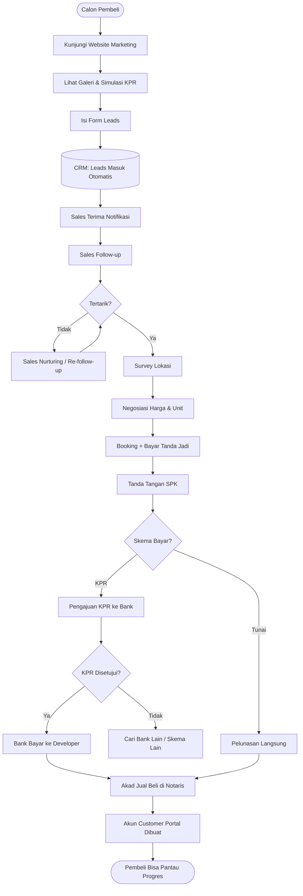
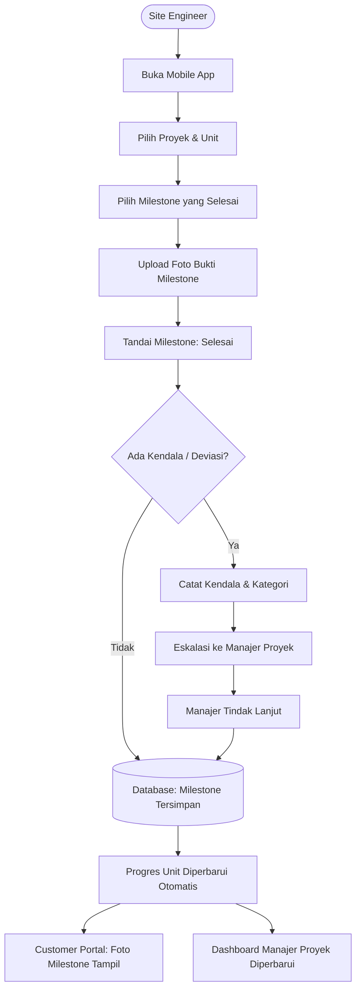
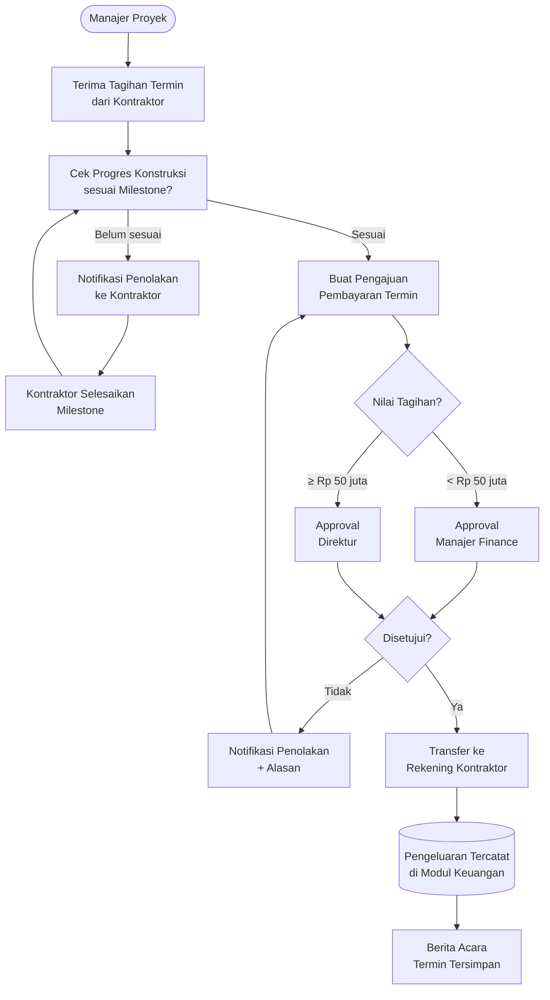
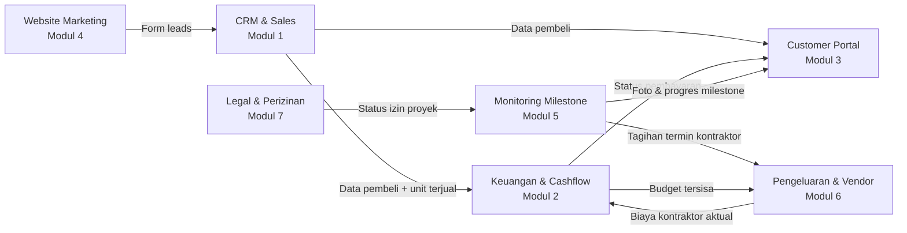
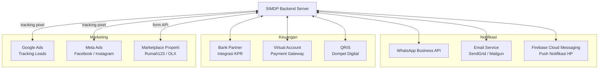
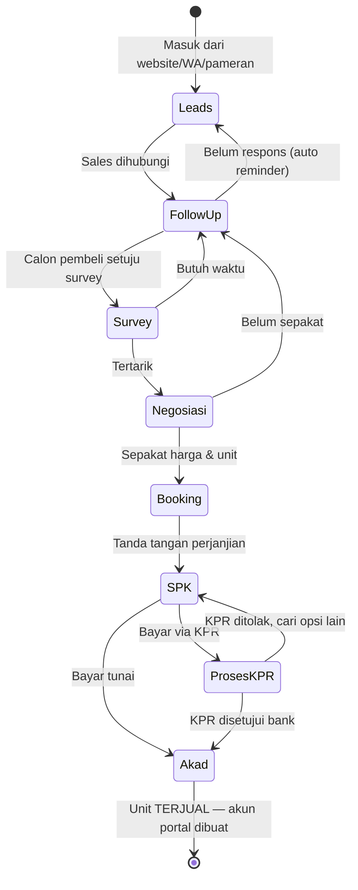
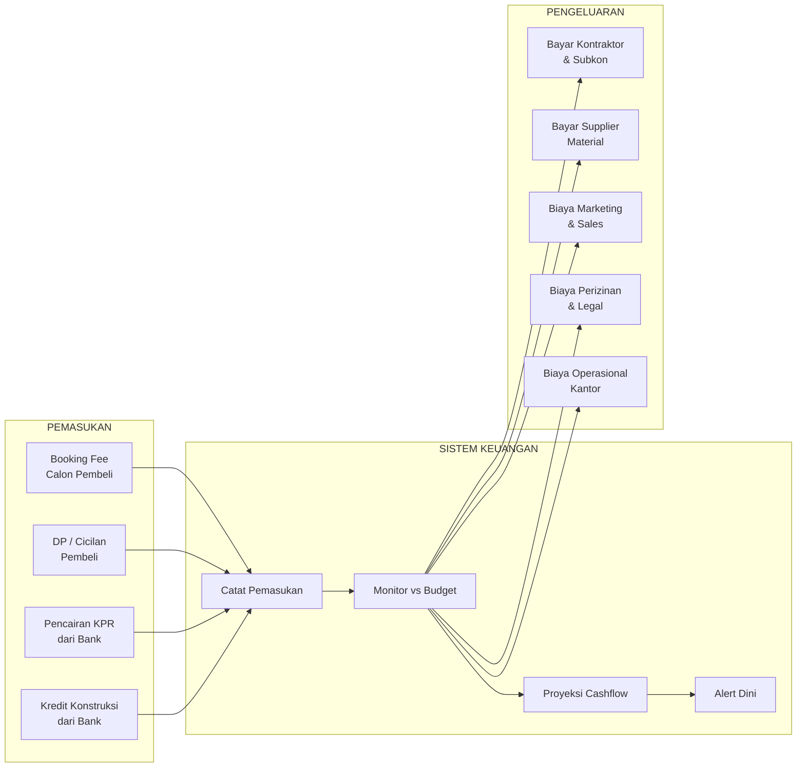
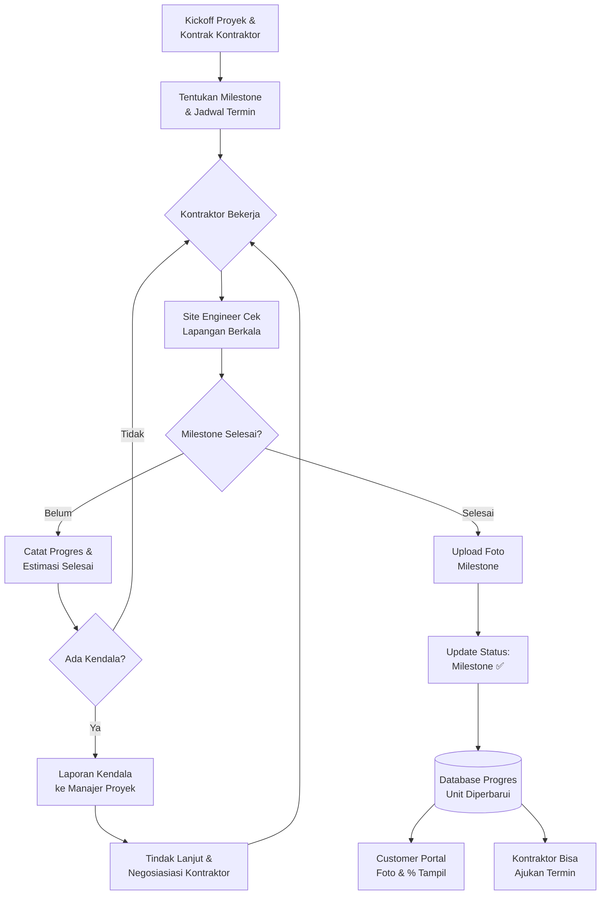
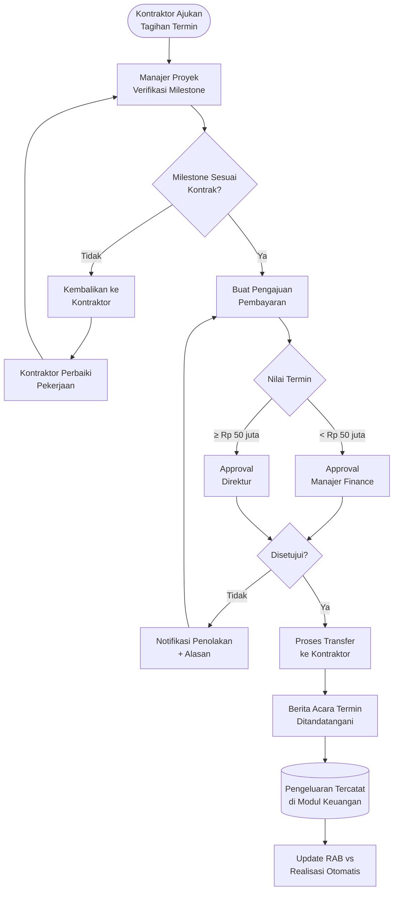
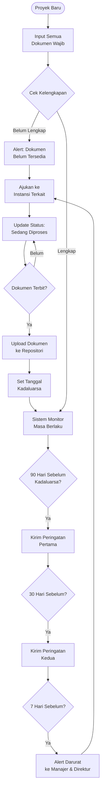

# Arsitektur Sistem — SIMDP
# Sistem Informasi Manajemen Developer Perumahan

---

## Daftar Isi

1. [Gambaran Arsitektur Keseluruhan](#1-gambaran-arsitektur-keseluruhan)
2. [Diagram Alur Pengguna (User Flow)](#2-diagram-alur-pengguna-user-flow)
3. [Arsitektur Aplikasi & Modul](#3-arsitektur-aplikasi--modul)
4. [Alur Data Antar Modul (Data Flow)](#4-alur-data-antar-modul-data-flow)
5. [Arsitektur Teknis (Tech Stack)](#5-arsitektur-teknis-tech-stack)
6. [Integrasi Sistem Eksternal](#6-integrasi-sistem-eksternal)
7. [Hak Akses & Keamanan](#7-hak-akses--keamanan)
8. [Alur Proses Per Modul](#8-alur-proses-per-modul)

---

## 1. Gambaran Arsitektur Keseluruhan

```
╔══════════════════════════════════════════════════════════════════════════╗
║                        SIMDP PLATFORM                                   ║
║                                                                          ║
║  ┌─────────────────┐  ┌─────────────────┐  ┌─────────────────────────┐  ║
║  │   WEB ADMIN     │  │ MOBILE LAPANGAN │  │    CUSTOMER PORTAL      │  ║
║  │  (Back Office)  │  │  (Android/iOS)  │  │   (Web + Android/iOS)   │  ║
║  │                 │  │                 │  │                         │  ║
║  │ • CRM & Sales   │  │ • Foto milestone│  │ • Pantau progres unit   │  ║
║  │ • Keuangan      │  │ • Upload foto   │  │ • Tagihan & pembayaran  │  ║
║  │ • Mon. Milestone│  │ • Lap. kendala  │  │ • Unduh dokumen         │  ║
║  │ • Pengel.&Vendor│  │ • BA kontraktor │  │ • Komplain & tiket      │  ║
║  │ • Legal         │  │                 │  │ • Notifikasi            │  ║
║  └────────┬────────┘  └────────┬────────┘  └───────────┬─────────────┘  ║
║           │                    │                        │                ║
║           └────────────────────┴────────────────────────┘                ║
║                                │                                         ║
║                    ┌───────────┴────────────┐                            ║
║                    │      API GATEWAY        │                            ║
║                    │   (REST API / HTTPS)    │                            ║
║                    └───────────┬────────────┘                            ║
║                                │                                         ║
║                    ┌───────────┴────────────┐                            ║
║                    │    BACKEND SERVER       │                            ║
║                    │  (Business Logic Layer) │                            ║
║                    └───────────┬────────────┘                            ║
║                                │                                         ║
║                    ┌───────────┴────────────┐                            ║
║                    │       DATABASE          │                            ║
║                    │     (PostgreSQL)        │                            ║
║                    └────────────────────────┘                            ║
║                                                                          ║
║  ┌──────────────────────────────────────────────────────────────────┐    ║
║  │                   WEBSITE MARKETING (Publik)                     │    ║
║  │          Landing Page · Galeri · Simulasi KPR · Form Leads       │    ║
║  └──────────────────────────────────────────────────────────────────┘    ║
╚══════════════════════════════════════════════════════════════════════════╝
                                │
            ┌───────────────────┼───────────────────┐
            │                   │                   │
     ┌──────┴──────┐   ┌────────┴───────┐   ┌───────┴──────┐
     │ WhatsApp API│   │   Bank / KPR   │   │    Email     │
     │  (Notifikasi│   │  (Integrasi    │   │   Service    │
     │   & Chat)   │   │  Pembayaran)   │   │              │
     └─────────────┘   └────────────────┘   └──────────────┘
```

---

## 2. Diagram Alur Pengguna (User Flow)

### A. Alur Calon Pembeli → Pembeli



---

### B. Alur Tim Lapangan → Update Milestone



---

### C. Alur Pembayaran Kontraktor (Pengeluaran & Vendor)



---

## 3. Arsitektur Aplikasi & Modul

```
SIMDP — 4 APLIKASI & 7 MODUL
═══════════════════════════════════════════════════════════════

┌─────────────────────────────────────────────────────────────┐
│                      WEB ADMIN                              │
│                   (Browser / Laptop)                        │
├──────────────┬──────────────┬──────────────┬────────────────┤
│   MODUL 1    │   MODUL 2    │   MODUL 5    │   MODUL 6      │
│ CRM & Sales  │  Keuangan &  │  Monitoring  │ Pengeluaran &  │
│              │  Cashflow    │  Milestone   │    Vendor      │
├──────────────┴──────────────┴──────────────┴────────────────┤
│           MODUL 4            │          MODUL 7              │
│      Website Marketing       │     Legal & Perizinan         │
│      (embed/terintegrasi)    │                               │
└─────────────────────────────────────────────────────────────┘

┌─────────────────────────────────────────────────────────────┐
│                   MOBILE LAPANGAN                           │
│    (Android / iOS — Site Engineer & Manajer Proyek)         │
├─────────────────────────────────────────────────────────────┤
│              Sub-modul: Monitoring Milestone                │
│  Update foto & progres milestone  ·  Laporan kendala        │
│  BA termin kontraktor  ·  Eskalasi masalah ke manajer       │
└─────────────────────────────────────────────────────────────┘

┌─────────────────────────────────────────────────────────────┐
│                   CUSTOMER PORTAL                           │
│            (Web Browser + Android / iOS)                    │
├─────────────────────────────────────────────────────────────┤
│                      MODUL 3                                │
│                  Customer Portal                            │
│  • Progres unit    • Tagihan    • Dokumen    • Komplain      │
└─────────────────────────────────────────────────────────────┘

┌─────────────────────────────────────────────────────────────┐
│                  WEBSITE MARKETING                          │
│                  (Website Publik)                           │
├─────────────────────────────────────────────────────────────┤
│                      MODUL 4                                │
│  Landing page · Galeri · Virtual Tour · Simulasi KPR        │
│  Form Leads ──────────────────────────────► Modul CRM       │
└─────────────────────────────────────────────────────────────┘
```

---

## 4. Alur Data Antar Modul (Data Flow)



---

### Matriks Keterhubungan Modul

```
             ┌────┬─────┬────┬─────┬─────┬─────┬─────┐
             │CRM │KEU  │CP  │WM   │PM   │PRO  │LEG  │
─────────────┼────┼─────┼────┼─────┼─────┼─────┼─────┤
CRM & Sales  │ —  │ ──► │ ──►│ ◄── │     │     │     │
Keuangan     │ ◄──│  —  │ ──►│     │     │ ◄── │     │
Cust. Portal │ ◄──│ ◄── │ — │     │ ◄── │     │     │
Website Mktg │ ──►│     │    │  —  │     │     │     │
Mon. Milest. │    │     │ ──►│     │  —  │ ──► │ ◄── │
Pengel.&Vend │    │ ──► │    │     │ ◄── │  —  │     │
Legal        │    │     │    │     │ ──► │     │  —  │
─────────────┴────┴─────┴────┴─────┴─────┴─────┴─────┘

Keterangan: ──► = mengirim data ke modul tersebut
```

---

## 5. Arsitektur Teknis (Tech Stack)

```
╔══════════════════════════════════════════════════════════════╗
║                    LAYER PRESENTASI                         ║
╠══════════════════╦═══════════════╦══════════════════════════╣
║   Web Admin      ║    Mobile     ║   Customer Portal        ║
║   Next.js        ║  React Native ║   Next.js (Web)          ║
║   (React.js)     ║  (Android/iOS)║   React Native (Mobile)  ║
╠══════════════════╩═══════════════╩══════════════════════════╣
║              LAYER KOMUNIKASI                               ║
║          REST API  ·  HTTPS  ·  JWT Auth                    ║
╠══════════════════════════════════════════════════════════════╣
║                    LAYER BISNIS                             ║
║            Backend Server (Node.js / Laravel)               ║
║                                                             ║
║  ┌──────────┐ ┌──────────┐ ┌────────────┐ ┌─────────────┐  ║
║  │  Auth &  │ │ Business │ │Notification│ │   File      │  ║
║  │  RBAC    │ │  Logic   │ │  Service   │ │  Storage    │  ║
║  └──────────┘ └──────────┘ └────────────┘ └─────────────┘  ║
╠══════════════════════════════════════════════════════════════╣
║                     LAYER DATA                              ║
║            PostgreSQL (Database Utama)                      ║
║            Redis (Cache & Session)                          ║
║            AWS S3 / GCS (Foto & Dokumen)                    ║
╠══════════════════════════════════════════════════════════════╣
║                  LAYER INFRASTRUKTUR                        ║
║          Cloud Server (AWS / GCP / Azure)                   ║
║          SSL Certificate · CDN · Auto-Scaling               ║
╚══════════════════════════════════════════════════════════════╝
```

### Detail Stack per Komponen

| Layer | Komponen | Teknologi | Fungsi |
|-------|----------|-----------|--------|
| Frontend | Web Admin | Next.js / React.js | Antarmuka tim internal |
| Frontend | Mobile Lapangan | React Native | Laporan & foto dari lapangan |
| Frontend | Customer Portal Web | Next.js | Portal pembeli via browser |
| Frontend | Customer Portal Mobile | React Native | Portal pembeli via HP |
| Frontend | Website Marketing | Next.js | Website publik perumahan |
| API | Gateway | REST API + HTTPS | Komunikasi frontend ↔ backend |
| Auth | Keamanan | JWT + RBAC | Token login + hak akses per jabatan |
| Backend | Server Utama | Node.js / Laravel | Business logic semua modul |
| Backend | Notifikasi | Firebase Cloud Messaging | Push notif ke HP |
| Backend | Email | SendGrid / Mailgun | Email otomatis ke pengguna |
| Backend | WhatsApp | WhatsApp Business API | Notifikasi & pesan ke WA |
| Database | Utama | PostgreSQL | Penyimpanan semua data bisnis |
| Database | Cache | Redis | Percepat query yang sering diakses |
| Storage | File | AWS S3 / Google Cloud Storage | Simpan foto, dokumen, sertifikat |
| Infrastruktur | Server | AWS / GCP / Azure | Hosting cloud |
| Infrastruktur | Keamanan | SSL + enkripsi AES | Enkripsi data sensitif |

---

## 6. Integrasi Sistem Eksternal



### Detail Integrasi

| Sistem Eksternal | Tujuan Integrasi | Arah Data |
|-----------------|-----------------|-----------|
| WhatsApp Business API | Kirim notifikasi reminder cicilan, update progres, info serah terima | SIMDP → Pengguna |
| Email (SendGrid) | Kirim tagihan, konfirmasi, dokumen digital | SIMDP → Pengguna |
| Firebase (FCM) | Push notifikasi ke aplikasi mobile | SIMDP → HP Pengguna |
| Bank / KPR | Terima notifikasi persetujuan KPR & pencairan dana | Bank → SIMDP |
| Virtual Account | Pembayaran cicilan & IPL dari pembeli | Pembeli → Bank → SIMDP |
| QRIS | Pembayaran digital | Pembeli → SIMDP |
| Google Ads | Tracking sumber leads dari iklan Google | Google → SIMDP |
| Meta Ads (FB/IG) | Tracking sumber leads dari iklan Facebook/Instagram | Meta → SIMDP |
| Marketplace Properti | Leads dari Rumah123 / OLX masuk otomatis ke CRM | Marketplace → SIMDP |

---

## 7. Hak Akses & Keamanan

### Diagram Hak Akses (Role-Based Access Control / RBAC)

```
PENGGUNA            APLIKASI          MODUL YANG BISA DIAKSES
════════            ════════          ══════════════════════════

Direktur ──────────► Web Admin ──────► Semua modul (full view)

Manajer Sales ─────► Web Admin ──────► CRM, Marketing, Customer Portal

Tim Sales ─────────► Web Admin ──────► CRM (unit yang ditangani)
                                        Customer Portal (unit sendiri)

Manajer Finance ───► Web Admin ──────► Keuangan, Pengeluaran & Vendor (approval)

Admin Finance ─────► Web Admin ──────► Keuangan

Manajer Proyek ────► Web Admin ──────► Monitoring Milestone, Pengeluaran & Vendor, Legal
                   ► Mobile App ─────► Semua fitur lapangan

Site Engineer ─────► Mobile App ─────► Update milestone, upload foto, laporan kendala

Admin Legal ───────► Web Admin ──────► Legal & Perizinan

Pembeli ───────────► Customer Portal ► Unit milik sendiri saja
```

### Tabel Hak Akses per Modul

| Role | CRM | Keuangan | Cust. Portal | Mon. Milestone | Pengel. & Vendor | Legal |
|------|-----|----------|--------------|:--------------:|:----------------:|-------|
| Direktur | ✅ Full | ✅ Full | ✅ Full | ✅ Full | ✅ Full | ✅ Full |
| Manajer Sales | ✅ Full | ❌ | ✅ Full | 👁 Lihat | ❌ | ❌ |
| Tim Sales | ✅ Terbatas | ❌ | ✅ Terbatas | ❌ | ❌ | ❌ |
| Manajer Finance | ❌ | ✅ Full | ❌ | 👁 Lihat | ✅ Approval | ❌ |
| Admin Finance | ❌ | ✅ Input | ❌ | ❌ | ❌ | ❌ |
| Manajer Proyek | 👁 Lihat | 👁 Lihat | ❌ | ✅ Full | ✅ Full | ✅ Full |
| Site Engineer | ❌ | ❌ | ❌ | ✅ Lapangan | ❌ | ❌ |
| Admin Legal | ❌ | ❌ | ❌ | ❌ | ❌ | ✅ Full |
| Pembeli | ❌ | ❌ | ✅ Unit sendiri | ❌ | ❌ | ❌ |

> **Keterangan:** ✅ Full = baca + tulis penuh | ✅ Terbatas = hanya data yang relevan | 👁 Lihat = read-only | ❌ = tidak bisa akses

### Layer Keamanan Sistem

```
REQUEST DARI PENGGUNA
        │
        ▼
┌───────────────────┐
│   HTTPS / SSL     │  ← Enkripsi semua data dalam perjalanan
└────────┬──────────┘
         │
         ▼
┌───────────────────┐
│  API Rate Limiter │  ← Batasi percobaan login berlebihan
└────────┬──────────┘
         │
         ▼
┌───────────────────┐
│  JWT Auth Token   │  ← Verifikasi identitas pengguna
└────────┬──────────┘
         │
         ▼
┌───────────────────┐
│  RBAC Middleware  │  ← Cek hak akses sesuai role
└────────┬──────────┘
         │
         ▼
┌───────────────────┐
│  Business Logic   │  ← Proses request
└────────┬──────────┘
         │
         ▼
┌───────────────────┐
│  Database (enkr.) │  ← Data sensitif dienkripsi saat disimpan
└───────────────────┘
```

---

## 8. Alur Proses Per Modul

### Modul 1 — CRM & Sales: Alur Pipeline



---

### Modul 2 — Keuangan: Alur Cashflow



---

### Modul 5 — Monitoring Milestone: Alur Pengawasan Kontraktor



---

### Modul 6 — Pengeluaran & Vendor: Alur Pembayaran Kontraktor



---

### Modul 7 — Legal: Alur Perizinan



---

*Dokumen: arsitektur-sistem.md | Versi 1.0 | Februari 2026*
*Dibuat sebagai lampiran teknis dari proposal-proyek.md*
