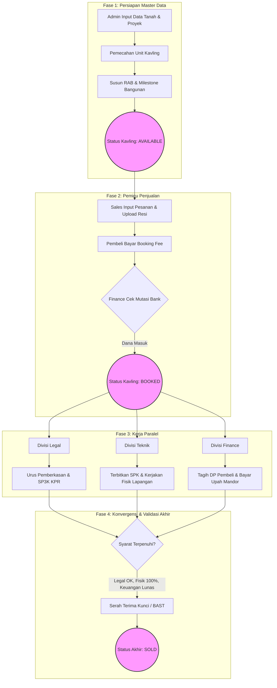
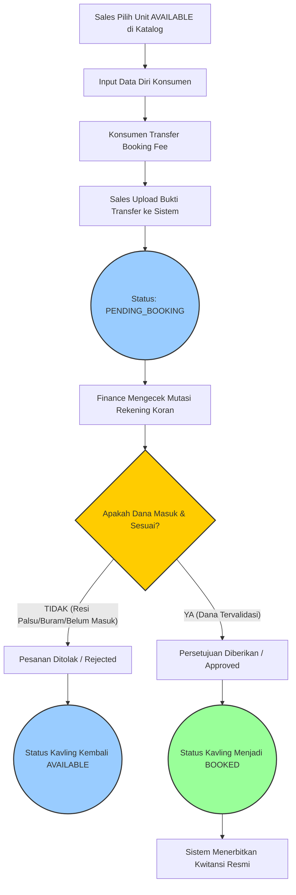
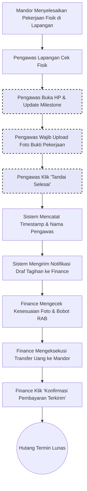
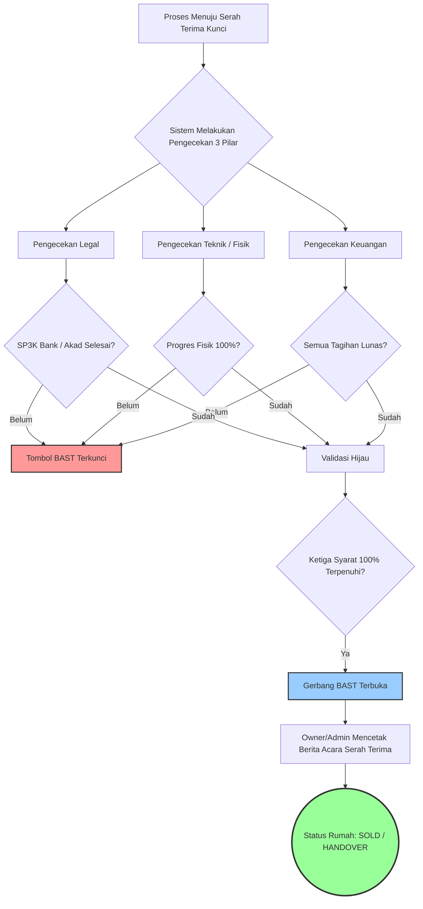

# BUKU PANDUAN PENGGUNAAN
SISTEM ERP DEVELOPER PROPERTI

---

# BAB 1: Pendahuluan & Konsep Dasar

## 1.1. Apa itu Sistem ERP Developer Properti?

Sistem ERP (Enterprise Resource Planning) Developer Properti adalah sebuah perangkat lunak manajemen terintegrasi yang dirancang secara khusus dan eksklusif untuk memenuhi dinamika serta kompleksitas bisnis pengembang perumahan. Di tengah tingginya arus informasi dan transaksi dalam proyek pembangunan properti, pengelolaan data secara konvensional—seperti menggunakan lembar kerja (spreadsheet) terpisah atau dokumen kertas—sering kali menimbulkan berbagai celah operasional. Celah tersebut meliputi ketidaksinkronan data antar divisi, risiko *double entry* (pencatatan data ganda), hingga hilangnya visibilitas terhadap arus kas (*cashflow*). Sistem ERP ini hadir sebagai solusi tunggal (*single source of truth*) yang mendigitalisasi dan mengotomatisasi seluruh siklus bisnis properti Anda dari hulu ke hilir.

Visi utama dari aplikasi ini adalah membebaskan perusahaan dari belenggu pekerjaan administratif manual yang memakan waktu dan sangat rentan terhadap kesalahan manusia (*human error*). Dengan memusatkan seluruh aktivitas ke dalam satu platform digital yang cerdas, sistem ini secara aktif mencegah terjadinya *double entry* yang sering mengacaukan laporan dan merugikan perusahaan. Lebih dari sekadar perangkat lunak pencatatan, sistem ini bertindak sebagai penjaga gawang keuangan (*financial gatekeeper*). Setiap rupiah uang yang masuk dan keluar akan dipantau secara ketat, ditautkan dengan bukti transaksi yang sah, dan diwajibkan melalui proses validasi berjenjang oleh otoritas yang berwenang. Hal ini akan mengamankan *cashflow* perusahaan secara menyeluruh, transparan, dan dapat dipertanggungjawabkan (akuntabel).

Keunggulan revolusioner lain dari sistem ini adalah kemampuannya dalam menjembatani kesenjangan komunikasi antara kantor pusat (manajemen, keuangan, legal) dan personel di lapangan (tim teknik, pengawas proyek, kontraktor/mandor). Melalui teknologi berbasis *cloud*, sistem memastikan pembaruan data terjadi secara *real-time*. Ketika tim lapangan melaporkan progres pembangunan fisik suatu unit kavling melalui ponsel mereka, pada detik yang sama tim keuangan di kantor pusat dapat melihat laporan tersebut dan menindaklanjutinya dengan pencairan dana atau penerbitan tagihan. Sinkronisasi instan ini menghilangkan birokrasi kertas kerja yang lamban, mempercepat proses pengambilan keputusan, dan memastikan setiap roda gigi di dalam perusahaan berputar secara harmonis dan efisien.

---

## 1.2. Alur Kerja Umum (The Grand Workflow)

Untuk memberikan gambaran menyeluruh tentang bagaimana sistem ERP ini mengendalikan denyut nadi operasional perusahaan, proses bisnis telah dipetakan ke dalam 4 (empat) fase utama. Pendekatan berbasis fase ini memastikan setiap tahapan saling mengunci, terintegrasi, dan mencegah terlewatinya Standar Operasional Prosedur (SOP) yang telah ditetapkan oleh manajemen.

Berikut adalah visualisasi The Grand Workflow (Diagram Alur Utama) beserta penjelasan mendetail dari 4 Fase Utama di dalam sistem:

### Fase 1: Persiapan (Master Data)
Tahap ini dapat diibaratkan sebagai proses membangun fondasi dan menyiapkan cetak biru (*blueprint*) sebelum sebuah proyek besar dipasarkan. Pada fase ini, administrator sistem atau manajemen akan memasukkan dan mengonfigurasi seluruh "Data Induk" (*Master Data*) yang akan menjadi acuan baku bagi seluruh divisi. Proses krusial ini meliputi:
*   **Pembuatan Data Kavling:** Mendaftarkan seluruh unit properti (blok dan nomor) yang akan dipasarkan, lengkap dengan spesifikasi teknis, luas tanah, tipe bangunan, harga dasar, dan posisinya dalam rancangan tapak (*site plan*).
*   **Penetapan Rencana Anggaran Biaya (RAB):** Menetapkan estimasi biaya material dan upah kerja untuk setiap tipe kavling secara presisi. RAB yang telah dikunci di fase ini akan menjadi pagu anggaran (*budget limit*) sistem. Sistem secara otomatis akan memblokir pengeluaran yang melebihi RAB tanpa adanya persetujuan khusus, guna mencegah pembengkakan biaya (*overbudget*) selama masa konstruksi.
*   **Pengaturan Milestone:** Mendefinisikan tahapan-tahapan krusial (*milestone*) dalam proses pembangunan fisik (misalnya: 0% Pondasi, 30% Pasang Bata, 50% Naik Atap, hingga 100% Finishing/Siap Huni). *Milestone* ini sangat penting karena nantinya akan menjadi pemicu otomatis (*trigger*) bagi sistem untuk menagih pembayaran kepada konsumen (*Auto-Invoice*) sekaligus mencairkan upah/termin kepada pihak pemborong.

Tanpa Fase Persiapan yang matang, akurat, dan tersistematis, roda transaksi penjualan tidak akan dapat diputar dan diproses ke tahap selanjutnya.

### Fase 2: Pemicu Penjualan
Fase ini adalah titik awal (*starting point*) bergeraknya roda transaksi yang sesungguhnya. Semua berawal dari interaksi komersial antara divisi Sales dan calon konsumen.
*   Ketika tim Sales berhasil mencapai kesepakatan dengan konsumen untuk membeli sebuah unit, konsumen diwajibkan melakukan pembayaran tanda jadi atau *Booking Fee*.
*   Tim Sales kemudian akan mendaftarkan data penjualan tersebut ke dalam sistem dan mengunggah bukti transfer pembayaran *Booking Fee*.
*   Pada titik ini, sistem tidak akan serta-merta mengunci kavling tersebut. Tim Finance (Keuangan) akan langsung menerima notifikasi otomatis untuk memverifikasi keabsahan dana yang masuk ke rekening bank perusahaan.
*   Setelah tim Finance mencocokkan mutasi bank dan mengonfirmasi penerimaan dana di dalam sistem, barulah status kavling secara resmi berubah menjadi **TERKUNCI (BOOKED)**. Begitu status berubah menjadi Booked, unit tersebut secara otomatis dihilangkan dari daftar kavling yang tersedia (*Available*). Hal ini membuat mustahil bagi Sales lain untuk menawarkan atau menjual kavling yang sama. Di sinilah letak pertahanan sistem dalam mencegah secara absolut kasus memalukan seperti penjualan ganda (*double booking*).

### Fase 3: Kerja Paralel (Inti Sistem)
Fase ketiga ini merupakan jantung dari keunggulan sistem ERP Developer Properti ini. Segera setelah kavling berstatus sah sebagai *Booked*, sistem secara cerdas dan otomatis akan menyebarkan instruksi kerja kepada 3 (tiga) divisi berbeda secara bersamaan (paralel). Alih-alih menunggu satu divisi selesai bekerja (sistem estafet atau sekuensial yang kuno), divisi-divisi ini kini dipaksa untuk berlari berdampingan:

1.  **Divisi Legal:** Secara instan akan mendapatkan tugas di panel *dashboard* mereka untuk mulai mengumpulkan berkas-berkas identitas konsumen, mengurus proses pengajuan akad kredit dengan pihak Bank (jika menggunakan skema KPR), serta mempersiapkan draf dokumen legal seperti Perjanjian Pengikatan Jual Beli (PPJB).
2.  **Divisi Teknik:** Langsung menerima notifikasi otorisasi untuk segera menerbitkan Surat Perintah Kerja (SPK) kepada mandor atau sub-kontraktor yang ditunjuk. Tim Teknik juga akan mulai melaporkan persentase progres pembangunan fisik di lapangan berdasarkan titik *Milestone* yang telah ditetapkan pada Fase 1. Setiap laporan progres yang diunggah ke sistem (wajib disertai bukti foto lapangan) akan memicu rantai aksi di divisi lain.
3.  **Divisi Finance:** Sistem akan bekerja layaknya asisten manajer keuangan otomatis. Berdasarkan laporan progres fisik yang disetorkan oleh divisi Teknik (misalnya progres fisik telah mencapai 30%), sistem *Auto-Invoice* akan otomatis menerbitkan dan mengirimkan surat tagihan cicilan Uang Muka (DP) kepada konsumen. Di saat yang persis bersamaan, sistem juga akan menghitung otomatis dan merilis jadwal pencairan dana/upah kepada mandor sesuai termin progres 30% tersebut. Semuanya dihitung dan disinkronisasikan oleh sistem tanpa perlu intervensi kalkulator manual.

Alur kerja paralel ini dijamin akan memberikan efisiensi waktu penyelesaian proyek yang drastis, mempercepat perputaran uang masuk (*cash turn-around*), dan memastikan secara mutlak bahwa progres pembangunan fisik di lapangan selalu sejalan dan seirama dengan penerimaan kas dari konsumen.

### Fase 4: Garis Finish (Validasi Serah Terima)
Fase terakhir ini bertindak sebagai pos pemeriksaan keamanan final (*final checkpoint*). Tujuan puncak dari sebuah proyek perumahan adalah penyerahan kunci rumah kepada konsumen. Namun, sistem ERP ini bertindak tegas dengan tidak mengizinkan proses Serah Terima Kunci (*Handover*) terjadi apabila syarat-syarat mutlak belum terpenuhi secara paripurna. Tombol Serah Terima di dalam sistem akan terkunci gembok secara digital hingga algoritma memvalidasi kelengkapan tiga indikator utama:
1.  **Validasi Legal:** Pihak Bank telah secara resmi menyetujui (ACC) permohonan KPR konsumen dan seluruh proses legalitas pencairan dana telah tuntas.
2.  **Validasi Teknik:** Laporan progres pembangunan fisik di lapangan telah divalidasi final mencapai angka 100%, dan status unit dinyatakan siap huni secara layak tanpa adanya cacat konstruksi (*defect*).
3.  **Validasi Keuangan:** Seluruh kewajiban pembayaran dari pihak konsumen (mulai dari DP, Biaya KPR, Pajak-pajak, hingga biaya strategis lainnya) telah diverifikasi dan diketuk palu dengan status LUNAS oleh tim Keuangan.

Dengan perlindungan mutlak di Fase 4 ini, jajaran direksi dan manajemen developer dapat tertidur pulas tanpa perlu khawatir akan adanya tragedi kunci diserahkan kepada konsumen, sementara masih ada sisa tagihan puluhan juta rupiah yang belum terbayarkan.

---

## 1.3. Panduan Akses & Keamanan Login

Kemudahan penggunaan yang dibalut dengan tingkat keamanan tinggi merupakan dua pilar utama dalam mengakses ERP ini. Sistem dirancang menggunakan teknologi antarmuka web modern (*Web-Based Application*). Ini berarti para pengguna tidak perlu dipusingkan dengan proses instalasi perangkat lunak (software) tambahan yang rumit, tidak memerlukan spesifikasi komputer grafis tingkat tinggi, dan tidak membebani kapasitas penyimpanan (*storage*) perangkat Anda.

*   **Akses Universal Tanpa Batas:** Sistem ini dapat diakses secara fleksibel dari mana saja dan kapan saja. Anda cukup menggunakan peramban web (*browser*) standar yang sudah terinstal di perangkat Anda—seperti Google Chrome, Mozilla Firefox, Apple Safari, atau Microsoft Edge. Akses dapat dilakukan melalui komputer kantor, laptop pribadi, tablet, hingga *smartphone*, asalkan perangkat tersebut terhubung ke jaringan internet yang stabil.

*   **Konsep Hak Akses Terbatas (Role-Based Access Control / RBAC):** 
    Demi melindungi kerahasiaan mahadata (*big data*) perusahaan dari kebocoran dan mencegah campur tangan operasional antar divisi, sistem menerapkan protokol keamanan *Role-Based Access Control* (RBAC) yang sangat ketat. Konsep ini secara tegas memisahkan hak akses, membatasi tampilan menu, dan memilah wewenang setiap pengguna mutlak berdasarkan jabatan atau peran (*role*) pekerjaan mereka di dalam struktur organisasi perusahaan:
    *   **Akun Sales (Pemasaran):** Hanya memiliki otorisasi untuk melihat daftar kavling yang masih tersedia, mendaftarkan data transaksi penjualan baru, dan memantau status persetujuan transaksi konsumen mereka sendiri. Mereka diblokir sepenuhnya dari akses untuk melihat isi brankas perusahaan, margin keuntungan, atau laporan arus kas proyek.
    *   **Akun Finance (Keuangan):** Memegang wewenang krusial untuk melihat lalu lintas mutasi kas, menyetujui pembayaran *Booking Fee*, menerbitkan tagihan (*invoice*), dan menyetujui pencairan dana operasional. Namun demi integritas data, mereka tidak diberikan hak untuk mengubah spesifikasi dimensi bangunan atau mengganti nama pembeli secara sepihak tanpa otorisasi tingkat lanjut.
    *   **Akun Teknik:** Layar antarmuka mereka difokuskan sepenuhnya pada *dashboard* progres lapangan, fasilitas unggah foto bukti pembangunan fisik, dan manajemen daftar pemborong/mandor.
    *   **Akun Owner / Manajemen (Super User):** Bertindak sebagai pemegang kunci utama (Super User / Executive Dashboard). Akun tingkat dewa ini dapat terbang melintasi batas-batas divisi untuk melihat rekapitulasi data secara komprehensif (helikopter view), memantau *cashflow* secara agregat, dan menganalisis performa penjualan bulanan secara *real-time* lewat sajian grafik interaktif.

Guna memastikan akuntabilitas (pertanggungjawaban), setiap pengguna tanpa terkecuali diwajibkan untuk masuk (*login*) menggunakan kombinasi Email/Username dan Kata Sandi (Password) yang bersifat personal dan rahasia. Seluruh aktivitas klik, penambahan, pengubahan, hingga penghapusan data yang dilakukan pengguna setelah login akan dicatat oleh sistem secara permanen dalam rekam jejak digital (*Audit Log*). Hal ini memastikan bahwa setiap perubahan sekecil apa pun dapat ditelusuri riwayatnya kembali ke identitas pengguna tersebut, sehingga mencegah terjadinya penyangkalan atau kecurangan.

---

## 1.4. Pengenalan Antarmuka (User Interface) Dasar

Sistem ERP ini dikembangkan dengan mengadopsi filosofi desain yang bersih (*clean design*), sangat intuitif, dan ramah bagi mata pengguna (*user-friendly*). Filosofi ini diambil agar para karyawan, bahkan yang tidak memiliki latar belakang keahlian di bidang IT sekalipun, dapat menguasai pengoperasian sistem dalam waktu yang sangat singkat. 

Berikut adalah panduan tekstual navigasi dasar untuk membiasakan Anda saat pertama kali berhasil masuk ke dalam ruang lingkup sistem:

*   **Layar Utama (Dashboard):** Sesaat setelah proses login berhasil, Anda akan langsung disambut oleh halaman *Dashboard* (Panel Instrumen). Halaman ini bertindak sebagai pusat informasi cerdas yang secara otomatis merangkum dan menampilkan metrik atau tugas-tugas terpenting yang membutuhkan perhatian Anda hari ini, yang disesuaikan secara dinamis dengan hak akses jabatan Anda.
*   **Menu Navigasi Utama:** Terletak berjejer vertikal di sepanjang **sisi kiri layar**. Area ini adalah roda kemudi utama Anda dalam mengoperasikan sistem. Di bilah (*sidebar*) ini, Anda akan menemukan ikon-ikon beserta label menu terstruktur seperti "Master Data", "Manajemen Kavling", "Modul Keuangan", "Laporan Teknik", dan daftar lainnya. Anda cukup mengklik salah satu label menu tersebut untuk membuka atau berpindah ke ruang kerja divisi yang bersangkutan.
*   **Profil Pengguna & Pengaturan Cepat:** Terletak bertengger di **sudut kanan atas layar**. Jika Anda mengklik nama atau foto profil Anda di area ini, sebuah menu tarik-turun (*dropdown*) akan muncul. Menu ini memberikan Anda akses pintas untuk mengubah detail akun pribadi, mengganti kata sandi demi keamanan berkala, serta yang terpenting: tombol "Keluar" (Logout) untuk mengakhiri sesi sistem secara aman sebelum Anda meninggalkan perangkat.
*   **Area Kerja (Workspace):** Adalah bagian sentral yang menempati area paling luas pada ruang layar Anda. Ini adalah kanvas digital tempat Anda benar-benar bekerja; area di mana tabel basis data ditampilkan, formulir isian (*input form*) dimunculkan untuk diisi, dan grafik laporan disajikan dengan interaktif.

### Standar Kode Warna Status
Untuk mempercepat proses otak dalam membaca ribuan baris data hanya dengan sekilas pandang (*skimming*), sistem dengan sengaja mengadopsi indikator "Kode Warna Universal" yang diaplikasikan secara seragam di setiap halaman tabel data (seperti daftar status kavling, lembar tagihan, atau deretan status persetujuan dokumen). Menguasai kamus visual ini sangatlah penting bagi kelancaran kerja Anda:

*   🟢 **HIJAU (Tersedia / Lunas / Disetujui):** Kemunculan label berwarna hijau selalu membawa kabar baik; mengindikasikan status yang bernilai positif, aman, atau tuntas. Pada tabel daftar kavling, blok warna hijau terang berarti unit tersebut belum bertuan dan **Tersedia (Available)** untuk segera dijual. Pada modul layar keuangan, ini adalah tanda melegakan bahwa sebuah tagihan telah resmi **Lunas**, atau pengajuan pencairan dana Anda telah **Disetujui (Approved)** oleh direksi.
*   🟡 **KUNING (Menunggu / Pending / Proses):** Label kuning bertindak layaknya lampu lalu lintas berhati-hati; sebagai tanda peringatan bahwa sebuah proses masih "menggantung" atau tertunda. Ini berarti suatu tindakan sistem tidak dapat dilanjutkan karena sedang **Menunggu (Pending)** persetujuan klik dari atasan, atau menunggu transfer dana dari pihak luar. Contoh nyata: *Booking Fee* yang statusnya masih menunggu proses ketuk palu verifikasi dari layar Finance, atau tagihan yang telah dikirimkan ke konsumen namun sistem mendeteksi belum adanya pembayaran yang masuk.
*   🔴 **MERAH (Dibatalkan / Tertunggak / Ditolak):** Visual berwarna merah mencerminkan status negatif yang mutlak, sebuah peringatan kritis yang membutuhkan perhatian ekstra, atau sinyal penghentian proses secara permanen. Pada tabel kavling, ini bisa mencerminkan bahwa sebuah transaksi pemesanan telah resmi **Dibatalkan (Canceled)** secara sepihak maupun dua belah pihak. Pada layar modul keuangan, warna merah berkedip sebagai tanda bahaya (*red flag*) untuk faktur tagihan yang umurnya telah melebihi jatuh tempo dan kini **Tertunggak (Overdue)**, atau sebuah proposal pengajuan biaya material yang dengan tegas **Ditolak (Rejected)** oleh otoritas keuangan.
*   🔵 **BIRU (Terkunci / Aktif / Sedang Berjalan):** Warna biru menenangkan yang melambangkan sebuah entitas proses aktif yang saat ini sedang secara dinamis berjalan di dalam rel ekosistem sistem. Sebagai contoh, status kavling yang sukses berubah menjadi **Terkunci (Booked)** oleh komitmen *Booking Fee* seorang konsumen, atau indikator pada proyek pembangunan rumah fisik yang saat ini berstatus **Sedang Berjalan (In Progress)** di bawah kendali alat berat.

Berikut adalah panduan referensi cepat untuk memahami tingkatan urgensi dari setiap indikator warna yang ada di dalam antarmuka sistem:

| Warna Notifikasi | Tingkat Urgensi | Contoh Pesan Sistem | Tindakan yang Harus Dilakukan Pengguna |
| :--- | :--- | :--- | :--- |
| 🔴 **Merah** (Danger) | **Sangat Tinggi / Kritis** | "Tagihan Jatuh Tempo!", "Pembayaran Ditolak", "Stok Material Habis" | Hentikan aktivitas lain. Segera lakukan tindakan perbaikan, penagihan, atau hubungi atasan karena ini berdampak langsung pada kerugian finansial atau berhentinya proyek. |
| 🟡 **Kuning** (Warning) | **Sedang / Menunggu** | "Menunggu Validasi Finance", "Pesanan Pending", "Progres Belum Di-ACC" | Pantau statusnya secara berkala. Lakukan *follow-up* (tindak lanjut) ke divisi terkait agar proses yang menggantung bisa segera diselesaikan menjadi hijau. |
| 🟢 **Hijau** (Success) | **Aman / Tuntas** | "Kavling Tersedia", "Tagihan Lunas", "SP3K Bank Disetujui" | Tidak ada tindakan mendesak. Lanjutkan alur kerja Anda ke tahap berikutnya, atau tawarkan kavling ke konsumen dengan tenang. |
| 🔵 **Biru** (Info) | **Rendah / Informatif** | "Kavling Telah Di-Booking", "Rumah Sedang Dibangun" | Pahami informasi tersebut sebagai status operasional *real-time*. Tidak perlu tindakan khusus selain memonitor progresnya. |

Dengan membiasakan diri terhadap pola letak navigasi dan kamus visual kode warna ini, Anda akan secara drastis meningkatkan kemampuan Anda dalam menavigasi menu dan menyerap informasi strategis dari sistem ERP dengan efisiensi dan kecepatan operasional yang maksimal.

---

# BAB 2: Panduan Admin Proyek & Teknik (Fase Persiapan)

Bab ini adalah jantung dari fase persiapan sistem ERP Developer Properti. Sebelum tim Sales dapat menawarkan satu unit pun rumah kepada calon pembeli, "dapur" perusahaan harus menyiapkan segala bumbu dan bahan bakunya terlebih dahulu. Tanpa data proyek yang akurat, sistem tidak akan memiliki landasan untuk beroperasi. 

Materi dalam bab ini ditujukan secara khusus bagi **Admin Proyek**, **Estimator**, dan **Admin Teknik**. Anda memegang peranan sangat krusial; kesalahan input di fase ini (misalnya salah memasukkan harga dasar atau luasan tanah) dapat berakibat fatal pada keakuratan tagihan konsumen dan profitabilitas proyek. Oleh karena itu, bacalah panduan ini dengan teliti.

## 2.1. Manajemen Proyek & Tanah (Master Plan)

Data proyek adalah fondasi utama dari sistem ini. Ibarat sebuah pohon, data proyek adalah batang utamanya, sedangkan tipe rumah, kavling, dan transaksi penjualan adalah cabang dan rantingnya. Sistem membutuhkan definisi yang jelas mengenai batas-batas lahan, nama proyek, dan total kavling yang akan dibangun sebelum fitur lainnya dapat digunakan.

### A. Mendaftarkan Proyek Perumahan Baru
Langkah pertama yang harus dilakukan saat perusahaan mengakuisisi lahan baru adalah mendaftarkannya ke dalam sistem.

1. Buka menu navigasi utama di sebelah kiri, lalu klik **"Master Data"**.
2. Dari menu *dropdown* yang muncul, pilih submenu **"Proyek"**. Anda akan melihat tabel daftar proyek yang sudah ada.
3. Klik tombol biru bertuliskan **"Tambah Proyek"** yang terletak di sudut kanan atas tabel.
4. Sebuah formulir isian akan muncul. Lengkapi kolom-kolom berikut dengan teliti:
   * **Nama Perumahan:** (Contoh: "Pesona Indah Residence Tahap 1").
   * **Alamat Lokasi:** Ketikkan alamat lengkap proyek beserta kode pos.
   * **Luas Lahan Total:** Masukkan total luas lahan proyek (dalam meter persegi). Angka ini penting untuk laporan *Site Plan* dan perhitungan efisiensi pemanfaatan lahan.
   * **Deskripsi:** Berikan keterangan singkat tentang keunggulan proyek atau target pasar.
5. Periksa kembali kebenaran data yang diketik. Jika sudah yakin, klik tombol **"Simpan"**.

> **Catatan Penting:**  
> Nama proyek yang sudah disimpan akan muncul di berbagai dokumen resmi (seperti PPJB dan Surat Tagihan/Invoice). Pastikan ejaan dan penamaan proyek tidak mengandung kesalahan ketik (*typo*).

### B. Proses Pemecahan Kavling
Setelah proyek didaftarkan, lahan yang luas tersebut tentu tidak dijual secara gelondongan. Lahan tersebut harus "dipecah" menjadi unit-unit kavling yang siap dipasarkan, sesuai dengan gambar *Site Plan* yang disetujui BPN/Pemda.

1. Masih di dalam submenu **"Master Data > Proyek"**, klik nama proyek yang baru saja Anda buat.
2. Cari dan klik tab atau tombol **"Manajemen Kavling"** / **"Pemecahan Kavling"**.
3. Klik tombol **"Tambah Kavling"**. Anda bisa menambahkan kavling satu per satu atau menggunakan fitur **"Tambah Massal"** (jika tersedia) untuk mempercepat proses.
4. Saat membuat kavling, isi detail berikut:
   * **Blok & Nomor:** (Contoh: "Blok A1", "Blok B-05"). Penamaan ini harus persis sama dengan gambar *Site Plan*.
   * **Status Awal:** Pilih status **AVAILABLE (Tersedia)**. Hal ini akan memunculkan kavling tersebut di layar tim Sales.
   * **Posisi/Keterangan:** Tentukan apakah ini kavling standar, *hook* (sudut), atau kavling dengan kelebihan tanah (fasum berdekatan).
5. Klik **"Simpan Kavling"**. Ulangi proses ini hingga seluruh unit di *Site Plan* berhasil didigitalkan ke dalam sistem.

## 2.2. Master Data Tipe Rumah

Setelah lahan fisik dibagi menjadi kavling, sistem harus mengetahui "bangunan seperti apa" yang akan berdiri di atas kavling tersebut. Di sinilah fungsi Master Data Tipe Rumah.

### A. Membuat Data Tipe Rumah Baru
Anda harus mendaftarkan semua tipe rumah yang dijual oleh perusahaan. Misalnya, perusahaan menjual Tipe 36/72 dan Tipe 45/90.

1. Pada menu navigasi utama di kiri, rentangkan menu **"Master Data"** lalu klik **"Tipe Rumah"**.
2. Klik tombol **"Tambah Tipe Rumah"**.
3. Isi formulir pembuatan tipe rumah dengan hati-hati. Kolom-kolom berikut **wajib diisi**:
   * **Nama Tipe:** Gunakan format standar perusahaan (Contoh: "Tipe 36/72 - Aster").
   * **Luas Bangunan:** Masukkan angka luas bangunan standar dalam satuan meter persegi (Contoh: "36").
   * **Luas Tanah:** Masukkan angka luas tanah standar dalam satuan meter persegi (Contoh: "72").
   * **Spesifikasi Singkat:** Sebutkan poin-poin utama konstruksi, seperti "2 Kamar Tidur, 1 Kamar Mandi, Lantai Granit 60x60, Atap Baja Ringan".
   * **Harga Jual Dasar:** Ini adalah elemen paling krusial. Masukkan harga jual *cash* / tunai standar untuk tipe ini (tanpa kelebihan tanah/hook). Harga ini akan menjadi patokan dasar (*base price*) bagi tim Sales.
4. Klik **"Simpan"** untuk menyimpan Tipe Rumah ke dalam pusat data.

### B. Menautkan Tipe Rumah ke Kavling
Setelah Tipe Rumah tercipta, Anda harus menautkannya (me-*link*-kan) ke data Kavling yang sudah dibuat di sub-bab 2.1. Langkah ini memberi tahu sistem bahwa "Kavling Blok A1 akan dibangun Tipe 36/72".

1. Kembali ke menu **"Manajemen Kavling"** di dalam detail Proyek.
2. Cari kavling yang ingin ditautkan (misalnya Blok A1), lalu klik ikon pensil atau tombol **"Edit"**.
3. Pada *dropdown* pilihan **Tipe Rumah**, pilih tipe yang bersesuaian (misal: Tipe 36/72).
4. Jika kavling tersebut memiliki luas tanah lebih besar dari standar (kavling *hook*), Anda bisa menyesuaikan angka luas tanah dan menambahkan biaya Kelebihan Tanah (*Kelebihan Luas Tanah/KLT*) di kolom yang disediakan.
5. Simpan perubahan. Kini Kavling A1 resmi dipasarkan sebagai unit Tipe 36/72.

## 2.3. Pengaturan RAB (Rencana Anggaran Biaya) & Milestone (SANGAT PENTING)

Secara konseptual, di dalam ERP ini **Milestone bukanlah sekadar jadwal waktu proyek biasa**. Milestone bertindak sebagai **Pemicu Keuangan Otomatis (Financial Trigger)**. Ketika admin teknik melaporkan sebuah Milestone selesai di lapangan, sistem secara serentak akan melakukan dua hal:
1. Menerbitkan tagihan (*Invoice*) cicilan kepada Konsumen.
2. Mencairkan upah borongan/termin kepada Mandor.

Oleh karena itu, penyusunan RAB dan Milestone harus presisi.

### A. Menginput Nilai Total RAB
Setiap Tipe Rumah harus memiliki pagu anggaran pembangunan (RAB) yang terkunci.

1. Buka menu **"Teknik"** di panel navigasi, lalu pilih **"Master RAB"**.
2. Pilih Tipe Rumah yang ingin dikelola (Misal: Tipe 36/72).
3. Klik **"Atur RAB"** atau **"Edit Total RAB"**.
4. Masukkan **Total Anggaran Biaya** untuk membangun satu unit rumah tipe tersebut. Nilai ini biasanya sudah dihitung matang oleh tim Estimator di luar sistem. (Contoh: Rp 120.000.000,-).
5. Klik **"Simpan Anggaran"**. Sistem kini akan memastikan pembayaran kepada mandor untuk tipe ini tidak akan melebihi angka tersebut.

### B. Memecah RAB Menjadi Milestone (Termin Progres)
Anggaran total harus dipecah berdasarkan tahapan progres fisik yang disepakati dengan pemborong.

1. Di layar Master RAB untuk Tipe 36/72, gulir ke bagian bawah untuk menemukan panel **"Pengaturan Milestone"**.
2. Klik **"Tambah Milestone"** untuk memasukkan tahapan progres langkah demi langkah:
   * **Milestone 1:** 
     * Nama: "Pekerjaan Persiapan & Pondasi"
     * Bobot (%): "20"
     * *Sistem akan otomatis menghitung 20% x Rp 120.000.000 = Rp 24.000.000 sebagai nilai termin ini.*
   * **Milestone 2:** 
     * Nama: "Pekerjaan Struktur, Dinding & Atap"
     * Bobot (%): "40"
   * **Milestone 3:** 
     * Nama: "Pekerjaan Lantai, Plafon & Finishing"
     * Bobot (%): "30"
   * **Milestone 4 (Retensi):** 
     * Nama: "Masa Pemeliharaan & Retensi"
     * Bobot (%): "10"
3. Lakukan pengecekan akhir pada tabel Milestone yang tercipta.

Untuk menghindari kesalahan perencanaan, berikut adalah contoh matriks pemecahan Milestone yang logis dan aman untuk Rumah Tipe 45 (Nilai RAB Rp 150.000.000):

| Tahapan Milestone | Detail Pekerjaan Lapangan | Bobot (%) | Nilai Termin | Pemicu Aksi Sistem (Otomatis) |
| :--- | :--- | :--- | :--- | :--- |
| **Milestone 1** (Persiapan & Pondasi) | Pembersihan lahan, galian tanah, pengecoran pondasi batu kali, sloof, dan urugan. | 20% | Rp 30 Juta | Sistem menerbitkan Tagihan DP-1 ke konsumen & Finance mentransfer Upah Termin 1 ke Mandor. |
| **Milestone 2** (Struktur & Dinding) | Pemasangan kolom praktis, bata merah/hebel sampai ring balok, plester, dan acian luar-dalam. | 35% | Rp 52,5 Juta | Sistem menerbitkan Tagihan DP-2 ke konsumen & Finance mentransfer Upah Termin 2 ke Mandor. |
| **Milestone 3** (Atap & Plafon) | Pemasangan rangka baja ringan, genteng, lisplang, rangka plafon *hollow*, dan gipsum. | 20% | Rp 30 Juta | Sistem menerbitkan Tagihan Plafon KPR/Cash Tahap 3. Upah Termin 3 cair. |
| **Milestone 4** (Finishing & ME) | Pemasangan keramik, pengecatan, instalasi listrik (ME), sanitasi air, pintu, dan jendela. | 20% | Rp 30 Juta | Pembayaran pelunasan akhir. Upah Termin 4 cair. Bangunan 100% siap. |
| **Milestone 5** (Retensi / Pemeliharaan) | Masa garansi bangunan dari kerusakan atau kebocoran (biasanya selama 3 bulan sejak BAST). | 5% | Rp 7,5 Juta | Upah Retensi ditahan oleh Finance dan baru akan dicairkan setelah masa garansi berakhir tanpa komplain konsumen. |

> **⚠️ PERINGATAN KERAS (WARNING):**
> Total penjumlahan persentase (Bobot %) dari keseluruhan Milestone **WAJIB bernilai tepat 100%**. 
> Jika total persentase kurang dari 100%, maka akan ada sisa anggaran yang menganggur. Sebaliknya, jika lebih dari 100%, sistem akan menolak penyimpanannya karena melanggar batas pagu total RAB. Pastikan hitungan Anda akurat sebelum menekan tombol simpan!

## 2.4. Penerbitan SPK (Surat Perintah Kerja)

Surat Perintah Kerja (SPK) adalah dokumen legal inter-divisi yang menandakan lampu hijau bagi Kontraktor atau Mandor untuk memulai penggalian tanah dan pembangunan. Tanpa SPK di dalam sistem, tim lapangan tidak akan bisa melaporkan progres apapun, dan otomatis *cashflow* proyek akan macet.

### A. Memilih Kavling & Menerbitkan SPK
SPK **hanya bisa diterbitkan** untuk kavling yang statusnya sudah **BOOKED** (konsumen sudah membayar tanda jadi) atau **SOLD** (lunas). Sistem akan mengunci fitur SPK pada kavling yang masih berstatus Available.

1. Buka menu navigasi **"Teknik"**, lalu klik submenu **"Manajemen SPK"**.
2. Layar akan menampilkan daftar kavling yang sudah dipesan (Booked). Cari dan pilih kavling target (Misal: Kavling A1).
3. Klik tombol **"Terbitkan SPK Baru"**.
4. Sebuah formulir penerbitan SPK akan terbuka. Anda diwajibkan mengisi data operasional lapangan:
   * **Mandor / Kontraktor:** Pilih nama mandor atau badan usaha yang akan memborong pekerjaan unit ini dari daftar menu *dropdown* (Pastikan data mandor sudah didaftarkan sebelumnya di Master Data).
   * **Tanggal Mulai (Start Date):** Tanggal resmi alat berat atau tukang mulai bekerja.
   * **Target Selesai (End Date):** Tenggat waktu penyerahan unit.
5. Sistem akan secara otomatis mengikat (*bind*) formulir SPK ini dengan **Master RAB** dan **Milestone** yang telah Anda konfigurasi di tahap 2.3 berdasarkan Tipe Rumah dari kavling tersebut.
6. Periksa pratinjau nominal kontrak kerja. Jika semuanya sesuai, klik tombol **"Terbitkan SPK"**.

> **Tips:**
> Setelah SPK diterbitkan, status kavling tersebut akan memiliki penanda "Sedang Dibangun" (In Progress). SPK yang sudah diketuk palu dan dijalankan oleh mandor akan **sulit untuk direvisi** (terutama jika termin pertama sudah dicairkan). Oleh karena itu, lakukan validasi data secara berlapis bersama pimpinan Teknik sebelum menekan tombol Terbitkan SPK.

---

# BAB 3: Panduan Tim Sales (Fase Penjualan)

Selamat datang di garis depan perusahaan! Bab ini disusun secara khusus untuk Anda para Sales, Marketing, dan Agen Properti. Di era digital ini, kecepatan dan keakuratan informasi adalah senjata utama Anda dalam meyakinkan calon pembeli. Sistem ERP ini dirancang bukan untuk menyulitkan, melainkan sebagai asisten pribadi yang akan mengamankan penjualan Anda, menghitung cicilan dalam hitungan detik, dan memastikan komisi Anda cair tepat waktu.

Dalam bab ini, Anda akan mempelajari langkah demi langkah bagaimana menggunakan sistem ini di lapangan—mulai dari mengecek rumah yang kosong, melakukan simulasi KPR di depan konsumen, hingga mengunci pesanan (*Booking Fee*). Mari kita mulai!

## 3.1. Melihat Ketersediaan Unit (Katalog & Siteplan)

Aturan emas dalam dunia properti: **Jangan pernah menawarkan rumah yang sudah dibeli orang lain!** Penjualan ganda (*double-booking*) akan menghancurkan reputasi perusahaan dan kredibilitas Anda di mata konsumen. Oleh karena itu, sebelum Anda mulai melakukan presentasi atau bernegosiasi dengan calon pembeli, langkah pertama yang mutlak dilakukan adalah mengecek ketersediaan unit secara *real-time* di dalam sistem.

### A. Membuka Katalog Unit / Ketersediaan Kavling
1. Masuk (*login*) ke dalam sistem menggunakan akun Sales Anda.
2. Pada panel navigasi utama di sebelah kiri layar, cari dan klik menu **"Katalog Unit"** atau **"Ketersediaan Kavling"**.
3. Layar akan menampilkan antarmuka daftar kavling. Tergantung pada preferensi Anda, Anda bisa melihatnya dalam bentuk daftar tabel (List View) atau denah peta interaktif (Siteplan View).

### B. Membaca Indikator Warna Ketersediaan
Katalog ini menggunakan kode warna lalu lintas yang sangat mudah dipahami. Jadikan indikator warna ini sebagai acuan absolut Anda:
*   🟢 **HIJAU (AVAILABLE / Bisa Dijual):** Ini adalah lampu hijau untuk Anda. Kavling berstatus hijau berarti unit ini 100% kosong dan siap Anda tawarkan kepada konsumen.
*   🟡 **KUNING (PENDING / Sedang Negosiasi):** Berhati-hatilah dengan warna kuning. Ini berarti kavling tersebut sedang dipesan oleh konsumen lain, namun uang *Booking Fee*-nya belum divalidasi oleh Finance, atau sedang menunggu bukti transfer masuk. **Jangan tawarkan kavling ini** kecuali statusnya berubah kembali menjadi hijau (jika transaksi sebelumnya batal).
*   🔴 **MERAH (SOLD / BOOKED / Sudah Terjual):** Kavling ini sudah sah menjadi milik orang lain. Uang masuk telah divalidasi. Lupakan kavling ini dan arahkan konsumen Anda ke unit berwarna hijau lainnya.

Untuk memberikan pemahaman yang lebih komprehensif, tabel di bawah ini merangkum siklus hidup (*Unit Cycle*) sebuah kavling dari saat berupa tanah kosong hingga serah terima kunci:

| Nama Status Kavling | Warna Indikator | Arti / Kondisi Fisik & Administrasi | Siapa yang Mengubah Status Ini? |
| :--- | :--- | :--- | :--- |
| **AVAILABLE** | 🟢 Hijau | Kavling kosong dan 100% siap untuk dipasarkan oleh tim Sales. Belum ada ikatan finansial dengan pihak manapun. | **Admin Proyek** (saat pemecahan lahan awal) atau **Finance** (jika membatalkan Booking). |
| **PENDING_BOOKING** | 🟡 Kuning | Sales telah mendaftarkan pesanan dan mengunggah resi transfer. Kavling disembunyikan sementara dari katalog, tetapi pesanan belum sah. | **Sales** (saat menekan tombol Ajukan Booking). |
| **BOOKED** | 🔵 Biru | Uang tanda jadi (*Booking Fee*) telah divalidasi masuk ke rekening perusahaan. Kavling resmi terkunci untuk satu konsumen. | **Finance** (saat menekan tombol *Approve* mutasi bank). |
| **ON_PROGRESS** | 🔵 Biru | Konsumen sedang menyicil DP, Legal sedang mengurus KPR, dan unit sedang dalam proses pembangunan fisik di lapangan (SPK Aktif). | **Sistem Otomatis** (saat SPK diterbitkan oleh Teknik). |
| **SOLD / HANDOVER** | ⚫ Hitam / Abu | Seluruh tagihan telah lunas 100%, fisik bangunan selesai 100%, Legalitas tuntas, dan Berita Acara Serah Terima (BAST) telah dicetak. | **Sistem Otomatis / Owner** (saat gerbang validasi 3 pilar hijau). |

### C. Menggunakan Fitur Pencarian & Filter
Terkadang konsumen memiliki permintaan spesifik ("Mas, saya mau rumah yang menghadap timur dan harganya di bawah 500 juta"). Fitur filter akan membuat Anda terlihat sangat profesional di mata konsumen:
1. Di bagian atas halaman Katalog Unit, cari tombol atau ikon **"Filter"** (biasanya berbentuk corong).
2. Anda bisa memasukkan kriteria pencarian:
   * **Tipe Rumah:** (Pilih Tipe 36, Tipe 45, dst).
   * **Rentang Harga:** Masukkan batas harga minimal dan maksimal sesuai *budget* konsumen.
   * **Arah Hadap / Posisi:** Pilih spesifikasi seperti "Hook" atau "Hadap Timur".
3. Klik **"Terapkan Filter"** (Apply). Sistem dalam hitungan detik hanya akan menampilkan kavling berstatus HIJAU yang memenuhi kriteria spesifik konsumen Anda.

## 3.2. Menggunakan Kalkulator Simulasi Pembayaran

Seringkali calon pembeli ragu karena mereka tidak bisa membayangkan berapa cicilan yang harus mereka bayar setiap bulannya. Untuk mengatasi hal ini, sistem dilengkapi dengan fitur **Auto-Calculator** atau Kalkulator Simulasi Pembayaran. Anda dapat menggunakan fitur ini tepat di depan konsumen (lewat layar HP atau tablet) untuk menjawab keraguan mereka secara instan dan akurat.

Berikut adalah cara melakukan simulasi berdasarkan 3 (tiga) skema pembayaran utama:

### A. Skema Cash Keras (Tunai Lunas)
Konsumen berencana melunasi pembayaran dalam waktu singkat (biasanya 1 bulan).
1. Buka menu **"Simulasi Pembayaran"** atau klik ikon kalkulator pada kavling yang diminati konsumen.
2. Pilih skema pembayaran: **"Cash Keras"**.
3. Sistem akan memunculkan Harga Jual Dasar unit tersebut.
4. Jika perusahaan sedang mengadakan promo diskon, masukkan persentase atau nominal diskon ke dalam kolom **"Diskon"**.
5. Sistem akan otomatis memotong harga dan memunculkan **Total Harga Nett** yang harus dilunasi oleh konsumen.

### B. Skema Cash Bertahap (Termin ke Developer)
Konsumen tidak ingin berurusan dengan Bank, namun ingin mencicil langsung kepada perusahaan pengembang.
1. Pilih skema pembayaran: **"Cash Bertahap"**.
2. Masukkan besaran **Uang Muka (DP)** yang disanggupi oleh konsumen.
3. Masukkan **Sisa Plafon Tagihan** yang akan dicicil.
4. Pilih metode pembagian termin. Anda bisa memilih berdasarkan **Bulan** (misal: dicicil rata selama 12 bulan) atau berdasarkan **Persentase Pembangunan** (misal: 30% saat pondasi, 40% saat dinding, 30% saat serah terima).
5. Klik **"Hitung Simulasi"**. Sistem akan membuat tabel jadwal pembayaran bulanan secara otomatis, lengkap dengan tanggal jatuh temponya. Anda bisa menunjukkan tabel ini kepada konsumen agar mereka bisa mengukur kemampuan finansial mereka.

### C. Skema KPR (Kredit Pemilikan Rumah)
Ini adalah skema yang paling banyak digunakan. Sales harus bisa memberikan estimasi cicilan Bank yang mendekati akurat.
1. Pilih skema pembayaran: **"KPR"**.
2. Masukkan nominal atau persentase **DP (Uang Muka)**. (Misal: 10% atau Rp 50.000.000). Sistem akan mengurangi Harga Jual dengan DP untuk menemukan Plafon KPR (nominal yang akan diajukan ke Bank).
3. Masukkan **Suku Bunga Bank** (Asumsi Bunga Tahunan/Flat, misalnya: 7.5%).
4. Masukkan **Tenor** atau lama pinjaman dalam hitungan tahun (Misal: 10, 15, atau 20 tahun).
5. Klik **"Hitung Estimasi KPR"**. Dalam sekejap, sistem akan memunculkan estimasi cicilan per bulan yang harus disiapkan konsumen.

## 3.3. Membuat Pesanan Baru (Input Booking Fee)

Ini adalah langkah paling krusial bagi Anda! Saat konsumen berkata "Saya mau ambil unit ini", Anda harus bergerak cepat mengunci kavling tersebut di dalam sistem. Jangan tunda pekerjaan ini, karena detik demi detik kavling tersebut bisa saja direbut oleh tim Sales lainnya.

Berikut adalah instruksi *step-by-step* untuk mendaftarkan pesanan dan mengunci kavling:

1. Dari menu **"Katalog Unit"**, pastikan kavling incaran berstatus HIJAU (Available).
2. Klik tombol **"Pesan"** atau **"Booking"** pada kotak kavling tersebut.
3. Formulir Pendaftaran Pesanan Baru akan terbuka. Anda diwajibkan mengisi **Data Diri Konsumen** secara lengkap dan *valid*:
   * Nama Lengkap (Harus persis sesuai KTP).
   * NIK (Nomor Induk Kependudukan).
   * Alamat Domisili.
   * Nomor HP / WhatsApp aktif.
   * Pekerjaan dan Pendapatan Bulanan (Penting jika skema menggunakan KPR).
4. Di bagian unggah berkas, klik tombol **"Pilih File"** untuk **Mengunggah Foto KTP** dan **NPWP** konsumen. (Sangat disarankan Anda memotret dokumen aslinya menggunakan kamera HP yang terang).
5. Gulir ke bawah menuju bagian **Detail Pembayaran**.
6. Pilih **Skema Pembayaran** yang telah disepakati bersama konsumen (Cash Keras, Cash Bertahap, atau KPR). Masukkan angka hasil hitungan kalkulator simulasi yang telah Anda buat di tahap 3.2.
7. Masukkan nominal uang tanda jadi atau **Booking Fee** yang dibayarkan konsumen hari ini.
8. **Unggah Foto Bukti Transfer** Booking Fee dari konsumen.
9. Lakukan pengecekan ulang! Apakah semua data KTP, nominal pembayaran, dan kavling yang dipilih sudah benar?
10. Jika yakin 100%, klik tombol **"Simpan & Ajukan Booking"**.

> **⚠️ PERINGATAN PENTING! (BACA SEBELUM MENYIMPAN):**
> * Setelah Anda menekan tombol Simpan, status kavling akan otomatis berubah dari HIJAU menjadi **KUNING (PENDING_BOOKING)**.
> * Kavling ini **BELUM SAH** menjadi milik konsumen Anda! Transaksi ini akan dikirim ke layar komputer divisi Finance untuk divalidasi keabsahannya.
> * **Pastikan Bukti Transfer Booking Fee difoto dengan SANGAT JELAS, tidak buram (blur), dan angka nominal serta nomor rekening terlihat terang.** Jika bukti transfer buram atau mencurigakan, tim Finance akan serta-merta **MENOLAK (Reject)** pesanan Anda. Kavling akan kembali menghijau (Available) dan berisiko dibeli oleh konsumen dari Sales lain!

## 3.4. Memantau Status Pesanan Konsumen

Setelah kavling berstatus PENDING_BOOKING, tugas Anda belum selesai. Sistem memberikan Anda kendali penuh untuk memantau perjalanan konsumen Anda dari titik awal hingga penyerahan kunci. Anda tidak perlu lagi mondar-mandir ke ruangan Finance atau Legal untuk bertanya status!

### A. Mengecek Status Validasi Booking Fee
1. Buka menu navigasi utama dan klik **"Pesanan Saya"** atau **"Transaksi Saya"**.
2. Cari nama konsumen Anda pada tabel daftar transaksi.
3. Perhatikan kolom **"Status Transaksi"**.
   * Jika masih berstatus **PENDING**, berarti Finance belum melakukan pengecekan mutasi bank. Anda bisa menghubungi Finance secara internal untuk memprosesnya.
   * Jika status telah berubah menjadi **BOOKED**, selamat! Uang masuk telah di-ACC. Kavling ini sekarang resmi dikunci atas nama konsumen Anda.

### B. Memantau Status Pemberkasan KPR & Legalitas
Untuk konsumen KPR, waktu tunggu persetujuan Bank adalah masa yang menegangkan. Sistem memfasilitasi Anda untuk melacak progres pemberkasan ini.
1. Di menu **"Pesanan Saya"**, klik nama konsumen yang ingin dicek.
2. Buka tab **"Legal & KPR"** pada detail pesanan tersebut.
3. Di layar ini, Anda bisa memantau *logbook* atau riwayat progres yang diperbarui oleh divisi Legal:
   * **Berkas Belum Lengkap:** Anda bisa melihat dokumen apa saja yang kurang (misal: Slip Gaji belum ada) sehingga Anda bisa segera memintanya kepada konsumen.
   * **Sedang Diproses Bank (BI Checking / Appraisal):** Berkas konsumen telah dikirim ke Bank rekanan. Anda bisa memberi tahu konsumen untuk bersiap menerima panggilan wawancara dari Bank.
   * **Keluar SP3K (ACC Bank):** Jika status ini muncul, permohonan KPR konsumen telah disetujui secara resmi oleh pihak perbankan. Anda dan konsumen kini hanya perlu menunggu undangan jadwal Akad Kredit.

Dengan memantau layar "Pesanan Saya" setiap pagi, Anda memegang kendali atas portofolio penjualan Anda sendiri. Tingkatkan interaksi dan pelayanan Anda kepada konsumen bermodalkan data yang akurat dan *real-time* ini!

---

# BAB 4: Panduan Tim Finance (Pusat Kendali Keuangan)

Selamat datang di "Brankas Utama" perusahaan. Bab ini ditujukan secara khusus bagi **Staf Finance, Kasir, dan Accounting**. Dalam sistem ERP ini, divisi Keuangan bertindak sebagai *gatekeeper* atau penjaga gerbang mutlak. Tidak ada kavling yang bisa diklaim terjual tanpa validasi Anda, dan tidak ada paku yang bisa dipasang di lapangan tanpa izin pencairan dana dari Anda. 

Sistem ini didesain dengan prinsip kehati-hatian (*prudence*) dan anti-kecurangan (*anti-fraud*). Tugas utama Anda adalah memastikan setiap rupiah uang masuk dari konsumen telah benar-benar mendarat di rekening perusahaan, serta memastikan setiap rupiah uang keluar untuk mandor/supplier dicairkan tepat waktu dan sesuai dengan progres lapangan yang sah. 

## 4.1. Validasi Pesanan & Booking Fee (Gerbang Pertama)

Pesanan yang diinput oleh tim Sales di lapangan (meskipun mereka sudah mengunggah foto struk transfer) **BELUM** sepenuhnya sah. Uang tersebut bisa jadi salah transfer, nyangkut di *kliring*, atau dalam skenario terburuk, merupakan resi transfer palsu/hasil editan. Sistem menyerahkan keputusan mutlak di tangan Anda untuk memvalidasi transaksi ini.

Berikut adalah visualisasi alur Pemesanan Unit antara divisi Sales dan Finance:

Berikut adalah langkah-langkah memverifikasi *Booking Fee* sebagai gerbang pertama penjualan:

1. Buka menu navigasi utama di sebelah kiri layar, kemudian klik menu **"Persetujuan Pesanan"** atau **"Validasi Booking"**.
2. Layar akan menampilkan daftar transaksi yang diajukan oleh Sales dengan status indikator berwarna Kuning (PENDING_BOOKING).
3. Klik nama konsumen atau tombol **"Detail"** pada baris pesanan tersebut.
4. Anda akan melihat informasi lengkap: Nama Sales, Nama Konsumen, Kavling yang dipilih, serta **Foto Bukti Transfer** yang diunggah oleh Sales.
5. **JANGAN LANGSUNG PERCAYA PADA FOTO!** Buka aplikasi *Mobile Banking* atau *Internet Banking* (Rekening Koran) resmi milik perusahaan di layar terpisah atau di HP Anda.
6. Cocokkan nominal uang masuk di rekening koran dengan nominal yang tertera pada foto resi dan data di sistem.
7. **Jika Uang Sudah Masuk dan Sesuai:**
   * Kembali ke sistem ERP, gulir ke bawah, dan klik tombol hijau **"Terima / Approve"**.
   * *Efek Sistem:* Seketika status kavling resmi terkunci menjadi **BOOKED** (warna Biru). Sistem secara paralel akan langsung membuka kunci (*unlock*) untuk divisi Legal agar mulai bekerja mengurus berkas KPR, dan divisi Teknik agar bisa menerbitkan Surat Perintah Kerja (SPK).
8. **Jika Uang TIDAK Masuk, atau Foto Buram/Mencurigakan:**
   * Klik tombol merah **"Tolak / Reject"**.
   * Sebuah kotak dialog (*pop-up*) akan muncul meminta alasan penolakan. Wajib isi alasan yang jelas. (Contoh: *"Resi buram, nominal tidak terbaca"* atau *"Dana belum masuk di mutasi Bank BCA, cek ulang"*).
   * *Efek Sistem:* Transaksi dibatalkan. Kavling akan kembali berwarna Hijau (Available) dan pesan penolakan Anda akan langsung terkirim ke layar tim Sales yang bersangkutan.

> **🔒 SOP KEUANGAN & PERINGATAN KEAMANAN:**
> 1. **Dilarang Keras** menekan tombol *Approve* hanya bermodalkan janji Sales ("Mbak, tolong di-ACC dulu, uangnya pasti masuk sore ini").
> 2. Selalu jadikan **Mutasi Rekening Koran Asli** dari pihak Bank sebagai satu-satunya bukti valid (*Single Source of Truth*), bukan selembar foto resi atau struk ATM. Kelalaian dalam menekan tombol *Approve* untuk dana fiktif akan berakibat pada bocornya aset perusahaan.

## 4.2. Manajemen Piutang & Tagihan Konsumen (Account Receivable)

Setelah *Booking Fee* dibayarkan, konsumen masih memiliki kewajiban lain seperti pembayaran Uang Muka (DP) atau cicilan *Cash* Bertahap. Sistem ERP ini dirancang untuk mempermudah Anda dalam menagih dan melacak kewajiban konsumen melalui fitur *Auto-Invoice* yang terhubung erat dengan progres fisik (Milestone).

### A. Logika *Auto-Invoice* (SANGAT PENTING)
Di sistem ERP yang cerdas ini, jadwal tagihan tidak selalu harus dibuat manual menggunakan kalender meja Anda. Sistem menggunakan logika *Milestone Trigger* (Pemicu Progres). 

*Sebagai contoh: Konsumen membeli rumah dengan skema Cash Bertahap berdasarkan progres bangunan.*
* Saat Pengawas Lapangan di proyek menekan tombol **"Milestone 1 (Pondasi 20%) Selesai"** dan disetujui oleh Kepala Teknik, sistem akan bekerja di latar belakang.
* Sistem secara otomatis merumuskan dan membuat draf *Invoice* (Surat Tagihan) cicilan sebesar 20% untuk konsumen tersebut.
* Notifikasi akan muncul di layar Finance Anda: *"Draf Tagihan Baru Tersedia"*. Tugas Anda hanyalah memverifikasi draf tersebut, lalu menekan tombol **"Kirim Tagihan / Cetak Invoice"** untuk diserahkan kepada konsumen via email/WhatsApp.

### B. Mengubah Status Tagihan Konsumen (UNPAID menjadi PAID)
Ketika konsumen telah menerima *Invoice* dan mentransfer cicilannya, Anda harus menutup buku hutang mereka di sistem:
1. Buka menu **"Keuangan > Piutang Konsumen"** atau **"Daftar Tagihan"**.
2. Layar akan menampilkan daftar tagihan konsumen yang belum lunas dengan status **UNPAID** (Warna Kuning/Merah).
3. Cari tagihan atas nama konsumen yang baru saja melakukan transfer. (Gunakan fitur *search* jika data terlalu banyak).
4. Klik tombol **"Konfirmasi Pembayaran"** pada baris tagihan tersebut.
5. Sama seperti prosedur Booking Fee, pastikan dana tersebut benar-benar telah mendarat di rekening koran perusahaan.
6. Masukkan tanggal penerimaan dana dan unggah bukti transfer/mutasi jika diperlukan.
7. Klik tombol **"Setujui & Lunaskan"**. Sistem akan otomatis mengubah status *Invoice* menjadi **PAID (Lunas)** (Warna Hijau) dan memotong sisa hutang plafon konsumen.

## 4.3. Manajemen Hutang & Pembayaran Mandor (Account Payable)

Keuangan perusahaan tidak hanya mengurus uang masuk, tetapi juga mengendalikan keran uang keluar. Pencairan dana upah pengerjaan atau biaya material kepada Mandor/Kontraktor **TIDAK BOLEH** dilakukan secara sembarangan apalagi berdasarkan *feeling* atau tebakan. Semuanya harus ketat berbasis data progres fisik (Milestone) yang sah.

Berikut adalah langkah-langkah pencairan Termin Pembayaran untuk Mandor:

1. Buka menu **"Keuangan > Tagihan Vendor / Pembayaran Mandor"**.
2. Layar ini akan menampilkan daftar pengajuan pencairan dana (Termin) dari divisi Teknik.
3. Klik pada pengajuan yang berstatus **"Menunggu Pembayaran"**.
4. **Cek Dokumen Validasi:** Periksa layar untuk memastikan bahwa ada dokumen Berita Acara Progres Lapangan (lengkap dengan foto-foto progres bangunan) yang sudah di-ACC dan ditandatangani digital oleh Admin Teknik atau Pengawas Lapangan. **Tolak pembayaran jika tidak ada bukti foto progres.**
5. **Cocokkan Nilai Termin:** Pastikan nominal rupiah yang diajukan oleh Mandor sesuai dengan persentase bobot RAB pada Milestone tersebut. (Misalnya: Termin Milestone 1 Pondasi adalah 20% dari total RAB Rp 100 Juta, maka nominal yang harus Anda bayar maksimal adalah Rp 20 Juta). Sistem biasanya sudah mengunci angka ini secara otomatis.
6. Lakukan eksekusi transfer dana dari rekening perusahaan ke nomor rekening Mandor menggunakan mesin *Token Internet Banking* Anda di luar sistem ERP.
7. Setelah transfer berhasil, kembali ke sistem ERP. Unggah resi bukti transfer bank (sebagai arsip) lalu klik tombol **"Konfirmasi Pembayaran Terkirim"**.
8. Status hutang termin tersebut akan berubah menjadi **LUNAS**, dan Mandor dapat melanjutkan pekerjaan ke tahap (Milestone) berikutnya.

> **🔒 SOP KEUANGAN & PERINGATAN KEAMANAN:**
> Pencairan dana tanpa landasan Berita Acara Progres Lapangan adalah pelanggaran keras. Fitur *Milestone* dirancang untuk melindungi perusahaan agar tidak membayar lebih dari apa yang sudah dibangun di lapangan (mencegah *overpayment* yang berujung kerugian jika mandor kabur). Taati selalu alur otorisasi berjenjang ini!

## 4.4. Laporan Arus Kas Sederhana (Rekap Keuangan Proyek)

Tugas purna Anda sebagai Finance adalah menyediakan data pelaporan (*reporting*) yang akurat bagi Owner atau Direksi. Sistem sudah merangkum semua klik validasi Anda menjadi sebuah laporan komprehensif yang siap dibaca kapan saja.

Untuk melihat perputaran uang:
1. Buka menu **"Keuangan > Laporan Arus Kas"** atau **"Cashflow Proyek"**.
2. Anda dapat mengatur filter rentang waktu (misalnya "Bulan Ini" atau "Tahun Ini") serta memilih tingkatan data: melihat seluruh keuangan Proyek secara gelondongan, atau mengerucut melihat profitabilitas per unit Kavling.
3. Di halaman laporan ini, sistem akan membagi angka ke dalam tiga metrik utama yang sangat mudah dibedakan:
   * 📈 **Total Uang Masuk (Piutang Terbayar):** Menampilkan akumulasi seluruh *Booking Fee*, DP, dan uang cicilan KPR/Cash yang sudah Anda validasi masuk (berstatus PAID).
   * 📉 **Total Uang Keluar (Hutang Terbayar):** Menampilkan akumulasi seluruh pencairan dana termin Mandor, pengeluaran material, atau biaya legalitas yang sudah Anda transfer.
   * 💰 **Sisa Saldo Tersedia (Net Cashflow):** Adalah hasil pengurangan Uang Masuk dikurangi Uang Keluar. Angka inilah yang merepresentasikan "Napas Keuangan" atau ketersediaan uang segar yang dimiliki proyek saat ini.

Dengan sistem pelaporan otomatis ini, Anda tidak perlu lagi begadang hingga larut malam menyusun rekap di Microsoft Excel setiap akhir bulan. Data Anda selalu *real-time*, transparan, dan siap dipresentasikan!

---

# BAB 5: Panduan Pengawas Lapangan (Akses & Pelaporan Proyek)

Selamat datang di lapangan! Bab ini disusun khusus bagi Anda yang merupakan ujung tombak proyek pembangunan fisik—**Pengawas Lapangan, Mandor, atau Tim Teknis**. Pekerjaan Anda tidak lagi sekadar mengawasi tukang, tetapi juga memastikan setiap kemajuan pembangunan tercatat secara digital di dalam sistem ERP.

Di era ini, Anda tidak perlu lagi repot membawa tumpukan kertas Surat Perintah Kerja (SPK) yang mudah lecek, kotor, atau hilang tertiup angin di lokasi proyek. Semuanya kini ada di dalam genggaman Anda (*smartphone*). Cukup buka aplikasi lewat peramban (*browser*) HP, dan Anda sudah memegang seluruh peta komando proyek. Bahasa yang digunakan di sini sangat lugas: **Sistem ini adalah jembatan yang menghubungkan keringat Anda di lapangan dengan pencairan uang dari kantor pusat.**

## 5.1. Membaca Surat Perintah Kerja (SPK) & Jadwal Aktif

Sebelum tukang menggali tanah untuk pondasi pertama, Anda harus memastikan bahwa unit tersebut memang sudah memiliki SPK yang sah. Mengerjakan unit tanpa SPK sama saja bekerja tanpa dibayar.

Berikut cara mengakses dan membaca tugas Anda:

1. Buka situs ERP perusahaan di HP Anda, dan *login* menggunakan akun Pengawas Lapangan / Teknik.
2. Pada layar utama (Dashboard), cari tombol menu bergambar garis tiga (*hamburger menu*) lalu pilih **"Proyek Aktif"** atau **"Daftar SPK"**.
3. Di sana akan muncul daftar kavling yang sudah dijadwalkan untuk mulai dibangun. Pilih kavling target Anda dan klik **"Lihat Detail"**.
4. Di halaman detail ini, Anda wajib mencermati empat informasi vital:
   * **Posisi Kavling:** Pastikan blok dan nomornya sesuai dengan lokasi fisik lahan.
   * **Mandor / Pemborong:** Siapa rekanan yang ditugaskan mengerjakan unit ini.
   * **Batas Waktu (Target Selesai):** Kapan kunci rumah ini harus diserahkan secara layak. Jangan sampai terlambat agar tidak terkena denda keterlambatan (penalti).
   * **Daftar Milestone Pekerjaan:** Ini adalah daftar target per termin yang harus diselesaikan satu per satu dari awal hingga serah terima.

## 5.2. Update Progres Pembangunan (Sistem Milestone)

Ini adalah fitur paling penting untuk Anda pahami. **Tombol "Tandai Selesai" yang Anda klik di HP adalah tombol ajaib yang akan memicu pencairan uang!** Saat Anda menyatakan sebuah Milestone selesai, pada detik yang sama kantor pusat (Finance) akan menerbitkan tagihan cicilan kepada konsumen dan menyiapkan jadwal transfer upah borongan untuk Mandor.

Berikut adalah visualisasi alur Pencairan Dana Mandor berbasis Sistem Milestone:

Berikut instruksi *step-by-step* untuk memperbarui progres:

1. Dari menu **"Daftar SPK"**, pilih kavling yang sedang Anda kerjakan.
2. Buka *tab* atau menu bertuliskan **"Milestone / Progres Pekerjaan"**.
3. Layar akan menampilkan tahapan pekerjaan (Misal: *Milestone 1 - Pondasi 20%*, *Milestone 2 - Dinding & Atap 40%*, dst). Pilih Milestone yang saat ini sudah **100% selesai dikerjakan secara fisik**.
4. Klik tombol **"Tandai Selesai"** atau **"Ajukan Pemeriksaan"**.
5. Sistem akan memunculkan konfirmasi. Pastikan Anda membaca peringatan yang muncul, lalu tekan **"Ya, Lanjutkan"**.
6. Seketika itu juga, sistem akan mengunci data tersebut dengan mencatat **Waktu (Timestamp)** hingga ke hitungan detik, serta merekam **Nama Akun Anda** sebagai penanggung jawab digital. Anda tidak bisa meralat atau menarik kembali pengajuan yang sudah disahkan, jadi pastikan Anda tidak salah tekan.

> **⚠️ PERHATIAN KHUSUS & PERINGATAN KERAS!**
> Menandai pekerjaan sebagai "Selesai" padahal secara fisik di lapangan masih berantakan/belum rampung adalah **PELANGGARAN SOP BERAT!** Tindakan ini dianggap sebagai penipuan data yang akan membuat divisi Finance mengeluarkan uang perusahaan yang tidak seharusnya cair. 
> *Contoh nyata: Anda menekan tombol Selesai untuk "Milestone Atap Terpasang" di hari Jumat agar mandor bisa gajian, padahal genteng baru separuh dipasang.* 
> Ini adalah manipulasi (*fraud*). Seluruh rekam jejak digital tercatat permanen dengan nama Anda dan dapat berujung pada sanksi pemecatan atau proses hukum. Klik "Selesai" hanya jika fisik benar-benar selesai!

## 5.3. Unggah Bukti Dokumentasi Lapangan (PENTING)

Menekan tombol "Selesai" saja belum cukup untuk meyakinkan kantor pusat. Orang keuangan (Finance) dan Pemilik Perusahaan (Owner) yang duduk di ruang ber-AC tidak bisa melihat lokasi proyek dengan mata kepala mereka sendiri. Mereka butuh bukti fisik berupa **FOTO**.

Berikut cara melampirkan foto bukti pekerjaan langsung dari lapangan:

1. Setelah Anda menekan tombol "Ajukan Pemeriksaan" pada suatu Milestone (di tahap 5.2), sistem akan otomatis meminta Anda untuk melampirkan dokumen pendukung.
2. Klik area bertuliskan **"Unggah Foto / Pilih File"**.
3. Di layar HP, Anda akan diberi pilihan: **Ambil Foto (Kamera)** atau **Pilih dari Galeri**. Lebih disarankan Anda langsung memotret (*jepret*) dari kamera agar lokasi dan kondisinya aktual.
4. Pastikan kriteria foto yang sah terpenuhi:
   * **Cahaya Terang:** Jangan memotret di malam hari atau gelap gulita sehingga hasil kerja tukang tidak terlihat.
   * **Sudut Lebar (Keseluruhan Bangunan):** Jangan hanya memotret satu buah bata merah. Potretlah dari jarak sedang agar terlihat keseluruhan bangunan rumah dari depan.
   * **Fokus Pada Detail Milestone:** Jika Anda mengajukan penyelesaian "Milestone Pondasi", pastikan galian dan cor pondasi batu kali terlihat jelas di foto.
5. Jika hasil jepretan sudah bagus, klik **"Simpan & Unggah Bukti"**. Foto tersebut akan dikirim dalam hitungan detik ke layar komputer kantor pusat.

> **⚠️ PERHATIAN KHUSUS!**
> Dilarang keras mengunggah foto palsu, foto hasil comotan dari proyek lain, atau menggunakan *file* foto lama (*recycle image*). Sistem dapat mendeteksi kapan dan dari mana foto itu diambil. Mengakali foto progres sama beratnya dengan memalsukan dokumen penagihan!

## 5.4. Pelaporan Kendala & Defect (Cacat Bangunan)

Proyek pembangunan di lapangan tidak selalu berjalan mulus. Sistem telah dirancang untuk mengakomodasi laporan jika terjadi masalah mendadak—mulai dari cuaca buruk, material kiriman dari supplier terlambat datang, hingga adanya cacat bangunan (*defect*) yang dikomplain oleh konsumen saat mengecek fisik rumah.

Jangan diam saja ketika ada masalah, laporkan melalui sistem:

1. Buka detail kavling yang mengalami kendala.
2. Cari dan klik tombol merah bertuliskan **"Laporkan Kendala"** atau tab **"Catatan Lapangan / Defect"**.
3. Tuliskan rincian masalah dengan jelas di kolom yang disediakan. (Contoh: *"Pengerjaan atap terhenti karena pengiriman baja ringan dari supplier terlambat 3 hari"* atau *"Konsumen komplain keramik kamar mandi retak"*).
4. Ambil foto bagian yang terkendala atau cacat sebagai bukti visual pendukung.
5. Jika masalah tersebut sangat fatal hingga membuat proyek benar-benar berhenti beroperasi, Anda dapat mengajukan perubahan status kavling menjadi **"Terkendala / On Hold"**.
6. *Efek Sistem:* Dengan melaporkan kendala ke dalam sistem, divisi pusat akan otomatis menerima notifikasi ("Alarm"). Yang terpenting, ini akan menangguhkan sementara (*pause*) argo perhitungan waktu target penyelesaian Anda, sehingga keterlambatan yang terjadi bukan dianggap sebagai kesalahan kinerja dari pihak pengawas/mandor.

---

# BAB 6: Panduan Eksekutif / Owner (Fase Monitoring & Validasi Akhir)

Selamat datang di ruang komando utama (*Executive Command Center*). Bab ini disusun secara eksklusif bagi Anda para **Pemilik Bisnis, Direktur Utama, dan Investor**—pemegang hak akses level tertinggi (Super Admin / Owner) di dalam sistem ERP ini. 

Sebagai seorang eksekutif puncak, Anda tidak diharapkan untuk terjun langsung menginput data harian ke dalam sistem. Waktu Anda terlalu berharga untuk urusan administratif. Sistem ERP ini dirancang bertindak sebagai sepasang "mata elang" yang memberikan Anda pandangan helikopter (*helicopter view*) terhadap seluruh pergerakan roda bisnis. Anda dapat memantau denyut nadi perusahaan, menilai performa penjualan, mengevaluasi *cashflow*, dan mengamankan aset Anda secara *real-time* dari mana saja, kapan saja, hanya melalui satu layar pintar.

## 6.1. Membaca Dashboard Keuangan (Real-Time Cashflow)

Lupakan masa lalu di mana Anda harus menelepon manajer Finance di tengah malam atau menunggu laporan akhir bulan hanya untuk mengetahui posisi uang kas perusahaan. Halaman **"Beranda / Dashboard Owner"** menyajikan ringkasan denyut nadi perusahaan Anda secara instan dan akurat.

Di bagian paling atas layar *Dashboard*, Anda akan langsung disambut oleh deretan angka (Metrik Utama) yang mencerminkan postur keuangan proyek:

*   **💰 Total Piutang (Account Receivable / Uang Konsumen di Luar):**  
    Angka ini merepresentasikan potensi pendapatan yang belum cair. Ini adalah akumulasi dari seluruh *Invoice* (seperti sisa DP atau cicilan Cash Bertahap) yang sudah diterbitkan kepada konsumen namun belum dibayarkan. Semakin tinggi angka ini, semakin keras Anda harus mendesak tim Finance dan Sales untuk melakukan penagihan (*collection*).
*   **📉 Total Hutang (Account Payable / Kewajiban ke Mandor & Vendor):**  
    Ini adalah daftar tagihan yang harus segera Anda bayar. Angka ini berasal dari akumulasi Berita Acara Progres Lapangan yang sudah diselesaikan dan di-ACC oleh tim Teknik, namun uangnya belum ditransfer oleh Finance Anda. Mengelola angka ini sangat penting untuk menjaga hubungan baik dengan pihak ketiga dan kelancaran material proyek.
*   **💵 Kas Bersih Tersedia (Net Cash Available):**  
    Inilah "napas" operasional Anda yang sebenarnya. Angka ini adalah perkiraan posisi uang tunai segar (*liquid*) yang mendarat di rekening perusahaan saat ini, dikurangi proyeksi kewajiban jangka pendek, yang siap Anda putar kembali untuk modal operasional atau ekspansi lahan.

Selain angka absolut, sistem juga menyajikan **Grafik Kurva Pendapatan Bulanan**. Melalui visualisasi kurva ini, Anda dapat memantau tren penjualan dari bulan ke bulan, membandingkan target dengan realisasi, serta menilai *Key Performance Indicator* (KPI) tim *marketing* secara objektif tanpa bias asumsi.

## 6.2. Memantau Kesehatan Proyek (Visualisasi Status Kavling)

Berapa sisa rumah yang belum terjual? Unit mana saja yang macet pembangunannya? Untuk menjawab pertanyaan ini, Anda tidak perlu lagi turun ke lapangan atau bertanya kepada tim Sales. 

Sistem menyediakan fitur **Peta Proyek Interaktif** dan **Pie Chart (Diagram Lingkaran)** yang merangkum status seluruh unit kavling dengan menggunakan indikator warna eksekutif:

*   🟢 **AVAILABLE (Nganggur / Belum Terjual):** Persentase unit berwarna hijau menunjukkan sisa inventaris (*stock*) aset Anda yang masih belum menghasilkan uang. Jika area hijau ini masih dominan, ini adalah sinyal bagi Anda untuk mengevaluasi strategi promosi atau mendesak tim Sales agar lebih agresif.
*   🔵 **BOOKED / ON PROGRESS (Aktif & Menghasilkan Uang):** Persentase area biru menunjukkan unit-unit yang sedang berdenyut aktif. Rumah ini telah dipesan, sedang menyumbang arus kas masuk dari cicilan, dan fisik bangunannya sedang dalam proses penyelesaian oleh mandor.
*   ⚫ **SOLD (Tuntas & Profit):** Persentase area ini merepresentasikan kesuksesan finansial. Unit ini telah lunas 100%, diserahterimakan kepada konsumen, dan sah menjadi profit bagi buku besar perusahaan Anda.

Keistimewaan dari *Dashboard* ini adalah kemampuannya untuk **Drill-Down** (menembus masuk ke dalam data). Anda bisa mengklik langsung pada bagian grafik berwarna biru, dan sistem seketika akan menampilkan rincian nama-nama konsumen, kavling yang dibeli, hingga foto progres bangunan terkini dari unit-unit tersebut. Kendali data sepenuhnya berada di ujung jari Anda.

## 6.3. Sistem Peringatan Dini (Early Warning System)

Sistem ERP ini tidak pasif; ia didesain untuk menjadi asisten pribadi proaktif yang siap melindungi Anda dari potensi kerugian. Melalui *widget* bertajuk **"Perhatian Khusus"** atau notifikasi **Alarm**, sistem akan otomatis berteriak (*flagging*) jika mendeteksi anomali operasional yang membutuhkan intervensi keputusan dari eksekutif.

Beberapa contoh kasus nyata yang akan secara cerdas ditangkap dan dimunculkan oleh *Early Warning System* kepada Anda:

*   **Tunggakan Pembayaran Ekstrem:** *"Konsumen A (Kavling B2) telah menunggak cicilan DP selama lebih dari 30 hari dari tanggal jatuh tempo."* Anda dapat langsung memberikan instruksi *cut-off* atau pembatalan sepihak untuk menyelamatkan arus kas.
*   **Proyek Mangkrak / Anomali Progres Lapangan:** *"Pembangunan di Kavling C5 berstatus 'Terkendala' dan tidak ada pembaruan progres dari Mandor selama lebih dari 7 hari."* Sinyal ini memungkinkan Anda untuk menegur Kepala Teknik sebelum konsumen marah karena keterlambatan penyerahan kunci.
*   **Kebuntuan Legalitas Bank:** *"Permohonan KPR Konsumen D ditolak (Reject) oleh 2 Bank rekanan."* Situasi buntu ini membutuhkan keputusan strategis dari Anda: apakah konsumen tersebut dialihkan ke skema *Cash* Bertahap (In-House) dengan denda tertentu, atau pesanannya dibatalkan agar unit bisa segera dijual kembali ke pasar.

## 6.4. Gerbang Validasi Akhir: Serah Terima Kunci (BAST)

Ini adalah puncak konvergensi dari seluruh alur kerja sistem (Fase 4). Tujuan akhir dari bisnis developer adalah menyerahkan kunci rumah kepada pembeli dan mencatatkan laba. Namun, proses krusial ini sering kali menjadi titik lemah di mana kebocoran aset terjadi. Aset rumah bernilai ratusan juta rupiah bisa saja melayang jika kunci diserahkan oleh karyawan yang lalai sementara pembayaran konsumen masih kurang.

Oleh karena itu, sistem ini membangun sebuah **Gerbang Validasi Akhir**. Penyerahan aset kepada pembeli tidak akan pernah bisa dilakukan jika algoritma mendeteksi ada satu saja syarat yang belum terpenuhi.

Berikut adalah visualisasi alur Gerbang Validasi Akhir untuk syarat Serah Terima Kunci (BAST):

Tombol "Cetak Berita Acara Serah Terima (BAST)" akan terkunci mati hingga 3 (tiga) syarat mutlak ini menyala hijau di layar Anda:

*   **🟢 Syarat Legal Tervalidasi:** Divisi Legal telah mengunggah bukti bahwa SP3K dari Bank sudah terbit atau proses Akad Kredit telah selesai secara hukum.
*   **🟢 Syarat Keuangan Tervalidasi:** Divisi Finance telah melakukan rekonsiliasi dan mengunci status bahwa seluruh biaya (mulai dari DP, Biaya KPR, BPHTB, hingga Pajak) telah 100% LUNAS tak bersisa.
*   **🟢 Syarat Teknik Tervalidasi:** Tim Teknik telah menyatakan bahwa progres fisik di lapangan (Milestone terakhir) telah mencapai angka 100% dan bangunan siap huni tanpa cacat.

Berikut adalah Tabel Checklist (*Matriks Syarat Validasi*) yang diperiksa oleh sistem sebelum membuka gerbang BAST:

| Kategori Syarat | Dokumen / Kondisi Wajib yang Dibutuhkan | Divisi Penanggung Jawab | Efek Sistem Jika Syarat Belum Terpenuhi |
| :--- | :--- | :--- | :--- |
| **LEGAL** | SP3K Bank Terbit / Berkas PPJB ditandatangani. | Divisi Legal | Penyerahan rumah tertunda karena konsumen belum punya dasar kepemilikan kredit yang sah dari bank. |
| **KEUANGAN** | Bukti Pelunasan DP, Bukti Pelunasan Biaya KPR, dan Pajak (BPHTB). | Divisi Finance | **FATAL!** Sistem akan mengunci total tombol BAST. Mencegah konsumen membawa lari aset sementara belum lunas. |
| **TEKNIK** | Milestone Akhir (100% Finishing) selesai di-klik & Berita Acara Cek Fisik Internal ACC. | Divisi Teknik / Pengawas | BAST tidak bisa dicetak untuk menghindari komplain konsumen menerima rumah yang masih cacat/berantakan. |

> Kehadiran fitur "Gerbang Validasi Akhir" ini adalah wujud perlindungan aset tingkat tinggi. Sistem ini menjamin 100% keamanan properti perusahaan Anda melalui algoritma anti-manipulasi. Tidak akan ada lagi cerita konsumen yang membawa kabur kunci rumah sementara ia masih memiliki sisa hutang puluhan juta, atau staf yang melakukan "serah terima di bawah tangan". Di dalam sistem ini, Andalah sang nahkoda sejati; Anda memegang kendali penuh, mutlak, dan aman atas seluruh aset perusahaan.

---

# BAB 7: Manajemen Pengguna & Keamanan Sistem (Super Admin)

Sistem ERP Developer Properti ini bukan hanya tentang efisiensi kerja, melainkan juga tentang perlindungan data perusahaan berskala setara perbankan. Bab ini diperuntukkan secara khusus bagi Anda yang memegang posisi sebagai **Administrator IT, HRD, atau Pemilik Perusahaan** dengan wewenang tertinggi (*Super Admin*). 

Anda memegang "kunci emas" yang menentukan siapa saja yang boleh masuk melintasi gerbang sistem, apa saja yang boleh mereka lihat, dan tindakan apa yang boleh mereka eksekusi. Konfigurasi keamanan di bab ini bersifat absolut dan krusial. Setiap kelalaian dalam manajemen pengguna (*user management*) dapat berisiko pada kebocoran data (*data breach*) atau penyalahgunaan wewenang. Bacalah dan terapkan setiap protokol di bawah ini dengan disiplin tingkat tinggi.

## 7.1. Konsep Hak Akses (Role-Based Access Control / RBAC)

Mengapa sistem ini membatasi tampilan menu dan fitur bagi setiap penggunanya? Jawabannya sederhana: **Prinsip Kebutuhan untuk Mengetahui (Need-to-Know Basis)**. Seorang tenaga pemasar tidak memiliki urgensi bisnis untuk melihat sisa saldo rekening perusahaan, dan seorang admin proyek tidak berhak menerima mutasi uang cicilan. Pembatasan jabatan (*Role*) mencegah tumpang tindih pekerjaan dan mengeliminasi godaan kecurangan.

Sistem ERP ini memiliki ekosistem pembagian wewenang baku (*Role*) sebagai berikut:

*   **1. Sales (Pemasaran):**  
    Pasukan garda depan. Mereka hanya diizinkan untuk melihat katalog ketersediaan unit, melakukan kalkulasi simulasi pembayaran, dan memasukkan data pesanan baru (*Booking Fee*). Mereka **diblokir** sepenuhnya dari akses mengubah harga dasar, tidak bisa merubah status kavling menjadi Sold tanpa validasi uang masuk, dan buta terhadap laporan arus kas perusahaan.
*   **2. Finance (Keuangan):**  
    Sang penjaga gawang (*Gatekeeper*). Mereka memiliki hak istimewa untuk memvalidasi uang masuk, menolak resi transfer palsu, menerbitkan *Invoice*, mencairkan tagihan ke vendor, dan melihat seluruh daftar piutang. Namun, mereka **diblokir** untuk campur tangan dalam urusan fisik seperti mengubah spesifikasi material bangunan atau menerbitkan Surat Perintah Kerja (SPK).
*   **3. Teknik / Admin Proyek:**  
    Sang perancang fisik. Mereka berhak penuh untuk mengatur Rencana Anggaran Biaya (RAB), menetapkan termin *Milestone*, menerbitkan SPK, dan menugaskan mandor lapangan. Mereka **tidak memiliki hak** untuk menyentuh uang konsumen atau mengeklik tombol "Tagihan Lunas".
*   **4. Super Admin / Owner:**  
    Penguasa absolut. Entitas yang memegang status *Role* ini dapat menjelajahi seluruh menu, meninjau ulang persetujuan apa pun, melihat laporan keuangan *real-time*, menambah pengguna baru, hingga mengubah konfigurasi fundamental sistem. Hak ini biasanya hanya diberikan pada 1-2 orang tertinggi di perusahaan.

Untuk memastikan tidak ada tumpang tindih otorisasi dan memperjelas batasan wilayah kerja, berikut adalah Matriks Hak Akses Pengguna (*Role & Permissions Matrix*) di dalam ekosistem ERP ini:

| Modul / Fitur Sistem | Super Admin (Owner) | Admin Finance | Admin Teknik | Sales |
| :--- | :--- | :--- | :--- | :--- |
| **Kelola Master Data (Kavling, Proyek, Tipe Rumah)** | ✅ | ❌ | ✅ | ❌ |
| **Melihat Katalog Ketersediaan Unit & Siteplan** | ✅ | ✅ | ✅ | ✅ |
| **Mengubah Harga Dasar Rumah & Diskon Maksimal** | ✅ | ❌ | ❌ | ❌ |
| **Membuat Simulasi KPR & Input Pesanan (Booking)** | ✅ | ❌ | ❌ | ✅ |
| **Validasi & Approve Uang Masuk (Booking/DP)** | ✅ | ✅ | ❌ | ❌ |
| **Menerbitkan & Menolak Surat Tagihan (Invoice)** | ✅ | ✅ | ❌ | ❌ |
| **Menyetujui Pencairan Upah Mandor (Hutang Termin)** | ✅ | ✅ | ❌ | ❌ |
| **Mengatur RAB Proyek & Membuat Termin Milestone** | ✅ | ❌ | ✅ | ❌ |
| **Menerbitkan Surat Perintah Kerja (SPK) Bangun** | ✅ | ❌ | ✅ | ❌ |
| **Update Progres Lapangan & Unggah Foto Fisik** | ✅ | ❌ | ✅ | ❌ |
| **Membatalkan (Refund) / Menghapus Transaksi Sah** | ✅ | ✅ | ❌ | ❌ |
| **Akses Dashboard Laba/Rugi (Real-Time Cashflow)** | ✅ | ❌ | ❌ | ❌ |
| **Mencetak BAST (Jika Semua Syarat Validasi Hijau)** | ✅ | ❌ | ❌ | ❌ |
| **Menambah Pengguna Baru & Reset Password Akun** | ✅ | ❌ | ❌ | ❌ |

## 7.2. Mendaftarkan Pengguna Baru (Onboarding Karyawan)

Ketika perusahaan merekrut karyawan baru, Anda wajib membukakan akses resmi untuk mereka agar mereka dapat segera bekerja. Jangan biarkan karyawan baru saling meminjam *username* dan *password* dengan karyawan lama!

Berikut adalah instruksi *step-by-step* untuk mendaftarkan akun pengguna baru:

1. Masuk ke dalam sistem menggunakan akun **Super Admin**.
2. Pada panel navigasi kiri, gulir ke area pengaturan lalu klik menu **"Manajemen Pengguna"** atau **"Kelola Karyawan"**.
3. Di sudut kanan atas tabel daftar karyawan, klik tombol **"Tambah Pengguna Baru"**.
4. Sebuah formulir pendaftaran akan terbuka. Lengkapi kolom-kolom wajib berikut ini dengan akurat:
   * **Nama Lengkap:** Masukkan nama asli karyawan sesuai KTP. Nama ini akan muncul sebagai *digital signature* setiap kali mereka mengeklik *Approve* atau *Selesai*.
   * **Email:** Gunakan alamat email resmi perusahaan (jika ada) atau email pribadi yang aktif. Email ini akan digunakan sebagai nama pengguna (*username*) untuk *login*.
   * **Nomor HP / WhatsApp:** Sangat penting diisi untuk kemudahan pelacakan internal.
   * **Role (Jabatan):** Klik kotak tarik-turun (*dropdown*) dan pilih peran (*Role*) secara spesifik (Misal: Sales, Finance, Teknik, dll). **Hati-hati!** Jangan salah memberikan *Role* Finance kepada Sales baru.
   * **Password Sementara:** Buatlah kata sandi sementara (*Default Password*), misalnya: `Developer123!`.
5. Klik tombol **"Simpan Pengguna"**.

**Langkah Lanjutan (Distribusi Kredensial):**
Setelah akun tercipta, segera berikan informasi email dan *password* sementara tersebut kepada karyawan bersangkutan secara personal. Instruksikan secara tegas kepada mereka: *"Silakan login menggunakan sandi ini, dan langsung menuju menu Pengaturan Profil di sudut kanan atas untuk mengganti password ke angka yang hanya Anda sendiri yang tahu!"*

## 7.3. Manajemen Keamanan: Reset Sandi & Pembaruan Data

Dalam dinamika perkantoran, laporan tentang *"Pak/Bu, saya lupa password login saya"* adalah hal yang paling lumrah terjadi. Sebagai Super Admin, Andalah satu-satunya otoritas yang bisa mereset sandi mereka jika mereka kehilangan akses.

*   **Prosedur Reset Sandi (Lupa Password):**
    1. Masuk ke menu **"Manajemen Pengguna"**.
    2. Cari nama karyawan yang bersangkutan melalui kolom pencarian.
    3. Di baris nama karyawan tersebut, klik ikon roda gigi (Pengaturan) atau tombol **"Edit"**.
    4. Cari kolom "Password Baru" atau tombol **"Reset Password"**.
    5. Ketikkan kata sandi acak sementara yang baru.
    6. Klik Simpan, lalu beritahu karyawan tersebut untuk segera masuk dan menggantinya.

*   **Pembaruan Data & Rotasi Divisi:**
    Jika seorang karyawan berganti nomor HP atau mendapatkan promosi/mutasi (misalnya dari posisi Sales naik menjadi Finance Manager), Anda tidak perlu menghapus akunnya dan membuat baru. Cukup gunakan tombol **"Edit"** pada akun yang sudah ada, lalu ubah isian kolom *Role* (Jabatan)-nya. Sistem akan secara cerdas menutup menu Sales-nya dan memunculkan menu Finance di layar mereka detik itu juga.

## 7.4. Menonaktifkan Pengguna (Offboarding Karyawan Resign) - SANGAT PENTING

Karyawan datang dan pergi. Saat seorang karyawan mengundurkan diri (*resign*), diberhentikan secara sepihak, atau pindah ke perusahaan kompetitor, wewenang aksesnya harus **DICABUT SAAT ITU JUGA**. Namun, terdapat satu hukum besi dalam ilmu sistem basis data (database) yang tidak boleh Anda langgar.

> **⚠️ SOP KEAMANAN KRUSIAL: Aturan Karyawan Keluar**
> **DILARANG KERAS** menggunakan tombol atau perintah "Hapus" (*Delete*) pada akun karyawan yang sudah keluar dari perusahaan. 
> Jika Anda menghapus akun "Budi (Sales)" dari *database*, maka seluruh rekam jejak Budi (ratusan transaksi *Booking Fee*, laporan penjualannya selama setahun, daftar insentif, dll) akan menjadi rusak (*corrupt*), menjadi tak bertuan, dan membuat laporan keuangan perusahaan berantakan. 
> **Data sejarah tidak boleh dilenyapkan.**

Berikut adalah langkah-langkah yang **BENAR** dan aman menurut SOP:
1. Segera masuk ke menu **"Manajemen Pengguna"**.
2. Cari nama karyawan yang baru saja *resign*/diberhentikan.
3. Klik tombol **"Edit"** pada akun mereka.
4. Cari *toggle* atau pilihan status (Account Status). Ubah statusnya dari **ACTIVE** menjadi **INACTIVE**, **SUSPENDED**, atau **BANNED**.
5. Klik **"Simpan"**.

**Efek Perlindungan Sistem:**
Detik itu juga (saat Anda menekan Simpan), jika karyawan tersebut sedang menggunakan HP-nya di luar sana, sesi *login*-nya akan tertendang secara paksa (*force logout*). Mereka tidak akan pernah bisa masuk ke sistem lagi menggunakan email tersebut. Di saat yang sama, nama mereka dan seluruh sejarah dokumen serta transaksi yang pernah mereka kerjakan sejak hari pertama bekerja akan tetap aman dan abadi tersimpan sebagai arsip pelaporan perusahaan.

## 7.5. Memantau Log Aktivitas (Audit Trail)

Sistem ERP terbaik bukan hanya yang bisa mengotomatisasi pekerjaan, tapi yang bisa menyediakan "CCTV Digital" untuk memantau gerak-gerik seluruh penghuninya. Fitur ini disebut sebagai **Log Aktivitas** atau *Audit Trail*. 

Fitur *Audit Trail* ini adalah senjata utama Super Admin untuk menginvestigasi kecurangan internal atau memecahkan perdebatan antar divisi yang saling lempar kesalahan ("Siapa yang mengubah harga ini?!").

*   Sistem merekam dan mencatat semua lalu lintas data operasional: siapa yang melakukan klik, jenis tindakan apa (menambah, mengubah, atau menghapus data), pada jam berapa klik itu terjadi, dan dari *IP Address* / perangkat mana.
*   **Contoh Kasus Nyata:** 
    Anda menemukan Harga Dasar Kavling Blok B1 tiba-tiba turun dari Rp 500 Juta menjadi Rp 400 Juta sehingga perusahaan merugi. Sebagai Super Admin, Anda cukup membuka menu "Log Aktivitas". Lakukan pencarian dengan kata kunci "Kavling B1". Dalam sekian detik, sistem akan menampilkan baris sejarah:
    *"[14 Agustus 2026 10:15 WIB] - Akun: Doni (Finance) - Tindakan: Update Master Data - Harga lama: 500.000.000 - Harga baru: 400.000.000".*
    Dengan bukti audit digital yang tak terbantahkan ini, tidak ada satu pun karyawan yang bisa berbohong atau mengelak dari tanggung jawabnya.

---

# BAB 8: Pemecahan Masalah (Troubleshooting) & Pertanyaan Umum (FAQ)

Sebuah sistem *software* berskala besar tentu membutuhkan waktu untuk dikuasai. Sangat wajar jika pada minggu-minggu pertama pemakaian, Anda (baik sebagai Sales, Finance, Admin Teknik, maupun Owner) merasa kebingungan atau menemui jalan buntu.

Jangan panik! Bab penutup ini didedikasikan sebagai **Pusat Bantuan Cepat**. Kami telah merangkum berbagai kendala yang paling sering ditanyakan oleh pengguna beserta solusi praktisnya (Langkah-demi-langkah). Jika Anda menemukan masalah, bacalah daftar Pertanyaan Umum (Q&A) di bawah ini sebelum Anda melapor ke tim IT.

## 8.1. Masalah Akses & Akun (Login)

**Q: Saya lupa kata sandi (password) saya, apa yang harus dilakukan? Apakah ada tombol "Lupa Sandi"?**  
**A:** Berbeda dengan media sosial biasa, sistem ERP ini menyimpan data finansial yang sangat sensitif. Demi alasan keamanan dan mencegah peretasan internal, sistem **tidak** menyediakan fitur otomatis "Lupa Sandi" (*Forgot Password*) yang mengirimkan tautan ke email Anda. 
**Solusi:** Anda **wajib melapor** secara langsung kepada Super Admin atau HRD perusahaan Anda. Mereka akan melakukan verifikasi identitas Anda dan melakukan "Reset Password" secara manual dari dalam sistem (Silakan rujuk **Bab 7.3** untuk melihat prosedurnya). Setelah Anda mendapatkan sandi sementara yang baru, segera *login* dan ganti sandi tersebut.

**Q: Kenapa akun saya tiba-tiba terkunci, atau layar memunculkan tulisan merah "Akses Ditolak" (Access Denied)?**  
**A:** Ada dua kemungkinan utama mengapa layar Anda diblokir:
**Solusi 1:** Akun Anda mungkin telah dinonaktifkan (*Inactive*/*Banned*) oleh manajemen (Mungkin karena kontrak habis atau ada pembekuan sementara). Silakan hubungi atasan Anda.
**Solusi 2:** Anda mencoba menembus batas wewenang (*Role*). Sistem menggunakan hak akses RBAC (Lihat **Bab 7.1**). Contoh: Anda adalah seorang Sales, tetapi Anda iseng mencoba mengetikkan *link* halaman *Dashboard Finance* di *browser*. Sistem akan secara otomatis mendeteksi bahwa jabatan Anda tidak sesuai dan langsung mengunci layar Anda dengan peringatan "Akses Ditolak". Pastikan Anda hanya mengeklik menu yang tersedia di bilah navigasi kiri Anda.

## 8.2. Kendala Operasional Sales & Transaksi

**Q: Konsumen saya sudah transfer Booking Fee kemarin. Kenapa status Kavling di katalog masih kuning (PENDING_BOOKING) dan belum hijau (BOOKED)?**  
**A:** Hal ini berarti proses penjualan Anda sedang "menggantung" di meja divisi Keuangan. Ingat, menekan tombol simpan saja tidak cukup!
**Solusi:** Sistem ini bekerja secara paralel dan butuh otorisasi dua arah. Anda harus bersabar menunggu divisi Finance melakukan validasi uang masuk dengan cara mengecek mutasi rekening koran perusahaan. Jika Anda merasa sudah terlalu lama, silakan hubungi tim Finance secara internal dan sampaikan, *"Tolong bantu klik Approve untuk konsumen A di Kavling B2"*. (Lihat **Bab 4.1** untuk mengetahui cara kerja Finance).

**Q: Bagaimana jika saya (Sales) salah memilih blok Kavling atau salah mengetikkan nama konsumen (Typo) saat membuat pesanan? Bisakah saya menghapusnya?**  
**A:** Anda **TIDAK BISA** menghapus atau mengedit data pesanan yang sudah terkirim (Disimpan). Ini dilakukan untuk mencegah Sales "mempermainkan" data *Booking Fee* atau menyabotase unit.
**Solusi:** Jangan panik. Segera hubungi Admin Proyek atau Finance yang berwenang. Anda harus mengajukan permohonan *"Revisi / Batal"* secara tertulis. Nantinya, Admin/Finance yang akan menolak (*Reject*) transaksi salah tersebut, sehingga kavling akan kembali *Available*, dan Anda bisa menginput ulang pesanan yang benar dari awal.

**Q: Konsumen tiba-tiba membatalkan pembelian (Cancel) di tengah jalan karena alasan pribadi. Bagaimana cara mengembalikan Kavling tersebut agar 'AVAILABLE' lagi untuk dijual ke orang lain?**  
**A:** Kavling yang sudah berstatus biru (BOOKED) terkunci kuat di sistem. Sales tidak memiliki wewenang untuk mencabut gembok tersebut.
**Solusi:** Permohonan pembatalan (*Refund/Cancel Booking*) harus dieksekusi oleh Divisi Finance. Finance memiliki menu khusus untuk membatalkan pesanan. Setelah Finance menekan tombol "Batal", maka Kavling akan otomatis berubah warna menjadi hijau di katalog, uang *Booking Fee* (jika ada *refund*) akan diproses, dan Anda bisa kembali menawarkan unit tersebut.

## 8.3. Kendala Sinkronisasi Finance, Teknik & Owner

**Q: (Bagi Owner/Direktur): Kenapa tombol "Cetak BAST (Serah Terima)" di dashboard saya berwarna abu-abu, tidak bisa diklik padahal rumahnya sudah jadi?**  
**A:** Tombol tersebut dilindungi oleh "Gerbang Validasi Akhir" yang sangat ketat untuk melindungi aset Anda (Lihat **Bab 6.4**). Jika tombol tersebut abu-abu/terkunci, berarti masih ada syarat yang **bolong**.
**Solusi:** Silakan periksa indikator lampu di atas tombol tersebut. Pastikan:
1.  Divisi Legal telah menyalakan lampu hijau (SP3K Bank / Akad Kredit selesai).
2.  Divisi Finance telah menyalakan lampu hijau (Semua tagihan konsumen berstatus LUNAS 100%).
3.  Divisi Teknik (Pengawas Lapangan) telah menyalakan lampu hijau (Milestone akhir sudah diklik 100% selesai).
Jika salah satu masih merah, tegur divisi yang bersangkutan untuk menyelesaikan tugasnya di sistem.

**Q: (Bagi Finance): Mandor proyek marah-marah menagih uang termin pondasi, tapi kenapa di layar saya belum muncul draf tagihannya? Saya tidak berani transfer tanpa bukti.**  
**A:** Anda sudah melakukan tindakan yang tepat! Jangan pernah mentransfer uang tanpa perintah dari sistem. Alasan draf tagihan belum muncul adalah karena **Mandor/Pengawas Lapangan belum melaporkan pekerjaannya di sistem**.
**Solusi:** Telepon Pengawas Lapangan atau Mandor Anda. Arahkan mereka untuk segera membuka HP-nya, masuk ke aplikasi, mengunggah foto pondasi, dan menekan tombol **"Milestone Selesai"** (Lihat instruksinya di **Bab 5.2**). Dalam hitungan detik setelah mereka mengeklik tombol tersebut, draf tagihan akan otomatis muncul di layar Anda.

## 8.4. Masalah Tampilan Layar & Perangkat (Technical Glitch)

**Q: Data yang baru saja saya input (misal: Kavling baru atau Tipe Rumah baru) kok tidak langsung muncul di tabel? Atau grafik di Dashboard Owner angkanya belum berubah?**  
**A:** Ini biasanya disebabkan oleh *Cache* (*memori sementara*) pada peramban web (*browser*) yang menahan tampilan lama agar internet Anda terasa lebih cepat.
**Solusi:** Anda hanya perlu melakukan pemuatan ulang paksa (*Hard Refresh*). 
*   Di **Laptop/PC (Windows):** Tekan kombinasi tombol **Ctrl + Shift + R** secara bersamaan.
*   Di **Laptop (Mac/Apple):** Tekan kombinasi **Cmd + Shift + R**.
*   Pastikan juga koneksi Wi-Fi atau paket data internet Anda stabil.

**Q: Tampilan tabel keuangan atau laporan Master Data terpotong/sangat kecil saat saya membukanya di HP.**  
**A:** Sistem ini memang berbasis web (*Web-Based*), namun tidak semua halaman dirancang nyaman untuk layar kecil.
**Solusi:** Kecuali Anda adalah Pengawas Lapangan yang menu-nya sudah dioptimalkan untuk layar vertikal (HP), kami **sangat menyarankan** divisi Finance, Admin Proyek, dan Owner untuk selalu mengakses sistem ERP ini menggunakan layar besar (Laptop, PC Desktop, atau minimal Tablet / iPad). Modul keuangan yang memuat ratusan kolom angka membutuhkan layar lebar agar Anda tidak salah membaca nominal.

---

## 8.5. LAMPIRAN: Glosarium (Kamus Istilah Properti & Sistem)

Sistem ini menggabungkan dua bahasa yang berbeda: bahasa IT (teknologi informasi) dan bahasa teknis konstruksi/properti. Jika Anda adalah staf yang baru bergabung dan kebingungan dengan istilah-istilah di dalam sistem, silakan jadikan daftar ini sebagai kamus pribadi Anda.

*   **Audit Trail:** Rekam jejak digital di dalam sistem perangkat lunak yang mencatat setiap aktivitas secara rinci. Memuat informasi siapa pelaku, waktu kejadian, dan apa yang diubah. Digunakan untuk investigasi dan mencegah kecurangan.
*   **BAST (Berita Acara Serah Terima):** Dokumen legal pamungkas yang menandakan penyerahan aset fisik bangunan dari pihak developer kepada pihak konsumen. Di dalam sistem, BAST hanya bisa dicetak jika seluruh kewajiban telah lunas.
*   **ERP (Enterprise Resource Planning):** Sistem perangkat lunak terintegrasi berskala besar yang digunakan oleh perusahaan untuk mengelola dan mengotomatisasi seluruh proses bisnis inti (Keuangan, SDM, Penjualan, dan Operasional Lapangan) dalam satu landasan data terpusat (*Single Source of Truth*).
*   **Kavling:** Bagian lahan tanah yang telah dipetak-petak dengan ukuran tertentu di dalam kawasan proyek perumahan, yang siap untuk didirikan bangunan dan dipasarkan.
*   **Milestone:** Titik pencapaian atau tahapan penyelesaian fisik bangunan di lapangan (Misalnya: Pondasi, Dinding, Atap, Finishing). Di dalam sistem ERP ini, Milestone juga berfungsi ganda sebagai pemicu (*trigger*) terbitnya tagihan finansial (termin).
*   **RAB (Rencana Anggaran Biaya):** Perkiraan perhitungan total biaya material dan upah yang diperlukan untuk mendirikan sebuah tipe bangunan. RAB di dalam sistem bertindak sebagai "pagar anggaran" yang tidak bisa dilanggar.
*   **SaaS (Software as a Service):** Model distribusi perangkat lunak di mana aplikasi di-*host* di server pusat (*cloud*) berbasis internet. Pengguna tidak perlu menginstal CD/Aplikasi, cukup membukanya melalui peramban (*browser*) dari perangkat apa pun.
*   **Siteplan:** Gambar denah atau peta tata letak perencanaan fisik (*Master Plan*) sebuah kawasan proyek, yang memperlihatkan pembagian blok, nomor kavling, jalan, hingga fasilitas umum (Fasum).
*   **SP3K (Surat Persetujuan Putusan Penyediaan Kredit):** Dokumen resmi dari pihak Bank yang menyatakan bahwa pengajuan kredit (KPR) dari calon konsumen telah disetujui, dan dana siap dicairkan setelah proses Akad.
*   **SPK (Surat Perintah Kerja):** Dokumen otorisasi yang diterbitkan oleh divisi Teknik kepada pemborong/mandor sebagai tanda bahwa pengerjaan fisik di suatu kavling boleh secara resmi dimulai.

---

## 8.6. LAMPIRAN: Templat Cetak Dokumen (Print-Out)

Dokumen-dokumen di bawah ini adalah representasi visual (cetakan fisik) dari data digital yang diproses oleh sistem ERP Developer Properti. Saat pengguna menekan tombol "Cetak" atau "Download PDF" di dalam sistem, struktur dokumen inilah yang akan dihasilkan secara otomatis.

### 1. Templat Cetak: Kwitansi Pembayaran (Booking Fee / Tanda Jadi)

> **PT. NUSA INDAH DEVELOPER**
> Graha Nusa Lt. 3, Jl. Sudirman No. 12, Jakarta Selatan
> Telp: (021) 555-1234 | Email: finance@nusaindah.co.id
> 
> ---
> 
> **KWITANSI PEMBAYARAN**
> **No. Kwitansi:** KWT/BKG/2026/08/0014
> **Tanggal Cetak:** 23 Agustus 2026
> 
> **Telah terima dari:** Bapak Budi Santoso
> **Uang Sejumlah:** Rp 5.000.000,-
> **Terbilang:** *(Lima Juta Rupiah)*
> 
> **Untuk Pembayaran:** 
> Tanda Jadi (Booking Fee) Pembelian 1 (Satu) Unit Rumah Tipe 45/90.
> Proyek Pesona Indah Residence Tahap 1, **Kavling Blok B-05**.
> 
> **Metode Pembayaran:** Transfer Bank BCA (Telah Divalidasi)
> 
> ---
> 
> Jakarta, 23 Agustus 2026
> 
> **Penyetor,** &nbsp;&nbsp;&nbsp;&nbsp;&nbsp;&nbsp;&nbsp;&nbsp;&nbsp;&nbsp;&nbsp;&nbsp;&nbsp;&nbsp;&nbsp;&nbsp;&nbsp;&nbsp;&nbsp;&nbsp;&nbsp;&nbsp;&nbsp;&nbsp;&nbsp;&nbsp;&nbsp;&nbsp;&nbsp;&nbsp;&nbsp;&nbsp;&nbsp;&nbsp;&nbsp;&nbsp;&nbsp;&nbsp;&nbsp;&nbsp;&nbsp;&nbsp;&nbsp;&nbsp;&nbsp;&nbsp;&nbsp;&nbsp;&nbsp;&nbsp;&nbsp;&nbsp;&nbsp;&nbsp;&nbsp;&nbsp;&nbsp;&nbsp;&nbsp;&nbsp;&nbsp;&nbsp;&nbsp;&nbsp;&nbsp;&nbsp;&nbsp;&nbsp;&nbsp;&nbsp;&nbsp;&nbsp;&nbsp;&nbsp;&nbsp;&nbsp;&nbsp;&nbsp;&nbsp;&nbsp;&nbsp;&nbsp;&nbsp;&nbsp;&nbsp;&nbsp;&nbsp;&nbsp;&nbsp;&nbsp; **Kasir / Finance,**
> 
>    
> 
> *( Budi Santoso )* &nbsp;&nbsp;&nbsp;&nbsp;&nbsp;&nbsp;&nbsp;&nbsp;&nbsp;&nbsp;&nbsp;&nbsp;&nbsp;&nbsp;&nbsp;&nbsp;&nbsp;&nbsp;&nbsp;&nbsp;&nbsp;&nbsp;&nbsp;&nbsp;&nbsp;&nbsp;&nbsp;&nbsp;&nbsp;&nbsp;&nbsp;&nbsp;&nbsp;&nbsp;&nbsp;&nbsp;&nbsp;&nbsp;&nbsp;&nbsp;&nbsp;&nbsp;&nbsp;&nbsp;&nbsp;&nbsp;&nbsp;&nbsp;&nbsp;&nbsp;&nbsp;&nbsp;&nbsp;&nbsp;&nbsp;&nbsp;&nbsp;&nbsp;&nbsp;&nbsp;&nbsp;&nbsp;&nbsp;&nbsp;&nbsp;&nbsp;&nbsp;&nbsp;&nbsp;&nbsp;&nbsp;&nbsp;&nbsp;&nbsp;&nbsp;&nbsp;&nbsp;&nbsp;&nbsp; *( Rina Amelia )*

### 2. Templat Cetak: Surat Pesanan Unit (SPU)

> **PT. NUSA INDAH DEVELOPER**
> Graha Nusa Lt. 3, Jl. Sudirman No. 12, Jakarta Selatan
> Telp: (021) 555-1234 | Email: sales@nusaindah.co.id
> 
> ---
> 
> **SURAT PESANAN UNIT (SPU)**
> **Nomor:** SPU/NID/VIII/2026/089
> 
> **DATA PEMESAN**
> **Nama Lengkap:** Budi Santoso
> **NIK:** 3174098765432100
> **Alamat:** Jl. Mawar Merah No. 45, Kebayoran Baru, Jakarta Selatan
> **No. HP / WA:** 0812-3456-7890
> 
> **DATA PROYEK & UNIT**
> **Nama Perumahan:** Pesona Indah Residence Tahap 1
> **Tipe Rumah:** Tipe 45 (Aster)
> **Posisi Kavling:** Blok B-05
> **Luas Tanah / Bangunan:** 90 m² / 45 m²
> **Harga Jual Dasar:** Rp 500.000.000,-
> 
> **SKEMA PEMBAYARAN**
> **Cara Bayar:** KPR Bank BTN
> **Nilai Uang Muka (DP):** Rp 50.000.000,- (10%)
> **Sisa Plafon KPR:** Rp 450.000.000,-
> 
> ---
> 
> Jakarta, 23 Agustus 2026
> 
> **Pembeli,** &nbsp;&nbsp;&nbsp;&nbsp;&nbsp;&nbsp;&nbsp;&nbsp;&nbsp;&nbsp;&nbsp;&nbsp;&nbsp;&nbsp;&nbsp;&nbsp;&nbsp;&nbsp;&nbsp;&nbsp;&nbsp;&nbsp;&nbsp;&nbsp;&nbsp;&nbsp;&nbsp;&nbsp;&nbsp;&nbsp;&nbsp;&nbsp;&nbsp;&nbsp;&nbsp;&nbsp;&nbsp;&nbsp;&nbsp;&nbsp;&nbsp;&nbsp;&nbsp;&nbsp;&nbsp;&nbsp;&nbsp;&nbsp;&nbsp;&nbsp;&nbsp;&nbsp;&nbsp; **Sales Executive,** &nbsp;&nbsp;&nbsp;&nbsp;&nbsp;&nbsp;&nbsp;&nbsp;&nbsp;&nbsp;&nbsp;&nbsp;&nbsp;&nbsp;&nbsp;&nbsp;&nbsp;&nbsp;&nbsp;&nbsp;&nbsp;&nbsp;&nbsp;&nbsp;&nbsp;&nbsp;&nbsp;&nbsp;&nbsp;&nbsp;&nbsp;&nbsp;&nbsp;&nbsp;&nbsp;&nbsp;&nbsp;&nbsp;&nbsp;&nbsp; **Manajer Marketing,**
> 
>    
> 
> *( Budi Santoso )* &nbsp;&nbsp;&nbsp;&nbsp;&nbsp;&nbsp;&nbsp;&nbsp;&nbsp;&nbsp;&nbsp;&nbsp;&nbsp;&nbsp;&nbsp;&nbsp;&nbsp;&nbsp;&nbsp;&nbsp;&nbsp;&nbsp;&nbsp;&nbsp;&nbsp;&nbsp;&nbsp;&nbsp;&nbsp;&nbsp;&nbsp;&nbsp;&nbsp;&nbsp;&nbsp;&nbsp;&nbsp;&nbsp;&nbsp;&nbsp;&nbsp; *( Andi Pratama )* &nbsp;&nbsp;&nbsp;&nbsp;&nbsp;&nbsp;&nbsp;&nbsp;&nbsp;&nbsp;&nbsp;&nbsp;&nbsp;&nbsp;&nbsp;&nbsp;&nbsp;&nbsp;&nbsp;&nbsp;&nbsp;&nbsp;&nbsp;&nbsp;&nbsp;&nbsp;&nbsp;&nbsp;&nbsp;&nbsp;&nbsp;&nbsp;&nbsp;&nbsp;&nbsp;&nbsp;&nbsp;&nbsp;&nbsp;&nbsp;&nbsp;&nbsp;&nbsp;&nbsp; *( Hendra Wijaya )*

### 3. Templat Cetak: Surat Perintah Kerja (SPK) untuk Mandor

> **PT. NUSA INDAH DEVELOPER**
> Graha Nusa Lt. 3, Jl. Sudirman No. 12, Jakarta Selatan
> Telp: (021) 555-1234 | Email: teknik@nusaindah.co.id
> 
> ---
> 
> **SURAT PERINTAH KERJA (SPK)**
> **Nomor SPK:** SPK-TEK/08/2026/044
> 
> Dengan ini memberikan perintah kerja dan tanggung jawab penuh kepada:
> **Nama Mandor / Kontraktor:** Bapak Sugeng Riyadi (CV. Bangun Jaya)
> Untuk melaksanakan pekerjaan fisik pembangunan di proyek **Pesona Indah Residence Tahap 1** pada unit kavling **Blok B-05** (Tipe 45/90).
> 
> **RINCIAN TAHAPAN & UPAH KERJA (MILESTONE):**
> 
> | No | Tahapan Milestone Pekerjaan | Target Waktu | Nilai Upah (Termin) |
> | :--- | :--- | :--- | :--- |
> | 1 | Pekerjaan Persiapan, Galian & Pondasi | 14 Hari | Rp 30.000.000,- |
> | 2 | Pekerjaan Struktur, Dinding & Plester | 30 Hari | Rp 52.500.000,- |
> | 3 | Pekerjaan Rangka Atap, Genteng & Plafon | 21 Hari | Rp 30.000.000,- |
> | 4 | Pekerjaan Finishing, Lantai & ME (100%) | 25 Hari | Rp 30.000.000,- |
> | 5 | Retensi / Masa Pemeliharaan (3 Bulan) | 90 Hari | Rp 7.500.000,- |
> | **TOTAL** | | **180 Hari** | **Rp 150.000.000,-** |
> 
> Surat Perintah Kerja ini mengikat dan mulai berlaku sejak tanggal ditandatangani.
> 
> ---
> 
> Jakarta, 01 September 2026
> 
> **Manajer Teknik,** &nbsp;&nbsp;&nbsp;&nbsp;&nbsp;&nbsp;&nbsp;&nbsp;&nbsp;&nbsp;&nbsp;&nbsp;&nbsp;&nbsp;&nbsp;&nbsp;&nbsp;&nbsp;&nbsp;&nbsp;&nbsp;&nbsp;&nbsp;&nbsp;&nbsp;&nbsp;&nbsp;&nbsp;&nbsp;&nbsp;&nbsp;&nbsp;&nbsp;&nbsp;&nbsp;&nbsp;&nbsp;&nbsp;&nbsp;&nbsp;&nbsp;&nbsp;&nbsp;&nbsp;&nbsp;&nbsp;&nbsp;&nbsp;&nbsp;&nbsp;&nbsp;&nbsp;&nbsp;&nbsp;&nbsp;&nbsp;&nbsp;&nbsp;&nbsp;&nbsp;&nbsp;&nbsp;&nbsp;&nbsp;&nbsp;&nbsp;&nbsp;&nbsp;&nbsp;&nbsp;&nbsp;&nbsp;&nbsp;&nbsp;&nbsp;&nbsp;&nbsp;&nbsp;&nbsp;&nbsp;&nbsp;&nbsp;&nbsp;&nbsp;&nbsp;&nbsp;&nbsp;&nbsp;&nbsp;&nbsp;&nbsp; **Mandor Pelaksana,**
> 
>    
> 
> *( Ir. Joko Susilo )* &nbsp;&nbsp;&nbsp;&nbsp;&nbsp;&nbsp;&nbsp;&nbsp;&nbsp;&nbsp;&nbsp;&nbsp;&nbsp;&nbsp;&nbsp;&nbsp;&nbsp;&nbsp;&nbsp;&nbsp;&nbsp;&nbsp;&nbsp;&nbsp;&nbsp;&nbsp;&nbsp;&nbsp;&nbsp;&nbsp;&nbsp;&nbsp;&nbsp;&nbsp;&nbsp;&nbsp;&nbsp;&nbsp;&nbsp;&nbsp;&nbsp;&nbsp;&nbsp;&nbsp;&nbsp;&nbsp;&nbsp;&nbsp;&nbsp;&nbsp;&nbsp;&nbsp;&nbsp;&nbsp;&nbsp;&nbsp;&nbsp;&nbsp;&nbsp;&nbsp;&nbsp;&nbsp;&nbsp;&nbsp;&nbsp;&nbsp;&nbsp;&nbsp;&nbsp;&nbsp;&nbsp;&nbsp;&nbsp;&nbsp;&nbsp;&nbsp;&nbsp;&nbsp;&nbsp;&nbsp;&nbsp;&nbsp;&nbsp;&nbsp;&nbsp;&nbsp;&nbsp;&nbsp;&nbsp;&nbsp; *( Sugeng Riyadi )*

### 4. Templat Cetak: Invoice Tagihan (Cicilan DP / Termin)

> **PT. NUSA INDAH DEVELOPER**
> Graha Nusa Lt. 3, Jl. Sudirman No. 12, Jakarta Selatan
> Telp: (021) 555-1234 | Email: finance@nusaindah.co.id
> 
> ---
> 
> # INVOICE
> **No. Invoice:** INV/DP/2026/09/112
> **Tanggal Cetak:** 15 September 2026
> **Tanggal Jatuh Tempo:** 25 September 2026
> 
> **Kepada Yth:**
> **Bapak Budi Santoso**
> Jl. Mawar Merah No. 45, Kebayoran Baru, Jakarta Selatan
> Proyek: Pesona Indah Residence (Blok B-05)
> 
> ---
> 
> **RINCIAN TAGIHAN**
> 
> | Deskripsi Tagihan | Jumlah | Total |
> | :--- | :--- | :--- |
> | Tagihan Cicilan Uang Muka (DP) Ke-2 | 1 Kali | Rp 15.000.000,- |
> | Denda Keterlambatan Bulan Sebelumnya | 0 Hari | Rp 0,- |
> | **TOTAL YANG HARUS DIBAYAR** | | **Rp 15.000.000,-** |
> 
> ---
> 
> **INFORMASI PEMBAYARAN:**
> Mohon lakukan transfer tepat waktu sebelum tanggal jatuh tempo ke rekening resmi perusahaan:
> **Bank:** Bank Central Asia (BCA)
> **No. Rekening:** 888-123-4567
> **Atas Nama:** PT. Nusa Indah Developer
> *(Harap cantumkan No. Invoice pada berita transfer)*
> 
> ---
> 
> Jakarta, 15 September 2026
> 
> **Divisi Finance,**
> 
>    
> 
> *( Rina Amelia )*

### 5. Templat Cetak: Berita Acara Serah Terima (BAST)

> **PT. NUSA INDAH DEVELOPER**
> Graha Nusa Lt. 3, Jl. Sudirman No. 12, Jakarta Selatan
> Telp: (021) 555-1234
> 
> ---
> 
> **BERITA ACARA SERAH TERIMA (BAST) BANGUNAN**
> **Nomor:** BAST/NID/12/2026/021
> 
> Pada hari ini, **Senin** tanggal **Empat Belas** bulan **Desember** tahun **Dua Ribu Dua Puluh Enam (14-12-2026)**, telah dilakukan serah terima kunci dan fisik bangunan antara Pihak Pertama (Developer) dan Pihak Kedua (Konsumen) dengan identitas sebagai berikut:
> 
> **Pihak Pertama:** PT. Nusa Indah Developer (Developer)
> **Pihak Kedua:** Budi Santoso (Pemilik Unit Blok B-05)
> 
> Kedua belah pihak telah melakukan inspeksi bersama terhadap fisik bangunan dan menyatakan bahwa:
> 
> | Daftar Periksa (Checklist) Kondisi Fisik | Status |
> | :--- | :--- |
> | Kualitas Struktur, Dinding, dan Atap | ✅ Berfungsi Baik (Tanpa Cacat) |
> | Pemasangan Keramik Lantai dan Sanitasi Kamar Mandi | ✅ Berfungsi Baik (Tanpa Cacat) |
> | Instalasi Kelistrikan (Saklar, Stop Kontak, Meteran) | ✅ Menyala / Berfungsi Baik |
> | Instalasi Air Bersih (Pompa Air / PAM) | ✅ Mengalir / Berfungsi Baik |
> | Kelengkapan Kunci Pintu dan Jendela | ✅ Lengkap / Diserahkan |
> 
> Dengan ditandatanganinya Berita Acara ini, maka tanggung jawab keamanan, pemeliharaan fisik bangunan, dan pembayaran iuran lingkungan sepenuhnya berpindah dari Pihak Pertama kepada Pihak Kedua.
> 
> ---
> 
> Ditandatangani di lokasi proyek, Pesona Indah Residence.
> 
> **PIHAK PERTAMA,** &nbsp;&nbsp;&nbsp;&nbsp;&nbsp;&nbsp;&nbsp;&nbsp;&nbsp;&nbsp;&nbsp;&nbsp;&nbsp;&nbsp;&nbsp;&nbsp;&nbsp;&nbsp;&nbsp;&nbsp;&nbsp;&nbsp;&nbsp;&nbsp;&nbsp;&nbsp;&nbsp;&nbsp;&nbsp;&nbsp;&nbsp;&nbsp;&nbsp;&nbsp;&nbsp;&nbsp;&nbsp;&nbsp;&nbsp;&nbsp;&nbsp;&nbsp;&nbsp;&nbsp;&nbsp;&nbsp;&nbsp;&nbsp;&nbsp;&nbsp;&nbsp;&nbsp;&nbsp;&nbsp;&nbsp;&nbsp;&nbsp;&nbsp;&nbsp;&nbsp;&nbsp;&nbsp;&nbsp;&nbsp;&nbsp;&nbsp;&nbsp;&nbsp;&nbsp;&nbsp;&nbsp;&nbsp;&nbsp;&nbsp;&nbsp;&nbsp;&nbsp;&nbsp;&nbsp; **PIHAK KEDUA,**
> *(Wakil Developer)* &nbsp;&nbsp;&nbsp;&nbsp;&nbsp;&nbsp;&nbsp;&nbsp;&nbsp;&nbsp;&nbsp;&nbsp;&nbsp;&nbsp;&nbsp;&nbsp;&nbsp;&nbsp;&nbsp;&nbsp;&nbsp;&nbsp;&nbsp;&nbsp;&nbsp;&nbsp;&nbsp;&nbsp;&nbsp;&nbsp;&nbsp;&nbsp;&nbsp;&nbsp;&nbsp;&nbsp;&nbsp;&nbsp;&nbsp;&nbsp;&nbsp;&nbsp;&nbsp;&nbsp;&nbsp;&nbsp;&nbsp;&nbsp;&nbsp;&nbsp;&nbsp;&nbsp;&nbsp;&nbsp;&nbsp;&nbsp;&nbsp;&nbsp;&nbsp;&nbsp;&nbsp;&nbsp;&nbsp;&nbsp;&nbsp;&nbsp;&nbsp;&nbsp;&nbsp;&nbsp;&nbsp;&nbsp;&nbsp;&nbsp;&nbsp;&nbsp;&nbsp;&nbsp;&nbsp;&nbsp;&nbsp; *(Pemilik Rumah)*
> 
>   
> *( Materai Rp 10.000 )* &nbsp;&nbsp;&nbsp;&nbsp;&nbsp;&nbsp;&nbsp;&nbsp;&nbsp;&nbsp;&nbsp;&nbsp;&nbsp;&nbsp;&nbsp;&nbsp;&nbsp;&nbsp;&nbsp;&nbsp;&nbsp;&nbsp;&nbsp;&nbsp;&nbsp;&nbsp;&nbsp;&nbsp;&nbsp;&nbsp;&nbsp;&nbsp;&nbsp;&nbsp;&nbsp;&nbsp;&nbsp;&nbsp;&nbsp;&nbsp;&nbsp;&nbsp;&nbsp;&nbsp;&nbsp;&nbsp;&nbsp;&nbsp;&nbsp;&nbsp;&nbsp;&nbsp;&nbsp;&nbsp;&nbsp;&nbsp;&nbsp;&nbsp;&nbsp;&nbsp;&nbsp;&nbsp;&nbsp;&nbsp;&nbsp;&nbsp;&nbsp;&nbsp;&nbsp;&nbsp;&nbsp;&nbsp;&nbsp;&nbsp; *( Materai Rp 10.000 )*
>  
> *( Ir. Joko Susilo )* &nbsp;&nbsp;&nbsp;&nbsp;&nbsp;&nbsp;&nbsp;&nbsp;&nbsp;&nbsp;&nbsp;&nbsp;&nbsp;&nbsp;&nbsp;&nbsp;&nbsp;&nbsp;&nbsp;&nbsp;&nbsp;&nbsp;&nbsp;&nbsp;&nbsp;&nbsp;&nbsp;&nbsp;&nbsp;&nbsp;&nbsp;&nbsp;&nbsp;&nbsp;&nbsp;&nbsp;&nbsp;&nbsp;&nbsp;&nbsp;&nbsp;&nbsp;&nbsp;&nbsp;&nbsp;&nbsp;&nbsp;&nbsp;&nbsp;&nbsp;&nbsp;&nbsp;&nbsp;&nbsp;&nbsp;&nbsp;&nbsp;&nbsp;&nbsp;&nbsp;&nbsp;&nbsp;&nbsp;&nbsp;&nbsp;&nbsp;&nbsp;&nbsp;&nbsp;&nbsp;&nbsp;&nbsp;&nbsp;&nbsp;&nbsp;&nbsp;&nbsp;&nbsp;&nbsp;&nbsp;&nbsp; *( Budi Santoso )*

---

# KATA PENUTUP

Selamat! Anda telah berhasil menavigasi dan menyerap intisari dari panduan komprehensif ini hingga lembar terakhir. Kami—sebagai tim *software engineer* dan *system architect* yang merancang fondasi digital ini—ingin menyampaikan apresiasi dan rasa hormat yang setinggi-tingginya kepada Anda dan seluruh jajaran manajemen. Keputusan berani perusahaan Anda untuk meninggalkan proses pencatatan manual yang penuh dengan tumpukan kertas (*paper-based*) dan bermigrasi ke dalam ekosistem *Enterprise Resource Planning* (ERP) yang canggih ini, bukan sekadar tentang membeli sebuah *software*. Ini adalah sebuah lompatan kuantum (*quantum leap*) strategis yang secara absolut akan mendongkrak efisiensi, mengamankan aset, dan memastikan perusahaan Anda melesat jauh meninggalkan para kompetitor yang masih terjebak di era konvensional.

Kami merancang sistem ERP Developer Properti ini dengan satu visi utama: **Sistem ini harus bekerja untuk Anda, bukan sebaliknya.** Kami paham betul betapa melelahkannya mencocokkan mutasi bank satu per satu, betapa berbahayanya jika tagihan konsumen terlewat untuk dikirim, dan betapa pusingnya melacak progres fisik ratusan rumah secara bersamaan. Oleh karena itu, kami menanamkan "otak" (*Auto-Invoice* dan sinkronisasi paralel) ke dalam sistem ini agar ia bertindak layaknya "Asisten Virtual" tanpa lelah bagi setiap divisi.

Setiap baris kode di dalam aplikasi ini ditulis dengan memikirkan Anda:
Bagi tim **Sales**, sistem ini adalah katalis untuk menutup penjualan lebih cepat dengan perhitungan otomatis yang menumbuhkan rasa percaya di mata konsumen. Bagi divisi **Teknik**, sistem ini meruntuhkan birokrasi, memastikan bahwa setiap batu bata yang diletakkan di lapangan segera terekam tanpa penundaan laporan. Bagi tim **Finance**, ia adalah anjing penjaga (*watchdog*) tak kenal kompromi yang akan menjaga gembok *cashflow* dari segala bentuk kebocoran, menolak mentransfer uang tanpa bukti progres fisik yang sah. Dan bagi **Manajemen/Owner**, ini adalah ruang kokpit kendali mutlak yang menyajikan kejernihan informasi agar Anda dapat mengambil keputusan bisnis krusial di tengah malam sekalipun, hanya bermodalkan *smartphone* di tangan.

Namun, kami percaya bahwa inovasi adalah sebuah perjalanan, bukan sebuah garis finis. Teknologi yang hebat bukanlah yang kaku, melainkan yang terus bernapas dan berevolusi seiring dengan dinamika bisnis penggunanya. Panduan ini mungkin sudah berakhir di halaman ini, tetapi dukungan kami kepada Anda baru saja dimulai. Kami meletakkan fondasi ini agar dapat Anda bangun lebih tinggi. Oleh karena itu, pintu kami akan selalu terbuka lebar. Kami sangat menantikan *feedback*, kritik konstruktif, serta gagasan liar dari pengalaman operasional Anda di lapangan. Sebuah tombol warna yang dirasa kurang pas, sebuah alur yang mungkin bisa dipersingkat satu klik lagi—hal-hal semacam itu adalah bahan bakar kami untuk terus menyempurnakan sistem ini pada setiap versi pembaruannya (*update*).

Akhir kata, teknologi hanyalah sebuah alat; ujung tombak keberhasilannya tetaplah berada di tangan Anda sebagai penggunanya yang andal. Biarkan ERP ini yang mengambil alih seluruh beban dan kerumitan perhitungan administratif. Tugas Anda kini jauh lebih strategis: bangunlah rumah-rumah impian terbaik untuk negeri ini, raihlah target penjualan tertinggi Anda, dan lebarkanlah sayap ekspansi bisnis Anda dengan rasa aman. 

Mari melangkah maju dan ciptakan karya yang monumental.

Salam Digitalisasi dan Sukses Selalu,

**Tim Pengembang Utama - Developer Properti**
