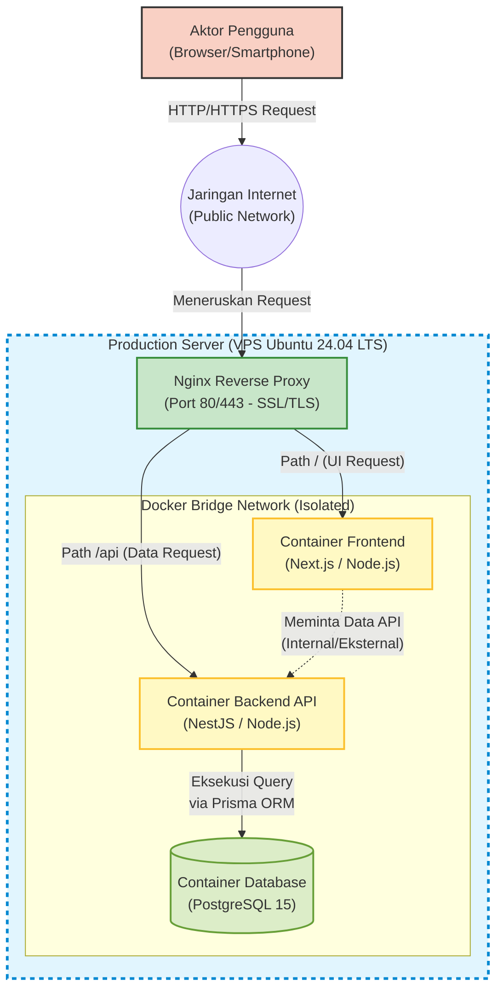
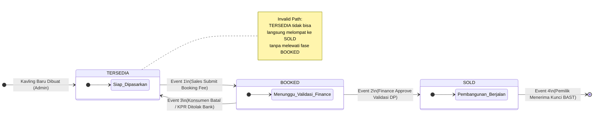
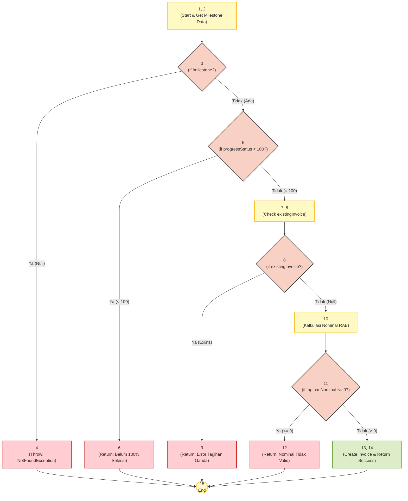

# ABSTRAK

Industri properti merupakan salah satu sektor penggerak utama perekonomian yang menuntut kecepatan, ketepatan, dan transparansi data dalam proses transaksinya. Namun, pada kenyataannya, masih banyak pengembang perumahan (*developer properti*) yang mengandalkan metode pencatatan manual berbasis kertas dan menjalankan proses bisnis yang sangat sekuensial. Permasalahan klasik ini bermuara pada inefisiensi operasional, kesulitan pihak manajemen dalam memantau perputaran arus kas (*cashflow*), serta tingginya risiko miskomunikasi antara divisi Sales, Keuangan, dan Teknik yang sering kali berdampak fatal pada keterlambatan serah terima unit kepada konsumen.

Sebagai solusi atas kompleksitas permasalahan tersebut, penelitian ini merancang dan mengembangkan sebuah sistem *Enterprise Resource Planning* (ERP) berbasis *web* yang dirancang secara spesifik untuk mengorkestrasi ekosistem developer properti. Sistem ini dibangun dengan tumpukan teknologi (*tech stack*) modern, menggunakan kerangka kerja Next.js pada sisi *frontend* dan NestJS pada sisi *backend*, serta didukung oleh keandalan Prisma ORM dan basis data PostgreSQL. Keunggulan inovatif dari sistem ini terletak pada penerapan "Alur Kerja Paralel"—di mana berbagai divisi dapat bekerja secara serentak sesaat setelah pembayaran uang muka divalidasi—serta fitur *Auto-Invoice* yang mengotomatisasi penagihan berdasarkan penyelesaian *Milestone* fisik di lapangan.

Untuk menjamin keandalan, fungsionalitas, dan integritas arsitektur sistem, pendekatan pengujian perangkat lunak dilakukan secara komprehensif. Pengujian *Black Box* diaplikasikan untuk memvalidasi interaksi pengguna akhir terhadap antarmuka sistem (*User Interface*) dan memverifikasi kelancaran alur bisnis. Sementara itu, pengujian *White Box* secara ketat difokuskan pada pengujian logika internal dan kompleksitas algoritma *backend*, khususnya pada modul krusial perhitungan *Milestone* dan pemicu (*trigger*) otomatisasi *Invoice*.

Implementasi sistem ERP terintegrasi ini diharapkan mampu merevolusi tata kelola perusahaan pengembang perumahan ke arah digitalisasi yang paripurna. Hasil akhir dari pengembangan ini diproyeksikan dapat mendongkrak efisiensi waktu penyelesaian proyek, mengamankan perputaran arus kas melalui pemantauan *real-time*, meminimalisasi terjadinya *human error* dalam perhitungan finansial, serta mempercepat terbitnya Berita Acara Serah Terima (BAST) dengan tingkat presisi dan transparansi tingkat tinggi.

---

# KATA PENGANTAR

Puji syukur ke hadirat Tuhan Yang Maha Esa atas segala rahmat, petunjuk, dan karunia-Nya, sehingga penulis dapat menyelesaikan penulisan Laporan Akhir Proyek yang berjudul "Pengembangan Sistem Enterprise Resource Planning (ERP) Developer Properti dengan Penerapan Alur Kerja Paralel dan Otomasi Invoice Berbasis Milestone". Laporan ini disusun sebagai bentuk pertanggungjawaban akademis, dokumentasi teknis, serta perwujudan nyata dari penerapan ilmu *Software Engineering* dalam menyelesaikan permasalahan bisnis berskala industri.

Proses perancangan hingga implementasi arsitektur sistem perangkat lunak yang kompleks ini—yang secara khusus dituntut untuk mampu menjembatani serta menyinkronkan data antar divisi Penjualan, Keuangan, dan Teknik secara simultan—bukanlah sebuah perjalanan yang mudah. Oleh karena itu, penyelesaian proyek dan laporan ini tentu tidak terlepas dari dukungan moril, bimbingan akademis, serta kontribusi pemikiran dari berbagai pihak. Penulis ingin menyampaikan apresiasi dan rasa terima kasih yang sebesar-besarnya kepada dosen pembimbing, para pakar industri, serta rekan-rekan pengembang yang telah mendedikasikan waktu dan tenaga untuk memberikan masukan yang sangat konstruktif.

Penulis menyadari sepenuhnya bahwa, di balik segala upaya keras dan ketelitian yang telah dicurahkan, baik sistem perangkat lunak yang dihasilkan maupun penulisan laporan ini masih memiliki ruang untuk penyempurnaan lebih lanjut. Oleh karenanya, penulis menerima dengan tangan terbuka segala bentuk kritik, saran, maupun diskursus akademis yang bersifat membangun demi perbaikan di masa mendatang. Akhir kata, penulis sangat berharap agar inovasi teknologi yang dihadirkan dalam karya ini dapat memberikan manfaat yang signifikan bagi transformasi digital di sektor industri properti serta menjadi sumbangsih literatur yang bernilai bagi akademisi dan praktisi teknologi informasi.

Padang, 23 Juni 2026

**[Nama Penulis]**

---

# BAB 1: PENDAHULUAN

## 1.1. Latar Belakang Masalah

Industri properti dan *real estate* merupakan salah satu pilar fundamental yang menopang laju pertumbuhan ekonomi nasional. Permintaan terhadap hunian yang terus melonjak secara eksponensial seiring dengan pertambahan populasi menuntut perusahaan pengembang perumahan (*developer properti*) untuk bergerak dengan ritme kerja yang sangat cepat, presisi, dan terstruktur. Mengelola sebuah proyek perumahan bukanlah sekadar perihal membangun struktur fisik bangunan; ia adalah orkestrasi kompleks yang melibatkan manajemen ribuan lembar dokumen legal, perputaran uang bernilai miliaran rupiah, hingga pengawasan terhadap kemajuan kerja ratusan pekerja kasar di lapangan. Dalam skala operasional sebesar ini, sebuah perusahaan mutlak membutuhkan fondasi tata kelola manajerial yang kokoh.

Sayangnya, realitas di lapangan menunjukkan anomali yang kontradiktif. Di tengah pesatnya laju industri, mayoritas developer properti skala menengah hingga ke bawah masih sangat bergantung pada metode pencatatan manajerial yang konvensional dan berbasis kertas (*paper-based*). Data transaksi sering kali berserakan di berbagai format lembar kerja (*spreadsheet*) yang tidak tersinkronisasi. Hal ini melahirkan permasalahan klasik yang masif: manajemen puncak sering kali berada dalam kegelapan karena kesulitan memantau posisi arus kas (*cashflow*) secara *real-time*, sementara di tingkat operasional, risiko terjadinya penjualan ganda (*double-booking*) pada satu unit kavling selalu membayangi akibat lambatnya pembaruan informasi.

Lebih jauh lagi, akar dari keterlambatan penyerahan rumah kepada konsumen sebagian besar disebabkan oleh proses bisnis internal yang masih berjalan secara linear atau sekuensial. Dalam alur tradisional, divisi Teknik baru akan memerintahkan perataan tanah setelah dokumen dari divisi Legal selesai seratus persen, dan divisi Keuangan baru akan menerbitkan tagihan setelah staf lapangan secara fisik membawa kertas laporan dari lokasi proyek. Skema operasional yang kaku ini sering kali memicu hambatan komunikasi (*bottleneck*) dan miskomunikasi yang tajam di antara divisi Sales, Keuangan, dan Teknik, yang pada akhirnya menunda penerbitan Berita Acara Serah Terima (BAST) dan mencederai tingkat kepercayaan konsumen.

Untuk mengurai benang kusut birokrasi dan inefisiensi tersebut, diperlukan sebuah terobosan fundamental melalui digitalisasi proses bisnis. Solusi rasional dan komprehensif yang diusulkan adalah merancang sebuah sistem *Enterprise Resource Planning* (ERP) berbasis *web* yang secara arsitektural dibangun untuk mendukung "Alur Kerja Paralel". Dengan sistem ini, seketika setelah uang tanda jadi (*Booking Fee*) disetujui, mesin ERP akan secara cerdas dan serentak membagi instruksi kerja ke semua divisi terkait secara bersamaan. Untuk mendukung visi sistem reaktif yang haus akan keandalan tinggi dan kemampuan pemrosesan asinkron ini, arsitektur modern Next.js digunakan pada sisi *frontend* guna memastikan antarmuka yang sangat dinamis, sedangkan *framework* NestJS yang kokoh dipadukan dengan efisiensi Prisma ORM dan PostgreSQL dipilih sebagai tulang punggung *backend* untuk menjamin integritas data dalam skala perusahaan (*enterprise*).

## 1.2. Rumusan Masalah

Berdasarkan paparan latar belakang permasalahan di atas, maka rumusan masalah dalam penelitian dan pengembangan sistem ini dapat dijabarkan melalui pertanyaan-pertanyaan akademis berikut:

1.  Bagaimana merancang arsitektur sistem *Enterprise Resource Planning* (ERP) yang mampu mengubah proses bisnis developer properti dari skema sekuensial (linear) menjadi skema Alur Kerja Paralel yang terintegrasi?
2.  Bagaimana membangun logika *backend* untuk mengotomatisasi penerbitan surat tagihan keuangan (*Auto-Invoice*) secara presisi yang dipicu secara langsung oleh pencapaian *Milestone* progres fisik bangunan di lapangan?
3.  Bagaimana menerapkan dan mengevaluasi keandalan fungsionalitas antarmuka serta keamanan logika kode sistem menggunakan metodologi pengujian *Black Box* dan pengujian *White Box* yang berfokus pada modul keuangan dan *Milestone*?
4.  Bagaimana mengimplementasikan protokol "Gerbang Validasi Tiga Pilar" (Legal, Teknik, dan Keuangan) sebagai prasyarat mutlak sebelum sistem mengizinkan pencetakan Berita Acara Serah Terima (BAST)?

## 1.3. Batasan Masalah

Guna menjaga agar fokus penelitian tetap terarah, mendalam, dan tidak melebar dari konteks spesifikasi awal yang telah ditetapkan, maka pengembangan sistem ERP ini dibatasi pada batasan-batasan operasional dan teknis sebagai berikut:

1.  **Cakupan Fungsional (Modul):** Sistem yang dikembangkan difokuskan secara eksklusif pada orkestrasi 3 (tiga) pilar operasional utama developer properti, yakni: Modul Penjualan (Sales), Modul Keuangan (Finance), dan Modul Teknik / Proyek. Sistem ini tidak mencakup pengelolaan modul eksternal seperti penggajian (*Payroll* HRD) atau sistem akuntansi perpajakan tingkat lanjut.
2.  **Platform Aplikasi:** Sistem ERP ini dirancang bangun sepenuhnya sebagai aplikasi berbasis *web* (*Web-Based Application*) dengan desain *responsive* yang dapat diakses melalui peramban standar. Penelitian ini tidak mencakup pengembangan aplikasi *native* untuk platform sistem operasi *mobile* (Android maupun iOS).
3.  **Lingkup Pengujian:** Pengujian *White Box* (*Logic & Path Testing*) dibatasi dan difokuskan secara intensif pada wilayah *backend* yang menangani algoritma perhitungan agregat *Milestone* pembangunan dan pemicu (*trigger*) otomatis sistem penagihan (*Auto-Invoice*).

## 1.4. Tujuan Penelitian / Pengembangan

Sikron dengan rumusan masalah yang telah diidentifikasi, tujuan utama dari penelitian dan pengembangan sistem ERP ini adalah:

1.  Merancang dan mengimplementasikan sistem ERP berbasis *web* yang sukses menerapkan metodologi Alur Kerja Paralel, guna memutus hambatan komunikasi (*bottleneck*) antar divisi di dalam perusahaan pengembang properti.
2.  Membangun mekanisme algoritma cerdas di dalam *backend* yang mampu mengeksekusi sistem *Auto-Invoice*, di mana penerbitan tagihan konsumen terjadi seketika secara terprogram sesaat setelah *Milestone* progres pembangunan disahkan oleh divisi Teknik.
3.  Memastikan tingkat kualitas perangkat lunak (*Software Quality Assurance*) yang sangat tinggi melalui eksekusi pengujian *Black Box* untuk memvalidasi interaksi fungsional pengguna, serta pengujian *White Box* untuk menjamin nihilnya celah logika (*logic flaw*) pada modul perhitungan finansial.
4.  Menyediakan sebuah mekanisme keamanan tingkat logis berupa "Gerbang Validasi Akhir" yang mengunci fitur penerbitan BAST hingga seluruh kewajiban administratif, finansial, dan teknis dinyatakan tuntas seratus persen.

## 1.5. Manfaat Penelitian / Pengembangan

Pengembangan sistem ERP terintegrasi ini diproyeksikan akan memberikan dampak manfaat yang bersifat multidimensional, yang dapat ditinjau dari tiga perspektif utama:

1.  **Bagi Perusahaan (Developer Properti):**
    Sistem ini menjadi katalisator efisiensi operasional. Implementasi *database* terpusat menjamin transparansi data secara absolut antar divisi, meminimalisasi *human error*, serta mempercepat siklus pengerjaan proyek dari tahap pembukaan lahan hingga *handover*. Fitur otorisasi berjenjang yang diterapkan secara ketat bertindak sebagai mekanisme proaktif untuk mencegah potensi kecurangan finansial (*fraud*) atau penjualan ganda.

2.  **Bagi Pihak Konsumen (Pembeli Rumah):**
    Memberikan tingkat kepastian, rasa aman, dan kepuasan pelayanan (*customer satisfaction*) yang tinggi. Otomatisasi alur kerja mencegah terjadinya tagihan "gaib" yang tiba-tiba membengkak di akhir periode, serta menekan risiko keterlambatan serah terima kunci bangunan akibat birokrasi *developer* yang buruk.

3.  **Bagi Pengembang Aplikasi / Ranah Akademis:**
    Proyek ini merupakan demonstrasi langsung dan wadah pembuktian (*Proof of Concept*) terhadap penerapan ilmu rekayasa perangkat lunak (*Software Engineering*) tingkat lanjut. Penelitian ini menyajikan wawasan empiris mengenai implementasi arsitektur modern (Next.js dan NestJS) dalam memecahkan permasalahan sirkulasi bisnis paralel yang rumit, sekaligus menjadi bahan kajian akademis yang kaya mengenai efektivitas metode pengujian *Black Box* dan *White Box* pada sistem berskala *enterprise*.

---

# BAB 2: LANDASAN TEORI

## 2.1. Enterprise Resource Planning (ERP)

Menurut standar industri perangkat lunak dan pakar sistem informasi, *Enterprise Resource Planning* (ERP) didefinisikan sebagai sebuah kerangka kerja (*framework*) sistem informasi terintegrasi yang dirancang untuk mengorkestrasi dan mengotomatisasi proses bisnis inti di dalam suatu organisasi berskala besar. Konsep fundamental dari ERP adalah penggabungan berbagai modul fungsional yang sebelumnya berjalan sendiri-sendiri secara terpisah (*siloed systems*) ke dalam satu landasan basis data yang terpusat (*Single Source of Truth*). Hal ini memungkinkan setiap departemen di dalam perusahaan untuk beroperasi dengan menggunakan serangkaian data yang sama secara serentak.

Karakteristik utama yang membedakan ERP dari perangkat lunak aplikasi biasa terletak pada kemampuannya untuk mendobrak sekat antar departemen. Karakteristik ini ditopang oleh tiga pilar utama: pertama, **sentralisasi *database*** yang mencegah terjadinya duplikasi dan redundansi data; kedua, **integrasi modul fungsional** yang secara mulus menghubungkan sirkulasi kerja antara divisi seperti Penjualan, Keuangan, Sumber Daya Manusia (HRD), dan Operasional Teknik; serta ketiga, **otomatisasi *workflow*** atau alur kerja di mana penyelesaian suatu tugas (*task*) di satu modul akan secara otomatis memicu reaksi komputasional di modul lainnya tanpa intervensi manusia secara manual.

Dalam konteks industri *Real Estate* atau Developer Properti, implementasi sistem ERP bukan lagi sebuah kemewahan, melainkan kebutuhan operasional yang mutlak. Industri properti sarat dengan kompleksitas manajerial yang melibatkan manajemen persediaan unit rumah (kavling), negosiasi penjualan berskala besar, perhitungan perpajakan, hingga pemantauan pembangunan fisik bangunan di lapangan. ERP secara spesifik memberikan manajemen sebuah "kokpit kendali" untuk mengendalikan arus kas (*cashflow*) secara ketat dan memonitor laju progres pembangunan fisik. Melalui sinkronisasi data ini, direksi dapat memastikan bahwa penerimaan uang dari konsumen (*Account Receivable*) selalu sejalan dengan laju pengeluaran dana termin untuk pihak kontraktor (*Account Payable*).

## 2.2. Konsep dan Terminologi Bisnis Properti

Dalam perancangan sistem informasi bagi industri properti, pemahaman teoritis terhadap terminologi dan proses bisnis internal (*domain knowledge*) adalah sebuah prasyarat mutlak. Beberapa konsep fundamental yang diadopsi ke dalam arsitektur sistem ini meliputi:

**Alur Kerja Paralel (*Parallel Workflow*):**
Alur kerja paralel merupakan sebuah paradigma manajemen di mana berbagai divisi dapat mengeksekusi sekumpulan tugas yang berbeda pada waktu yang bersamaan, alih-alih saling menunggu antrean instruksi (alur kerja linear/sekuensial). Dalam manajemen proyek properti tradisional yang linear, divisi Teknik dan Keuangan harus diam menunggu hingga divisi Legal menyelesaikan seluruh dokumen konsumen. Namun, berkat penerapan ERP berbasis sentralisasi data, sebuah pemicu (*trigger*) tunggal—seperti divalidasinya pembayaran tanda jadi (*Booking Fee*) oleh kasir—akan secara simultan memberikan instruksi kepada divisi Legal untuk mengurus KPR, sekaligus memberi otorisasi kepada divisi Teknik untuk segera meratakan tanah di lokasi proyek. Konsep ini memangkas waktu pengerjaan (*lead time*) secara drastis.

**RAB (Rencana Anggaran Biaya) & *Milestone*:**
RAB secara teoretis adalah estimasi rinci mengenai akumulasi biaya material, jasa, dan *overhead* yang dibutuhkan untuk menyelesaikan satu unit fisik bangunan. Di dalam sistem ERP yang dinamis, nilai total RAB tersebut dipecah ke dalam unit-unit pengukuran yang lebih kecil yang disebut sebagai *Milestone*. *Milestone* mendefinisikan titik-titik penyelesaian target fisik (contoh: 20% untuk pondasi, 40% untuk dinding dan atap). Dalam arsitektur *Auto-Invoice*, penyelesaian sebuah *Milestone* bukan hanya sekadar laporan progres fisik, melainkan bertindak secara sistemik sebagai pemicu finansial (*financial trigger*) untuk melepaskan tagihan cicilan kepada pembeli dan membayarkan upah termin kepada mandor pemborong.

**SPK (Surat Perintah Kerja) & BAST (Berita Acara Serah Terima):**
Secara yuridis dan administratif, SPK adalah dokumen otorisasi legal yang diterbitkan oleh manajemen perusahaan kepada pihak ketiga (kontraktor/mandor) sebagai landasan hukum untuk memulai eksekusi pembangunan fisik di lokasi kavling. Tanpa SPK, seluruh aktivitas pembangunan dianggap ilegal dan tidak dapat diklaim pembayarannya. Di ujung siklus proyek, terdapat BAST yang merupakan dokumen peresmian peralihan tanggung jawab dan kepemilikan aset dari pihak *developer* kepada pihak konsumen. Dalam konteks sistem ini, pencetakan BAST dikunci secara komputasional hingga algoritma memvalidasi bahwa seluruh syarat fungsional (lunasnya tagihan dan sempurnanya fisik bangunan) telah tercapai secara paripurna.

## 2.3. Tinjauan Teknologi (*Tech Stack*)

Untuk menopang beban kerja transaksional perusahaan properti yang tinggi (*Enterprise Scale*), sistem ERP ini dibangun di atas fondasi teknologi (*tech stack*) modern yang mengedepankan skalabilitas, keamanan, dan keandalan sistem.

**NestJS (*Backend Framework*):**
NestJS adalah kerangka kerja (*framework*) *backend* berbasis Node.js yang sangat progresif. Berbeda dengan kerangka kerja Node.js konvensional yang sering kali tidak memiliki struktur baku (*opinionated*), NestJS mengadopsi arsitektur berbasis *Module*, *Controller*, dan *Service* yang terinspirasi secara kuat dari Angular. Pemisahan tanggung jawab (*Separation of Concerns*) ini menghasilkan *source code* yang sangat terstruktur, bersih, dan mudah dikelola. Terlebih lagi, NestJS dibangun dengan dukungan penuh (*first-class support*) terhadap bahasa pemrograman TypeScript dan menerapkan konsep *Dependency Injection*. Hal ini sangat memudahkan tim pengembang dalam melakukan penambahan fitur (*scaling*) serta menyederhanakan isolasi komponen saat dilakukan pengujian (Unit Testing).

**Next.js (*Frontend React Framework*):**
Pada sisi antarmuka pengguna, sistem mengandalkan Next.js, sebuah kerangka kerja tangguh di atas ekosistem antarmuka React. Next.js mengatasi kelemahan mendasar dari aplikasi React murni melalui penggabungan teknologi *Server-Side Rendering* (SSR) dan *Client-Side Rendering* (CSR). Dengan rendering berbasis server, aplikasi mampu menyajikan halaman antarmuka data *dashboard* yang berat dalam waktu muat (*load time*) yang sangat singkat karena proses komputasi elemen HTML telah diselesaikan di *server* sebelum dikirim ke peramban. Pendekatan ini tidak hanya menaikkan performa kecepatan secara signifikan, namun juga memberikan *User Experience* (UX) yang sangat reaktif dan mulus layaknya aplikasi *desktop* tanpa memerlukan *refresh* halaman.

**Prisma ORM (*Object-Relational Mapping*):**
Dalam menjembatani komunikasi antara logika *backend* dan basis data relasional, sistem mengimplementasikan Prisma ORM. Prisma adalah piranti *Database Toolkit* generasi baru yang mentransformasikan cara aplikasi Node.js berinteraksi dengan basis data. Secara teoritis, Prisma memetakan relasi tabel secara langsung ke dalam bentuk *Object* TypeScript, menjadikannya sistem ORM yang dijamin aman secara tipe data (*Type-Safety*). Melalui pendekatan *Type-Safe* ini, Prisma secara proaktif mendeteksi kesalahan *query* basis data sejak fase kompilasi (saat kode ditulis), bukan saat sistem berjalan (*runtime*), serta secara fundamental mencegah celah kelemahan serangan injeksi SQL (*SQL Injection*) yang sering terjadi pada penggunaan *raw SQL query*.

**PostgreSQL (*Relational Database*):**
Sebagai wadah utama penyimpanan data, PostgreSQL (*Postgres*) dipilih karena posisinya yang diakui secara global sebagai *Relational Database Management System* (RDBMS) sumber terbuka yang paling tangguh (*robust*). Berbeda dengan basis data NoSQL, sistem ERP yang menangani perhitungan akuntansi, validasi *Booking Fee*, dan histori tagihan menuntut penerapan prinsip integritas relasional (ACID - *Atomicity, Consistency, Isolation, Durability*) yang ketat. PostgreSQL memiliki rekam jejak yang tidak diragukan dalam menangani volume data transaksional finansial yang masif, mendukung *query* agregasi yang sangat kompleks, serta memelihara konsistensi integritas referensial antar jutaan baris relasi data *Invoice* dan data Konsumen.

## 2.4. Teori Pengujian Perangkat Lunak (*Software Testing*)

Pengujian perangkat lunak adalah fase disiplin ilmu dalam *Software Engineering* yang bertujuan untuk menemukan perbedaan antara kondisi sistem aktual dengan kondisi yang disyaratkan (menemukan cacat/*bug*) serta memastikan seluruh fungsionalitas bekerja secara presisi. Dalam pengembangan sistem ERP ini, digunakan pendekatan pengujian secara komprehensif dari luar maupun dalam arsitektur kode.

### 2.4.1. Pengujian *Black Box*

Pengujian *Black Box* (Pengujian Kotak Hitam) didefinisikan sebagai metode pengujian perangkat lunak yang berfokus penuh pada evaluasi spesifikasi fungsional dari aplikasi tanpa perlu membedah struktur internal aliran kontrol, logika algoritma, maupun kode sumber (*source code*). Penguji memosisikan diri layaknya pengguna akhir, memasukkan parameter input ke dalam antarmuka UI/UX dan mengamati kecocokan hasil keluaran (*output*) dengan dokumen spesifikasi awal.

Untuk menghasilkan kasus uji (*test cases*) yang optimal dalam menguji formulir input (seperti form validasi *Booking Fee* atau pendaftaran harga *Milestone*), digunakan dua teknik utama:
1.  ***Equivalence Partitioning* (Partisi Ekuivalensi):** Teknik ini memecah domain input dari sebuah program ke dalam kelas-kelas atau kelompok data yang ekuivalen (sebanding). Logika teoritisnya adalah jika satu masukan dari suatu kelas uji terbukti berhasil mengungkap sebuah cacat, maka seluruh masukan dalam kelas yang sama berpotensi besar mengungkapkan cacat yang sama, sehingga jumlah pengujian dapat ditekan tanpa mengorbankan kualitas.
2.  ***Boundary Value Analysis* (Analisis Nilai Batas):** Merupakan teknik lanjutan dari partisi ekuivalensi yang menargetkan pengujian secara ekstrem pada batas-batas numerik rentang kelas input. Teori pengujian membuktikan bahwa cacat program memiliki kecenderungan probabilitas yang jauh lebih tinggi untuk bersarang di batas-batas ujung sebuah parameter input (misal: tepat pada batas persentase *Milestone* 100%) dibandingkan di angka pertengahan.

### 2.4.2. Pengujian *White Box*

Berlawanan dengan metode *Black Box*, Pengujian *White Box* (Pengujian Kotak Putih atau *Glass Box Testing*) adalah metode pengujian sistem tingkat lanjut yang di desain dengan berbasiskan pemahaman yang utuh terhadap struktur logika operasional dan arsitektur internal algoritma (*source code*). Pengujian ini menuntut keterlibatan langsung dari sang pembuat program atau teknisi *Software Quality Assurance* yang memahami bahasa pemrograman.

Metode pengujian struktural yang diterapkan untuk menjamin keandalan sistem ERP ini, khususnya pada wilayah logika *backend* (pemrosesan *Auto-Invoice*), adalah **Basis Path Testing** (Pengujian Jalur Dasar). Teknik pemodelan ini dipelopori oleh Tom McCabe dan dirancang untuk memastikan bahwa setiap pernyataan logis atau jalur keputusan independen (*decision path*) di dalam sebuah modul perangkat lunak dieksekusi minimal satu kali.

Pendekatan ini berlandaskan pada visualisasi aliran logika algoritma menggunakan **Flowgraph** (Notasi Grafik Alir). Di dalam pemodelan Flowgraph, setiap titik pernyataan berurutan dalam program direpresentasikan sebagai **Node** (simpul), sedangkan panah penunjuk aliran eksekusi kendali logis antar *node* direpresentasikan sebagai **Edge** (sisi).

Untuk mengukur tingkat kerumitan suatu logika program dan merumuskan batas atas (*upper bound*) dari jumlah *test cases* yang mutlak dibutuhkan, digunakan formula metrik perangkat lunak yang disebut **Cyclomatic Complexity**. Rumus matematis dari metrik ini adalah:

**V(G) = E - N + 2**

Di mana:
*   **V(G)** melambangkan nilai Cyclomatic Complexity (Kompleksitas Siklomatis) dari suatu diagram alir *G*.
*   **E** mewakili jumlah total panah penghubung (*Edges*) dalam *Flowgraph*.
*   **N** mewakili jumlah total simpul atau pernyataan fungsional (*Nodes*) dalam *Flowgraph*.

Dengan mengkalkulasikan nilai *Cyclomatic Complexity*, tim pengembang dapat mendeduksi jumlah jalur dasar independen (*independent paths*) yang terdapat di dalam sebuah modul kode. Setiap penambahan jalur pengambilan keputusan (misalnya blok logika *if-else* untuk menolak atau menyetujui tagihan *Invoice*) akan menambah nilai *Cyclomatic*. Dengan terukurnya nilai tersebut, penulis dapat menggaransi bahwa seluruh skenario logika (*branching*) di dalam algoritma *Auto-Invoice* telah teruji kelayakannya secara empiris tanpa ada sebaris kode pun yang luput dari verifikasi.

---

# BAB 3: METODOLOGI PENELITIAN DAN PERANCANGAN SISTEM

## 3.1. Metode Pengembangan Perangkat Lunak

Pengembangan sistem *Enterprise Resource Planning* (ERP) berskala industri menuntut pendekatan rekayasa perangkat lunak yang dinamis dan adaptif. Oleh karena itu, metodologi pengembangan yang diimplementasikan dalam penelitian ini adalah **Agile Software Development** (Pendekatan Tangkas), secara spesifik menggunakan kerangka kerja *Scrum* iteratif. Pemilihan metode *Agile* didasarkan pada argumentasi akademis yang kuat terkait tingkat kompleksitas operasional developer properti yang sangat tinggi. 

Dalam proses perancangan sistem yang melibatkan sinkronisasi lintas divisi (Penjualan, Keuangan, dan Teknik), kebutuhan fungsional dari setiap aktor pengguna (*Role*) sering kali mengalami evolusi seiring dengan pemahaman mereka terhadap alur kerja digital. Model pengembangan tradisional seperti *Waterfall*, yang mengunci spesifikasi di awal fase dan mengeksekusi pengkodean secara sekuensial, terbukti terlalu kaku dan berisiko tinggi menghasilkan sistem yang tidak relevan dengan kondisi dinamis di lapangan. Sebaliknya, metode *Agile* memecah kompleksitas arsitektur ERP ini ke dalam siklus-siklus pengembangan pendek (disebut *Sprint*). Pendekatan iteratif ini memungkinkan tim pengembang untuk merilis potongan-potongan modul secara bertahap (misalnya: Modul Katalog Unit dirilis lebih dulu untuk dievaluasi oleh *Sales*, menyusul kemudian Modul Pencairan Mandor untuk divisi *Finance*). Melalui putaran umpan balik (*feedback loop*) yang konstan dan berkelanjutan dari para pengguna sistem yang otentik, fleksibilitas metodologi *Agile* menggaransi bahwa hasil akhir (*deliverables*) dari aplikasi ERP ini benar-benar selaras dengan kebutuhan spesifik dan alur kerja paralel di lapangan.

## 3.2. Analisis Kebutuhan Sistem (*System Requirements*)

Analisis kebutuhan sistem merupakan fondasi arsitektural yang mendefinisikan apa yang harus mampu dieksekusi oleh sistem dan bagaimana standar kualitas eksekusi tersebut. Analisis ini dipecah ke dalam dua klasifikasi utama:

### 3.2.1. Kebutuhan Fungsional (*Functional Requirements*)

Kebutuhan fungsional memetakan secara spesifik daftar fungsionalitas dan fitur operasional yang diwajibkan ada di dalam sistem, diklasifikasikan berdasarkan batasan hak akses atau peran aktor penggunanya (*Role-Based*):

*   **Bagi Aktor Sales (Tenaga Pemasar):**
    *   Sistem wajib menyediakan katalog ketersediaan unit kavling (*Siteplan*) yang terbarui secara instan (*real-time*).
    *   Sistem harus memampukan aktor untuk menghasilkan simulasi perhitungan cicilan (KPR maupun *Cash* Bertahap) secara otomatis berdasarkan harga dasar dan *markup* khusus.
    *   Sistem wajib menyediakan antarmuka penginputan data pesanan konsumen baru dan fasilitas unggah (*upload*) dokumen resi bukti transfer *Booking Fee*.
*   **Bagi Aktor Finance (Divisi Keuangan):**
    *   Sistem harus menyediakan panel rekonsiliasi untuk melakukan persetujuan (Validasi) atau penolakan (*Reject*) terhadap setoran uang muka dari konsumen.
    *   Sistem harus memiliki kemampuan logika untuk secara algoritmik menghitung dan menahan (*hold*) pembayaran persentase retensi kepada mandor hingga masa garansi bangunan dinyatakan usai.
*   **Bagi Aktor Teknik (Pengawas Lapangan & Admin Proyek):**
    *   Sistem harus menyediakan fitur pembentukan dan pemecahan Rencana Anggaran Biaya (RAB) ke dalam persentase termin tahapan fisik (*Milestone*).
    *   Sistem harus memampukan aktor untuk menerbitkan Surat Perintah Kerja (SPK) yang terikat langsung dengan data kavling dan mandor yang berwenang.
*   **Fungsionalitas Sistemik (Otomatisasi Sistem):**
    *   Sistem harus bertindak secara otonom dalam menerbitkan surat tagihan atau termin (*Auto-Invoice*) pada detik yang sama ketika aktor Teknik mengeklik persetujuan bahwa sebuah *Milestone* fisik telah rampung.
    *   Sistem wajib menerapkan mekanisme "Gerbang Validasi 3 Pilar" yang mengunci dan mencegah aktor manapun untuk mencetak Berita Acara Serah Terima (BAST) apabila masih terdapat tagihan keuangan yang menunggak atau progres fisik yang belum mencapai angka 100%.

### 3.2.2. Kebutuhan Non-Fungsional (*Non-Functional Requirements*)

Kebutuhan non-fungsional tidak mendefinisikan apa yang sistem lakukan, melainkan mengikat metrik seberapa baik dan aman sistem tersebut dalam beroperasi:

*   **Keamanan Data (*Security*):** Seluruh kata sandi pengguna wajib dienkripsi menggunakan fungsi *hashing* kriptografis (*Bcrypt*) di dalam *database*. Otentikasi sesi *login* pengguna harus dijaga dengan tingkat keamanan tingkat lanjut menggunakan *JSON Web Token* (JWT) yang memiliki batas kedaluwarsa.
*   **Performa & Aksesibilitas (*Performance & Accessibility*):** Mengingat antarmuka digunakan oleh para pengawas lapangan yang bekerja secara nomaden di lokasi proyek, desain *frontend* wajib mengadopsi prinsip *Mobile-First Responsiveness*. Antarmuka harus menyesuaikan diri secara elegan di berbagai resolusi layar *smartphone*. Selain itu, waktu respon dari setiap panggilan *API* (kecuali pembuatan laporan agregat raksasa) diwajibkan berada di bawah ambang batas 500 milidetik (*milliseconds*) guna menjaga pengalaman pengguna yang mulus.

## 3.3. Arsitektur Sistem (*System Architecture*)

Dalam upaya mencapai tingkat modularitas dan skalabilitas tingkat *Enterprise*, perancangan sistem ERP ini mengimplementasikan konsep **Arsitektur Klien-Server yang Dipisahkan** (*Decoupled Client-Server Architecture*). Berlawanan dengan arsitektur monolitik yang menggabungkan logika presentasi (UI) dan logika basis data dalam satu kesatuan yang kaku, arsitektur terpisah ini membelah sistem menjadi dua entitas independen yang hanya berkomunikasi melalui bahasa standar *Application Programming Interface* (API).

Sisi Klien (*Client-Side*) dibangun dengan menggunakan ekosistem *React.js* melalui kerangka kerja *Next.js*. Ketika pengguna (seperti Sales atau Finance) mengakses aplikasi melalui peramban web (*browser*), sisi klien ini bertindak sebagai sebuah *Single Page Application* (SPA) interaktif yang menata antarmuka (*User Interface*). Seluruh manipulasi visual, transisi halaman, dan validasi formulir awal dieksekusi di sisi klien untuk memberikan sensasi responsivitas instan tanpa membebani server utama.

Untuk melakukan pertukaran data bisnis, sisi klien akan mengirimkan serangkaian permintaan HTTP asinkron berformat JSON menuju Sisi Server (*Server-Side*). Di sinilah kerangka kerja *NestJS* mengambil alih peran krusial. Bertindak sebagai *API Gateway* dan *Business Logic Layer*, NestJS menerima rute permintaan, memvalidasi token JWT sekuritas, dan menjalankan algoritma perhitungan (misalnya proses eksekusi perhitungan *Milestone*).

Namun, NestJS tidak diizinkan untuk berbicara langsung dengan basis data fisik. Untuk menjamin keamanan maksimal dari potensi peretasan *SQL Injection*, sistem menginjeksi sebuah lapisan perantara tambahan (*middleware*), yakni **Prisma ORM**. Prisma bertindak sebagai penterjemah mutlak (*Query Builder*) yang menerima instruksi objek TypeScript dari NestJS, memastikan keabsahan tipe datanya (*Type-Safety*), dan kemudian mengubahnya menjadi *query* relasional SQL yang dioptimalkan sebelum akhirnya mengeksekusinya di dalam mesin *database* **PostgreSQL**. Jika operasi berhasil, aliran data akan mengalir mundur (*upstream*) dari PostgreSQL ke Prisma, dikemas oleh NestJS menjadi format JSON standar, dan dikembalikan ke klien Next.js untuk divisualisasikan kepada mata pengguna.

## 3.4. Perancangan Basis Data (*Database Design*)

Sebagai sistem ERP yang merekam jejak aktivitas operasional perusahaan properti secara presisi dan komprehensif, penyusunan arsitektur data mutlak membutuhkan ketegasan integritas relasional (ACID). Oleh karena itu, skema yang digunakan adalah *Relational Database* menggunakan mesin PostgreSQL. Sistem basis data dirancang untuk menangani tingginya frekuensi mutasi keterkaitan data.

Struktur fisik basis data dibentuk oleh beberapa tabel entitas utama berikut beserta narasi relasi (*Cardinality*) antartabelnya:

1.  **Tabel `Users` (Pengguna):** Merupakan repositori otentikasi yang menyimpan kredensial *login* (nama, email terenkripsi, *password hash*, dan penetapan batas *Role* wewenang). Setiap rekam jejak (*audit trail*) yang terjadi di seluruh sistem (siapa yang menekan tombol *approve* atau batal) selalu direlasikan kembali secara absolut ke ID pengguna di tabel ini.
2.  **Tabel `Kavling` (Master Lahan):** Menyimpan koordinat identitas inventaris fisik. Mencakup nama blok, dimensi luas tanah, orientasi hadap, tipe dasar rumah, hingga status terkini ketersediaannya (*Available/Booked/Sold*).
3.  **Tabel `Pesanan` (Transaksi Induk):** Ini adalah jantung pertemuan antara aktor eksternal dan internal. Menyimpan data konsumen dan nominal *Booking Fee*. Tabel `Pesanan` memiliki kardinalitas relasi *One-to-One* (1:1) dengan tabel `Kavling`, menegaskan hukum fisik bahwa satu kavling hanya dapat dikunci secara sah oleh satu transaksi pesanan konsumen yang valid.
4.  **Tabel `RAB` dan `Milestone` (Rencana Anggaran & Termin):** Tabel `RAB` bertindak sebagai induk pagu harga dari sebuah tipe bangunan. Tabel `RAB` memiliki relasi *One-to-Many* (1:N) terhadap tabel anak `Milestone`. Hal ini karena satu desain rumah senilai 200 Juta Rupiah (Satu `RAB`) di lapangan akan senantiasa dipecah-pecah konstruksinya menjadi 4 hingga 5 termin persentase pencapaian kerja (Banyak `Milestone`).
5.  **Tabel `Invoices` (Tagihan Keuangan):** Merupakan muara akhir perputaran uang. Tabel ini menyimpan catatan hutang piutang konsumen maupun kontraktor. Tabel `Pesanan` memiliki relasi *One-to-Many* (1:N) secara asimetris terhadap tabel `Invoices`. Sebuah transaksi `Pesanan` pembelian rumah secara *cash* bertahap akan melahirkan berlembar-lembar riwayat cicilan `Invoices` dari bulan ke bulan hingga akhirnya terlunasi sempurna.

## 3.5. Pemodelan Sistem Berorientasi Objek (UML - *Unified Modeling Language*)

Untuk mendokumentasikan spesifikasi, visualisasi, dan merancang kerangka arsitektur logis rekayasa perangkat lunak sebelum fase pengkodean dimulai, penelitian ini mengaplikasikan standar internasional grafis UML (*Unified Modeling Language*). Tiga diagram krusial yang menopang pemahaman arsitektur ERP ini adalah sebagai berikut:

### 3.5.1. *Use Case Diagram*

*Use Case Diagram* menyajikan pemetaan interaktif dari sudut pandang level atas (helikopter), mendefinisikan batasan wilayah kerja fungsional di antara aktor-aktor utama sistem. Terdapat empat entitas *Aktor* fungsional di dalam ruang lingkup ERP ini:
*   **Aktor Sales:** Aktor ini dibatasi haknya untuk mengeksekusi *use case* "Melihat Katalog Siteplan", "Mengakses Simulasi KPR", dan "Menambahkan Input Pesanan Baru". Mereka secara ketat dihalangi untuk mengeksekusi fungsi pembatalan atau *refund* transaksi.
*   **Aktor Finance:** Berperan ganda sebagai penjaga *database* uang. Memiliki otorisasi eksklusif untuk mengeksekusi *use case* "Validasi Booking Fee", "Persetujuan Pencairan Upah Mandor", dan "Mencetak *Invoice* Resmi".
*   **Aktor Teknik:** Pemegang otorisasi pembangunan fisik. Mengeksekusi *use case* "Pembuatan Dokumen SPK" dan "Mengunggah Laporan Persentase *Milestone* Fisik".
*   **Aktor Super Admin (Owner):** Bertindak layaknya sistem root yang mengawasi seluruh aktivitas. Selain dapat mengakses mode "Melihat Laporan Keuangan Agregat (*Dashboard*)", ia memiliki wewenang puncak (*overriding privilege*) untuk mengeksekusi *use case* "Cetak Dokumen Legal BAST".

### 3.5.2. *Activity Diagram* (Siklus Alur Kerja Paralel)

Diagram aktivitas (*Activity Diagram*) membedah *unique selling proposition* (USP) dari arsitektur ERP ini: kapabilitas eksekusi Alur Kerja Paralel.
Proses dimulai dari simpul awal ketika Aktor Sales mendaftarkan data sebuah kavling berstatus "Tanah Kosong". Aktivitas berlanjut menjadi linear (satu arah) manakala konsumen diwajibkan mentransfer uang tanda jadi (*Booking Fee*), yang kemudian direspons oleh aktivitas Aktor Finance berupa klik tombol persetujuan (*Approve Booking*). 

Di titik krusial inilah *Activity Diagram* menampilkan **simpul percabangan (Fork)**. Sebuah simpul *Fork* dalam terminologi UML menginstruksikan sistem untuk memecah alur kendali tunggal menjadi tiga utas jalur proses atau aktivitas (utas *threads*) yang dieksekusi secara berbarengan atau paralel, yaitu:
1.  **Jalur Legal:** Sistem memicu divisi Legal untuk memulai pengumpulan persyaratan dan memproses administrasi persetujuan KPR dengan lembaga perbankan.
2.  **Jalur Teknik:** Sistem melepaskan gembok pada modul SPK, memberikan otorisasi kepada pengawas lapangan untuk mengerahkan alat berat dan memulai tahap pemecahan fondasi.
3.  **Jalur Finance:** Sistem memulai hitung mundur untuk menagih jadwal persentase cicilan Uang Muka (DP) pertama dari konsumen.

Ketiga jalur fungsionalitas ini akan terus berpacu dalam lintasannya masing-masing hingga pembangunan selesai. Pada akhirnya, ketiga utas aktivitas ini akan dipaksa untuk bertemu kembali di sebuah **simpul penyatuan (Join)**. Simpul *Join* ini adalah wujud konkret dari Gerbang Validasi BAST; di mana arus kontrol sistem tidak akan pernah bisa melangkah ke aktivitas terminal akhir (Pencetakan BAST dan Penyerahan Kunci) jika salah satu utas paralel (baik itu fisik rumah, kelengkapan KPR bank, maupun pelunasan denda) belum berstatus komplet.

### 3.5.3. *Sequence Diagram* (Logika *Auto-Invoice*)

*Sequence Diagram* (Diagram Urutan) menyelam lebih dalam ke wilayah teknis arsitektur untuk memvisualisasikan pertukaran pesan komputasional (*message passing sequence*) antarkomponen arsitektur secara kronologis seiring berjalannya waktu. Salah satu logika yang paling kompleks adalah mekanisme algoritma *Auto-Invoice*. 

Urutan pertukaran pesan digambarkan sebagai berikut:
1.  Aktor **Pengawas Lapangan (Teknik)** memulai urutan (*sequence*) dengan menekan sebuah tombol "Konfirmasi 100% Selesai" pada sebuah *Milestone* di layar *smartphone* (komponen **Frontend UI / Next.js**).
2.  **Frontend UI** segera membungkus permintaan (*request*) tersebut lengkap dengan bukti foto lampiran (*payload*), lalu mengirimkan pesan HTTP POST secara asinkron ke wilayah server, menargetkan *endpoint* spesifik di komponen **API Controller (NestJS)**.
3.  Di dalam server, **API Controller** mendelegasikan beban hitung ke *Service Layer*, yang kemudian memanggil perantara **Prisma ORM** untuk mengeksekusi pesan modifikasi `UPDATE status` pada tabel *Milestone* di komponen basis data **PostgreSQL**.
4.  Segera sesudah **PostgreSQL** merespon berhasil, logika algoritma di sisi *Service Layer NestJS* tidak berhenti; ia secara implisit (*Trigger/Event*) membaca besaran bobot persentase dari *Milestone* tersebut, menghitung kalkulasi rupiahnya berdasarkan nilai total RAB rumah, dan secara instan mengirimkan pesan persetujuan internal untuk melakukan `INSERT INTO` (penambahan) baris data tagihan baru ke dalam tabel *Invoices* di **PostgreSQL**.
5.  Sebagai rantai reaksi akhir dari *sequence* logis ini, **NestJS** mengirimkan respons status 201 (Created) kembali ke **Frontend UI**, yang mana langsung secara otomatis memunculkan draf tagihan cicilan baru ke dalam layar antarmuka *dashboard* Aktor **Finance** secara *real-time*.

---

# BAB 4: IMPLEMENTASI DAN PENGUJIAN SISTEM

Bab ini menguraikan tahapan realisasi konkret dari desain arsitektur dan spesifikasi fungsional yang telah dipaparkan pada Bab 3, mengubahnya menjadi bentuk wujud perangkat lunak (*software*) fungsional yang siap beroperasi. Fase implementasi ini tidak hanya mencakup penulisan kode (*coding*), melainkan juga penyusunan lingkungan server (*server environment*), konfigurasi basis data, serta arsitektur penerapan (*deployment*) ke ranah *production*. 

Lebih lanjut, bagian kedua dari bab ini akan mendokumentasikan secara komprehensif serangkaian pengujian (*Software Testing*) yang dieksekusi untuk memverifikasi tingkat keandalan, memvalidasi presisi logika, dan memastikan bahwa sistem secara absolut terbebas dari kecacatan fungsional (*bugs*) sebelum diserahterimakan kepada pihak perusahaan.

## 4.1. Lingkungan Implementasi (*Implementation Environment*)

Agar sistem *Enterprise Resource Planning* (ERP) yang menuntut kapabilitas pemrosesan asinkron yang tinggi ini dapat beroperasi secara optimal, stabil, dan aman dari gangguan, pemilihan lingkungan perangkat keras dan perangkat lunak yang menopangnya (*underlying infrastructure*) harus dilakukan melalui perhitungan presisi. Sistem ini dideploy ke dalam *Virtual Private Server* (VPS) berskala industri guna menampung lalu lintas (*traffic*) pertukaran data yang intens antara para aktor lapangan dan kantor pusat.

### 4.1.1. Lingkungan Perangkat Keras (*Hardware*)

Kinerja tinggi dari basis data relasional serta mesin komputasi *backend* (Node.js) menuntut prasyarat spesifikasi perangkat keras (*hardware*) peladen (*server*) yang mumpuni. Berikut adalah spesifikasi minimal perangkat keras *Virtual Private Server* (VPS) *Production* yang digunakan untuk mendeploy keseluruhan komponen sistem ini:

| Komponen Perangkat Keras | Spesifikasi *Production* Minimal | Fungsi Operasional dalam Sistem |
| :--- | :--- | :--- |
| **Prosesor (CPU)** | 4 *Virtual Cores* (*vCPU*), Arsitektur x86_64 atau ARM64, *Base Clock* ≥ 2.5 GHz | Menangani kalkulasi fungsi kriptografi (enkripsi JWT/Bcrypt) secara mulus dan memproses ratusan permohonan HTTP (*HTTP Requests*) secara simultan per detik (Node.js *Event Loop*). |
| **Memori (RAM)** | 8 GB DDR4 (Atau lebih besar) | Menjaga stabilitas eksekusi instansiasi *Container* Docker, *caching* *query* basis data tingkat lanjut oleh Prisma ORM, serta mencegah ancaman kebocoran memori (*Memory Leak*) atau *Out Of Memory* (OOM). |
| **Penyimpanan (*Storage*)** | 100 GB *Solid State Drive* (NVMe SSD) | Menampung secara leluasa rekam jejak berkas *database* PostgreSQL, menampung log aplikasi (*application logs*), serta menyimpan ratusan *file* statis berupa dokumen unggahan resi transfer atau foto bukti fisik *Milestone*. |
| **Bandwidth & Jaringan** | *Dedicated* 1 Gbps, *Public Static IPv4* | Menggaransi tingkat kelambatan (*latency*) serendah mungkin saat sistem diakses dari lokasi proyek perumahan yang seringkali memiliki sinyal seluler kurang stabil, serta memberikan *IP Public* untuk konfigurasi *Domain Name System* (DNS). |

### 4.1.2. Lingkungan Perangkat Lunak (*Software*)

Selain bertumpu pada perangkat keras, peranti lunak penopang (*Software Environment*) dituntut harus selaras dengan teknologi web modern untuk menjamin tingkat keamanan dan kemudahan pemeliharaan (*maintainability*). Berikut adalah tumpukan perangkat lunak (*Tech Stack*) yang diimplementasikan di dalam server *Production*:

| Nama Perangkat Lunak / *Framework* | Versi Stabil (Saat Implementasi) | Fungsi Spesifik dan Alasan Pemilihan Arsitektural |
| :--- | :--- | :--- |
| **Ubuntu Linux Server** | 24.04 LTS (Noble Numbat) | Bertindak sebagai Sistem Operasi (OS) *host* utama pada peladen *production* yang menyediakan stabilitas tingkat *Enterprise*, keamanan berkas (UFW/Iptables), dan efisiensi manajemen sumber daya. |
| **Node.js Runtime** | v20.x (LTS) | Mesin komputasi berbasis *V8 JavaScript Engine* untuk mengeksekusi secara asinkron seluruh *logic* dari komponen *backend* NestJS maupun prapemrosesan SSR komponen *frontend* Next.js. |
| **Docker Engine & Compose** | v24.0+ | Melakukan isolasi aplikasi ke dalam wujud "Kontainer" (*Containerization*), memastikan lingkungan *development* di laptop identik secara presisi dengan lingkungan di *server*, serta mencegah konflik *dependency*. |
| **PostgreSQL Database** | v15.x | Mesin Sistem Manajemen Basis Data Relasional (RDBMS) utama, dipilih karena kemampuannya yang sangat tangguh menjaga integritas data transaksional (ACID) yang kompleks seperti relasi *Auto-Invoice*. |
| **NestJS (*Backend API*)** | v10.x | Kerangka kerja Node.js berbasis TypeScript yang menyediakan struktur ter-standar (*opinionated*), mengelola sistem validasi, dan menampung seluruh logika kalkulasi *business rules* sistem. |
| **Next.js (*Frontend UI*)** | v14.x (App Router) | *Framework React* tingkat lanjut yang bertugas menderetkan antarmuka pengguna grafis (GUI) melalui peramban, serta secara proaktif mengoptimalkan waktu respons (*Load Time*) via teknologi *Server-Side Rendering*. |
| **Prisma ORM** | v5.x | Lapisan *middleware Database Toolkit* (ORM) terotomatisasi yang menerjemahkan model TypeScript menjadi kueri SQL murni serta bertindak sebagai perisai pelindung utama sistem dari kelemahan peretasan *SQL Injection*. |

## 4.2. Arsitektur Implementasi & *Deployment*

Strategi penerapan (*deployment strategy*) ke lingkungan server *production* tidak menggunakan metode konvensional (*bare-metal instalation*), melainkan secara utuh mengadopsi prinsip **Kontainerisasi (Containerization)** melalui platform **Docker**. Pendekatan berorientasi layanan mikro (*microservice-oriented*) ini diaplikasikan dengan memisahkan arsitektur *Frontend*, *Backend*, dan mesin *Database* ke dalam tiga entitas kontainer yang terisolasi sepenuhnya. 

Isolasi kontainer (*Container Isolation*) memberikan garansi fungsionalitas yang luar biasa: jika terjadi *crash* fatal akibat beban lalulintas (*traffic spike*) pada kontainer *Frontend*, hal tersebut sama sekali tidak akan menjalar hingga menumbangkan kontainer *Database*. Selain itu, Docker Compose difungsikan sebagai orkestrator sentral (*orchestrator*) yang mengatur jaringan tertutup (*Virtual Private Bridge Network*) antar kontainer. Melalui jaringan tertutup ini, kontainer *Backend* (NestJS) dapat berkomunikasi langsung dengan kontainer *Database* (PostgreSQL) tanpa mengekspos gerbang basis data ke jaringan internet publik, sehingga mereduksi ancaman peretasan (*surface attack*) secara eksponensial.

Untuk memvisualisasikan lebih tajam mengenai bagaimana lalu lintas klien peramban disalurkan dan diorkestrasi masuk ke dalam ekosistem *server*, berikut adalah diagram pemodelan arsitektur *deployment* dari sistem ini:



## 4.4. Pengujian *Black Box* (*Black Box Testing*)

Fase pengujian perangkat lunak (*Software Testing*) diawali dengan pelaksanaan metodologi *Black Box Testing* (Pengujian Kotak Hitam). Pendekatan empiris ini dieksekusi murni untuk memvalidasi fungsionalitas faset eksternal sistem, yakni kelancaran interaksi pada antarmuka *Frontend* (Next.js) serta keandalan respons balasan dari antarmuka pemrograman aplikasi atau *API* (NestJS). Pengujian ini secara sengaja mengabaikan inspeksi terhadap struktur internal (*source code*) dan algoritma *database*, memosisikan teknisi penguji seolah-olah sebagai *end-user* (pengguna akhir) yang hanya berinteraksi melalui formulir masukan (*input forms*) dan layar antarmuka.

Untuk memastikan bahwa fungsionalitas sistem telah memenuhi *System Requirements* yang disepakati pada Bab 3, pengujian *Black Box* ini tidak dilakukan secara acak (*ad-hoc testing*), melainkan dikerucutkan menggunakan empat teknik partisi pengujian yang spesifik, ilmiah, dan terstruktur, yakni: *Equivalence Partitioning*, *Boundary Value Analysis*, *State Transition Testing*, dan *Decision Table Testing*. Keempat teknik ini secara kolektif memberikan cakupan pengujian (*test coverage*) yang sangat menyeluruh, mencakup validasi data masukan, batas numerik, siklus hidup entitas, serta kombinasi logika keputusan sistem.

### 4.4.1. Pengujian dengan Teknik *Equivalence Partitioning* (EP)

*Equivalence Partitioning* (Partisi Ekuivalensi) merupakan metode analisis ranah masukan (*input domain*) di mana sekumpulan data masukan direduksi ke dalam dua kelas atau partisi logis: Kelas Valid (data yang sesuai dengan aturan sistem) dan Kelas Invalid (data yang melanggar aturan sistem). Berdasarkan teori rekayasa perangkat lunak, apabila sistem berhasil menangani satu data sampel dari suatu kelas partisi dengan benar, maka probabilitasnya sangat tinggi bahwa sistem akan memberikan respons yang identik untuk seluruh anggota data dalam kelas partisi yang sama. Metode ini secara drastis mengeliminasi jumlah kasus uji (*test cases*) yang redundan tanpa mengorbankan kedalaman cakupan pengujian.

Pengujian EP diaplikasikan pada tiga modul fungsional utama: Modul Autentikasi (*Login*), Modul Sales (*Booking Fee*), dan Modul Finance (*Validasi Pembayaran*).

#### a. Pengujian EP pada Modul Autentikasi (*Login*)

Modul *Login* merupakan gerbang masuk (*entry gate*) pertama yang menentukan hak akses setiap aktor ke dalam sistem. Pengujian EP pada modul ini memastikan bahwa mekanisme autentikasi berbasis JWT (*JSON Web Token*) dan enkripsi Bcrypt berfungsi tanpa celah.

**Tabel 4.1a. Skenario Pengujian *Equivalence Partitioning* (Form *Login*)**

| ID Uji | Skenario Pengujian | Kelas Data | Input Data (*Mock Data*) | Hasil yang Diharapkan (*Expected Result*) | Hasil Aktual (*Actual Result*) | Kesimpulan |
| :--- | :--- | :---: | :--- | :--- | :--- | :---: |
| **EP-L01** | Memasukkan kredensial (*email* dan *password*) yang valid dan terdaftar di dalam basis data PostgreSQL. | **Valid** | Email: `admin@erp.id`; Password: `Admin123!` | Sistem memvalidasi *hash* Bcrypt, menerbitkan token JWT, dan mengarahkan pengguna ke halaman *Dashboard* sesuai perannya (*role-based redirect*). | Sistem berhasil mencocokkan *hash* dan mengarahkan pengguna ke *Dashboard* role-nya masing-masing sesuai rancangan. | **[ LULUS ]** |
| **EP-L02** | Memasukkan alamat *email* yang valid secara format namun tidak terdaftar di dalam basis data. | **Invalid** | Email: `tidak.ada@erp.id`; Password: `Test123!` | Sistem merespons dengan pesan galat generik "Email atau Password salah" tanpa mengungkap informasi apakah *email* terdaftar atau tidak (*security best practice*). | Sistem merespons dengan pesan galat ambigu dan tidak membocorkan informasi registrasi *email* sesuai rancangan. | **[ LULUS ]** |
| **EP-L03** | Memasukkan alamat *email* yang terdaftar namun dengan *password* yang tidak cocok. | **Invalid** | Email: `admin@erp.id`; Password: `SalahPassword` | Sistem menolak autentikasi dan menampilkan pesan galat yang sama dengan EP-L02 untuk mencegah *brute-force enumeration*. | Sistem memblokir akses dan menampilkan pesan galat yang konsisten tanpa membedakan jenis kesalahan sesuai rancangan. | **[ LULUS ]** |
| **EP-L04** | Mencoba mengirimkan formulir *login* dengan kedua *field* (*email* dan *password*) dalam keadaan kosong. | **Invalid** | Email: *(Kosong)*; Password: *(Kosong)* | Validasi sisi klien (*client-side validation*) memblokir pengiriman formulir dan menandai kedua *field* dengan indikator merah. | Sistem berhasil menahan pengiriman formulir kosong pada tingkat *Frontend* tanpa membebani *API backend* sesuai rancangan. | **[ LULUS ]** |

#### b. Pengujian EP pada Modul Sales (*Booking Fee*)

Formulir Input Pesanan dan *Booking Fee* merupakan instrumen vital yang memicu seluruh Alur Kerja Paralel. Akurasi validasi pada formulir ini akan menentukan integritas data yang mengalir ke divisi Finance, Legal, dan Teknik secara simultan.

**Tabel 4.1b. Skenario Pengujian *Equivalence Partitioning* (Form Input *Booking Fee*)**

| ID Uji | Skenario Pengujian | Kelas Data | Input Data (*Mock Data*) | Hasil yang Diharapkan (*Expected Result*) | Hasil Aktual (*Actual Result*) | Kesimpulan |
| :--- | :--- | :---: | :--- | :--- | :--- | :---: |
| **EP-B01** | Mengisi seluruh *field* wajib (Nama, NIK, Nominal) dan mengunggah bukti resi format gambar standar. | **Valid** | Nama: Budi Santoso; NIK: 3201041505990001; Nominal: 5000000; File: `bukti_transfer.jpg` (1.5 MB). | Sistem memproses permintaan, menyimpan data ke PostgreSQL, mengubah status kavling menjadi BOOKED, dan menavigasi pengguna ke halaman sukses. | Sistem berhasil memvalidasi format berkas, memutasi status kavling, dan merespons dengan status HTTP 201 (Created) sesuai rancangan. | **[ LULUS ]** |
| **EP-B02** | Mencoba mengirimkan formulir dengan membiarkan parameter identitas esensial (NIK) dalam keadaan kosong (*null*). | **Invalid** | Nama: Budi Santoso; NIK: *(Kosong)*; Nominal: 5000000; File: `bukti_transfer.jpg`. | *Frontend* memblokir pengiriman (*submit*) dan menampilkan teks peringatan merah "NIK wajib diisi". | Sistem berhasil menahan injeksi *null* dan memunculkan notifikasi validasi wajib isi pada antarmuka sesuai rancangan. | **[ LULUS ]** |
| **EP-B03** | Mengunggah tipe berkas dokumen yang tidak diizinkan pada komponen *upload* gambar bukti resi. | **Invalid** | Nama: Budi Santoso; NIK: 3201041505990001; Nominal: 5000000; File: `dokumen_perjanjian.pdf`. | Komponen validasi (MIME-Type) mendeteksi ketidaksesuaian dan menolak unggahan *file* ekstensi `.pdf`. | Sistem berhasil mendeteksi penolakan format `.pdf` dan menampilkan galat "Hanya gambar JPG/PNG yang diizinkan" sesuai rancangan. | **[ LULUS ]** |
| **EP-B04** | Mengunggah berkas gambar yang valid namun melebihi batas ukuran maksimum yang diizinkan (*file size limit*). | **Invalid** | Nama: Budi Santoso; NIK: 3201041505990001; Nominal: 5000000; File: `foto_resolusi_tinggi.jpg` (15 MB). | Sistem menolak unggahan berkas yang melebihi batas 5 MB dan menampilkan pesan peringatan ukuran. | Sistem berhasil memblokir unggahan berkas berlebih dan merespons dengan pesan "Ukuran file maksimal 5MB" sesuai rancangan. | **[ LULUS ]** |
| **EP-B05** | Memasukkan format NIK yang tidak memenuhi panjang standar 16 digit angka (kurang dari 16 digit). | **Invalid** | Nama: Budi Santoso; NIK: 320104; Nominal: 5000000; File: `bukti_transfer.jpg`. | Validasi *regex* pada *Frontend* mendeteksi format NIK tidak standar dan memblokir pengiriman formulir. | Sistem berhasil mendeteksi anomali panjang NIK dan menampilkan galat "Format NIK harus 16 digit angka" sesuai rancangan. | **[ LULUS ]** |

#### c. Pengujian EP pada Modul Finance (*Validasi Pembayaran*)

Modul Finance menangani operasi yang sangat sensitif secara finansial. Pengujian EP pada modul ini difokuskan pada mekanisme validasi dan persetujuan pembayaran (*payment approval*).

**Tabel 4.1c. Skenario Pengujian *Equivalence Partitioning* (Validasi Pembayaran Finance)**

| ID Uji | Skenario Pengujian | Kelas Data | Input Data (*Mock Data*) | Hasil yang Diharapkan (*Expected Result*) | Hasil Aktual (*Actual Result*) | Kesimpulan |
| :--- | :--- | :---: | :--- | :--- | :--- | :---: |
| **EP-F01** | Admin Finance menekan tombol "Approve" pada pesanan yang berstatus BOOKED dan memiliki bukti resi valid. | **Valid** | Pesanan ID: ORD-001; Status: BOOKED; Bukti Transfer: Ada. | Sistem memperbarui status pesanan menjadi SOLD, memicu Alur Kerja Paralel (Sales, Legal, Teknik), dan mencatat *timestamp* persetujuan. | Sistem berhasil memutasi status ke SOLD dan mengirim sinyal pemicu paralel ke tiga divisi sesuai rancangan. | **[ LULUS ]** |
| **EP-F02** | Admin Finance mencoba melakukan persetujuan pada pesanan yang belum memiliki lampiran bukti transfer (*attachment null*). | **Invalid** | Pesanan ID: ORD-002; Status: BOOKED; Bukti Transfer: *(Tidak Ada)*. | Sistem memblokir persetujuan dan menampilkan galat "Bukti transfer wajib dilampirkan sebelum validasi". | Sistem berhasil mencegah persetujuan tanpa bukti dan merespons dengan *HTTP 422 Unprocessable Entity* sesuai rancangan. | **[ LULUS ]** |
| **EP-F03** | Admin Finance mencoba melakukan persetujuan ganda (*double approval*) pada pesanan yang sudah berstatus SOLD. | **Invalid** | Pesanan ID: ORD-001; Status: SOLD (sudah di-*approve*). | Sistem menolak operasi dan menampilkan galat "Pesanan ini sudah divalidasi sebelumnya". | Sistem berhasil memblokir mutasi ganda dan merespons dengan *HTTP 409 Conflict* sesuai rancangan. | **[ LULUS ]** |

### 4.4.2. Pengujian dengan Teknik *Boundary Value Analysis* (BVA)

*Boundary Value Analysis* (Analisis Nilai Batas) adalah ekstensi analitis dari metode *Equivalence Partitioning*. Berdasarkan hukum statistika distribusi cacat perangkat lunak (*software defect distribution*), titik kelemahan algoritma (*bugs*) memiliki tingkat probabilitas pemunculan yang tertinggi bukan pada bagian tengah rentang nilai sebuah kelas, melainkan bersarang tepat di ujung-ujung batas ekstrem numerik (nilai minimum absolut dan nilai maksimum absolut). Oleh karena itu, BVA difokuskan pada pengujian di ambang batas nilai variabel parameter.

Pengujian BVA diaplikasikan pada dua instrumen numerik yang berbeda: Kalkulator Simulasi Tenor KPR dan Input Nominal Harga Kavling.

#### a. Pengujian BVA pada Kalkulator Simulasi Tenor KPR

Aturan bisnis (*Business Rules*) menetapkan limitasi ketat bahwa opsi tenor pembayaran hanya diizinkan dalam rentang waktu **1 tahun (Batas Minimum)** hingga maksimal **20 tahun (Batas Maksimum)**.

**Tabel 4.2a. Skenario Pengujian *Boundary Value Analysis* (Input Rentang Tenor KPR)**

| ID Uji | Skenario Pengujian (Ambang Batas Numerik) | Kelas Data | Input Data | Hasil yang Diharapkan (*Expected Result*) | Hasil Aktual (*Actual Result*) | Kesimpulan |
| :--- | :--- | :---: | :---: | :--- | :--- | :---: |
| **BVA-T01** | Menguji input nilai negatif yang secara logika tidak memiliki makna dalam konteks durasi waktu. | **Invalid** | **-1** | Sistem menolak input negatif dan menampilkan pesan galat validasi format. | Sistem berhasil mendeteksi anomali input negatif dan memblokir kalkulasi dengan pesan "Nilai tenor tidak valid" sesuai rancangan. | **[ LULUS ]** |
| **BVA-T02** | Menguji nilai numerik berada tepat di bawah titik Batas Minimum (*Minimum - 1*). | **Invalid** | **0** | Sistem membatalkan kalkulasi dan menampilkan peringatan batas bawah tenor. | Sistem menolak proses kalkulasi matematis (menghindari *Division by Zero*) dan merespons dengan pesan galat validasi sesuai rancangan. | **[ LULUS ]** |
| **BVA-T03** | Menguji nilai numerik mutlak tepat berada pada titik Batas Minimum (*Minimum Absolute*). | **Valid** | **1** | Sistem menerima input dan merender hasil tabel simulasi cicilan KPR selama 12 bulan (1 tahun). | Sistem berhasil menerima batas bawah dan mengeksekusi kalkulasi algoritma angsuran bunga secara presisi sesuai rancangan. | **[ LULUS ]** |
| **BVA-T04** | Menguji nilai numerik di antara batas minimum dan maksimum (*Mid-Range*) untuk memastikan konsistensi. | **Valid** | **10** | Sistem menerima input dan merender hasil tabel simulasi cicilan KPR selama 120 bulan (10 tahun). | Sistem berhasil mengeksekusi iterasi kalkulasi pada nilai tengah rentang dengan presisi konsisten sesuai rancangan. | **[ LULUS ]** |
| **BVA-T05** | Menguji nilai numerik mutlak tepat berada pada titik Batas Maksimum (*Maximum Absolute*). | **Valid** | **20** | Sistem menerima input dan merender hasil tabel simulasi cicilan KPR selama 240 bulan (20 tahun). | Sistem berhasil menerima batas maksimum dan mengeksekusi iterasi tabel amortisasi angsuran dengan mulus sesuai rancangan. | **[ LULUS ]** |
| **BVA-T06** | Menguji nilai numerik melampaui batas ekstrem titik Batas Maksimum (*Maximum + 1*). | **Invalid** | **21** | Sistem menolak input yang melampaui ketentuan umur produktif pemohon KPR standar perbankan. | Sistem memblokir *request* dari antarmuka (UI) maupun proteksi *API* dengan galat "Tenor maksimal adalah 20 tahun" sesuai rancangan. | **[ LULUS ]** |

#### b. Pengujian BVA pada Input Nominal Harga Kavling

Sistem menetapkan aturan bisnis bahwa harga kavling memiliki batas minimum **Rp 50.000.000** (lima puluh juta rupiah) dan batas maksimum **Rp 5.000.000.000** (lima miliar rupiah) untuk menjaga integritas data ekonomi.

**Tabel 4.2b. Skenario Pengujian *Boundary Value Analysis* (Input Nominal Harga Kavling)**

| ID Uji | Skenario Pengujian (Ambang Batas Nominal) | Kelas Data | Input Data (Rp) | Hasil yang Diharapkan (*Expected Result*) | Hasil Aktual (*Actual Result*) | Kesimpulan |
| :--- | :--- | :---: | :---: | :--- | :--- | :---: |
| **BVA-H01** | Memasukkan nominal harga di bawah batas minimum. | **Invalid** | **49.999.999** | Sistem memblokir penyimpanan dan menampilkan peringatan batas minimum harga. | Sistem menolak penyimpanan data dan menampilkan pesan "Harga minimum kavling adalah Rp 50.000.000" sesuai rancangan. | **[ LULUS ]** |
| **BVA-H02** | Memasukkan nominal harga tepat pada titik batas minimum. | **Valid** | **50.000.000** | Sistem menerima dan menyimpan harga kavling ke dalam basis data. | Sistem berhasil melakukan *INSERT* data harga kavling ke PostgreSQL tanpa anomali sesuai rancangan. | **[ LULUS ]** |
| **BVA-H03** | Memasukkan nominal harga tepat pada titik batas maksimum. | **Valid** | **5.000.000.000** | Sistem menerima input nominal besar dan menyimpannya dengan tipe data `BigInt`/`Decimal`. | Sistem berhasil menyimpan nominal berskala miliar tanpa kehilangan presisi (*precision loss*) sesuai rancangan. | **[ LULUS ]** |
| **BVA-H04** | Memasukkan nominal harga melampaui batas maksimum. | **Invalid** | **5.000.000.001** | Sistem menolak input yang melampaui batas wajar harga properti residensial. | Sistem memblokir penyimpanan dan menampilkan pesan "Harga maksimum kavling adalah Rp 5.000.000.000" sesuai rancangan. | **[ LULUS ]** |

### 4.4.3. Pengujian dengan Teknik *State Transition Testing*

*State Transition Testing* (Pengujian Transisi Status) merupakan pendekatan spesifik untuk menguji entitas *database* yang memiliki sifat berkeadaan (*stateful entity*). Teknik ini dieksekusi dengan merangsang sistem melalui pemberian sejumlah pemicu (*events/triggers*), guna memvalidasi apakah algoritma mampu mengubah atribut status (*state*) dari suatu objek ke tahapan logis berikutnya dengan benar, atau sebaliknya, mampu mengunci transisi yang bersifat ilegal.

Di dalam ekosistem sistem ERP properti ini, entitas dengan transisi paling krusial adalah tabel Master Kavling Tanah. Kavling tidak boleh dijual dua kali, sehingga perputaran statusnya harus diawasi dengan pengujian yang ketat. Diagram pemodelan berikut merepresentasikan rute hukum transisi logis dari sebuah entitas kavling yang dievaluasi selama proses *testing*:



Berdasarkan diagram transisi di atas, berikut adalah pelaksanaan skenario pengujian formal yang mencakup jalur transisi legal maupun ilegal:

**Tabel 4.3. Skenario Pengujian *State Transition Testing* (Siklus Hidup Kavling)**

| ID Uji | Status Awal (*Current State*) | Pemicu / Kejadian (*Event*) | Status Akhir yang Diharapkan (*Expected State*) | Legalitas Transisi | Hasil Aktual (*Actual Result*) | Kesimpulan |
| :--- | :---: | :--- | :---: | :---: | :--- | :---: |
| **ST-01** | TERSEDIA | Sales mengirimkan formulir *Booking Fee* lengkap dengan bukti transfer valid. | BOOKED | **Legal** | Sistem berhasil memutasi status kavling dari TERSEDIA ke BOOKED dan mencatat *timestamp* sesuai rancangan. | **[ LULUS ]** |
| **ST-02** | BOOKED | Admin Finance menekan tombol "Approve" setelah memverifikasi bukti transfer. | SOLD | **Legal** | Sistem berhasil memutasi status ke SOLD dan memicu tiga jalur paralel (Legal, Teknik, Finance) sesuai rancangan. | **[ LULUS ]** |
| **ST-03** | BOOKED | Konsumen membatalkan pesanan atau pengajuan KPR ditolak oleh bank. | TERSEDIA | **Legal** | Sistem berhasil mengembalikan status kavling ke TERSEDIA dan menghapus *lock* pemesanan sesuai rancangan. | **[ LULUS ]** |
| **ST-04** | SOLD | BAST berhasil ditandatangani dan kunci diserahterimakan. | SELESAI | **Legal** | Sistem berhasil menandai kavling sebagai SELESAI dan mengarsipkan seluruh dokumen terkait sesuai rancangan. | **[ LULUS ]** |
| **ST-05** | TERSEDIA | Percobaan untuk langsung mengubah status menjadi SOLD (melewati fase BOOKED). | *(Ditolak)* | **Ilegal** | Sistem berhasil memblokir lompatan status ilegal dan merespons dengan *HTTP 409 Conflict* sesuai rancangan. | **[ LULUS ]** |
| **ST-06** | SOLD | Percobaan untuk mengembalikan status dari SOLD ke TERSEDIA (*rollback*). | *(Ditolak)* | **Ilegal** | Sistem berhasil mencegah pembalikan status irreversibel dan merespons "Kavling yang sudah SOLD tidak dapat dikembalikan" sesuai rancangan. | **[ LULUS ]** |
| **ST-07** | SOLD | Percobaan untuk memasukkan kavling yang sudah SOLD ke dalam formulir *Booking* baru oleh Sales lain. | *(Ditolak)* | **Ilegal** | Sistem berhasil mendeteksi duplikasi pemesanan dan memblokir *double booking* sesuai rancangan. | **[ LULUS ]** |

### 4.4.4. Pengujian dengan Teknik *Decision Table Testing*

*Decision Table Testing* (Pengujian Tabel Keputusan) merupakan teknik pengujian *Black Box* tingkat lanjut yang sangat efektif untuk menangani fungsionalitas kompleks yang melibatkan kombinasi dari beberapa kondisi masukan (*input conditions*) secara bersamaan. Teknik ini memetakan seluruh kemungkinan kombinasi kondisi ke dalam sebuah tabel keputusan (*decision matrix*), lalu memvalidasi apakah sistem menghasilkan aksi keluaran (*output action*) yang benar untuk setiap kombinasi tersebut.

Pengujian *Decision Table* diaplikasikan pada logika otorisasi cetak dokumen BAST (*Berita Acara Serah Terima*). Sistem menetapkan bahwa BAST hanya boleh dicetak apabila **tiga kondisi** berikut terpenuhi secara simultan:
1.  **K1:** Seluruh *Milestone* pembangunan fisik telah 100% selesai.
2.  **K2:** Seluruh tagihan cicilan konsumen telah berstatus LUNAS (PAID).
3.  **K3:** Dokumen legalitas KPR dari perbankan telah disetujui (*Approved*).

**Tabel 4.4. Pengujian *Decision Table Testing* (Otorisasi Cetak BAST)**

| ID Uji | K1: Milestone 100%? | K2: Tagihan Lunas? | K3: KPR Approved? | Aksi yang Diharapkan (*Expected Action*) | Hasil Aktual (*Actual Result*) | Kesimpulan |
| :--- | :---: | :---: | :---: | :--- | :--- | :---: |
| **DT-01** | ✅ Ya | ✅ Ya | ✅ Ya | Tombol "Cetak BAST" aktif; sistem menghasilkan dokumen PDF BAST lengkap. | Sistem berhasil mengaktifkan tombol dan merender dokumen BAST siap cetak sesuai rancangan. | **[ LULUS ]** |
| **DT-02** | ✅ Ya | ✅ Ya | ❌ Tidak | Tombol "Cetak BAST" dinonaktifkan (*disabled*); sistem menampilkan pesan "Menunggu persetujuan KPR Bank". | Sistem memblokir pencetakan dan menampilkan notifikasi penundaan legalitas sesuai rancangan. | **[ LULUS ]** |
| **DT-03** | ✅ Ya | ❌ Tidak | ✅ Ya | Tombol dinonaktifkan; sistem menampilkan pesan "Masih terdapat tagihan yang belum lunas". | Sistem memblokir pencetakan dan menginformasikan saldo tunggakan konsumen sesuai rancangan. | **[ LULUS ]** |
| **DT-04** | ❌ Tidak | ✅ Ya | ✅ Ya | Tombol dinonaktifkan; sistem menampilkan pesan "Pembangunan fisik belum 100% selesai". | Sistem memblokir pencetakan dan menampilkan persentase progres *Milestone* terkini sesuai rancangan. | **[ LULUS ]** |
| **DT-05** | ❌ Tidak | ❌ Tidak | ❌ Tidak | Tombol dinonaktifkan; sistem menampilkan pesan komprehensif yang merinci seluruh syarat yang belum terpenuhi. | Sistem menampilkan daftar lengkap ketiga kondisi prasyarat yang masih tertunda sesuai rancangan. | **[ LULUS ]** |
| **DT-06** | ❌ Tidak | ✅ Ya | ❌ Tidak | Tombol dinonaktifkan; sistem menampilkan pesan gabungan kegagalan Milestone dan KPR. | Sistem menampilkan dua kondisi yang belum terpenuhi secara bersamaan sesuai rancangan. | **[ LULUS ]** |
| **DT-07** | ✅ Ya | ❌ Tidak | ❌ Tidak | Tombol dinonaktifkan; sistem menampilkan pesan gabungan kegagalan Tagihan dan KPR. | Sistem menampilkan dua kondisi yang belum terpenuhi secara bersamaan sesuai rancangan. | **[ LULUS ]** |
| **DT-08** | ❌ Tidak | ❌ Tidak | ✅ Ya | Tombol dinonaktifkan; sistem menampilkan pesan gabungan kegagalan Milestone dan Tagihan. | Sistem menampilkan dua kondisi yang belum terpenuhi secara bersamaan sesuai rancangan. | **[ LULUS ]** |

Pelaksanaan *Decision Table Testing* dengan 8 kombinasi kondisi di atas membuktikan bahwa logika gerbang validasi BAST (*Join Gate*) telah beroperasi dengan presisi absolut. Sistem hanya mengizinkan penerbitan dokumen BAST apabila ketiga prasyarat terpenuhi secara simultan (DT-01), dan secara konsisten memblokir seluruh 7 kombinasi lainnya yang tidak memenuhi syarat.

## 4.5. Pengujian *White Box* (*White Box Testing*)

Berbeda dengan pengujian *Black Box* yang hanya menilik fungsionalitas dari luar, pengujian *White Box* (Pengujian Kotak Putih) merupakan metode analitis mendalam yang membedah struktur kontrol dan logika internal dari perangkat lunak. Pengujian ini mutlak diperlukan untuk memastikan bahwa setiap cabang kondisi algoritma (*conditional branching*) dan jalur perulangan di dalam *source code* dieksekusi secara presisi, bebas dari blok kode mati (*dead code*), dan tidak terjebak dalam perulangan tanpa henti (*infinite loop*).

Objek pengujian *White Box* pada penelitian ini difokuskan secara eksklusif pada wilayah arsitektur *backend* (NestJS), secara spesifik pada modul inti yang menangani **Otomasi Pembuatan Tagihan (*Auto-Invoice*)**. Fungsi ini sangat krusial karena ia bertanggung jawab langsung terhadap keamanan pencatatan nominal finansial saat Pengawas Lapangan memvalidasi penyelesaian sebuah *Milestone* fisik. Pengujian ini memanfaatkan pendekatan *Basis Path Testing* yang diperkenalkan oleh Thomas J. McCabe Sr., di mana kompleksitas logika kode diukur secara kuantitatif melalui metrik matematis.

### 4.5.1. Logika Bisnis dan Potongan Kode Internal (*Source Code*)

Untuk melakukan pengujian struktural, algoritma logika internal dari fungsi `generateInvoiceOnMilestoneComplete()` di dalam `MilestoneService` diekstraksi. Berikut adalah potongan kode (*Code Snippet*) berbahasa TypeScript/NestJS yang merepresentasikan logika pengambilan keputusan (*decision making*) sistem secara menyeluruh, termasuk penanganan kesalahan (*error handling*):

```typescript
// 1. Fungsi dieksekusi saat milestone diupdate oleh Pengawas Lapangan
async function generateInvoiceOnMilestoneComplete(milestoneId: number, progressStatus: number) {

  // 2. Inisiasi: Pengambilan data milestone dari database
  const milestone = await prisma.milestone.findUnique({
    where: { id: milestoneId },
    include: { rab: true },
  });

  // 3. Cek Kondisi 1: Apakah data milestone ditemukan di database?
  if (!milestone) {
    // 4. Jika milestone tidak ditemukan, kembalikan error (data tidak valid)
    throw new NotFoundException('Milestone dengan ID tersebut tidak ditemukan.');
  }

  // 5. Cek Kondisi 2: Apakah progress fisik sudah mencapai 100%?
  if (progressStatus < 100) {
    // 6. Jika belum 100%, hentikan eksekusi (batalkan pembuatan invoice)
    return { success: false, message: 'Milestone belum 100% selesai.' };
  }

  // 7. Cek Kondisi 3: Apakah invoice untuk milestone ini sudah pernah dibuat?
  const existingInvoice = await prisma.invoice.findFirst({
    where: { milestoneId: milestoneId },
  });

  // 8. Evaluasi eksistensi Invoice
  if (existingInvoice) {
    // 9. Jika invoice sudah ada, lemparkan pesan error (mencegah tagihan ganda)
    return { success: false, message: 'Error: Tagihan ganda terdeteksi!' };
  }

  // 10. Jika semua validasi lolos, lanjutkan kalkulasi nominal dari RAB
  const tagihanNominal = (milestone.rab.totalNilai * milestone.bobotPersen) / 100;

  // 11. Cek Kondisi 4: Apakah hasil kalkulasi nominal valid (> 0)?
  if (tagihanNominal <= 0) {
    // 12. Jika nominal tidak valid, batalkan pembuatan invoice
    return { success: false, message: 'Error: Nominal tagihan tidak valid (Rp 0).' };
  }

  // 13. Simpan data Invoice baru ke tabel Invoices di database
  const newInvoice = await prisma.invoice.create({
    data: {
      milestoneId: milestoneId,
      nominal: tagihanNominal,
      status: 'UNPAID',
      tanggalTerbit: new Date(),
    },
  });

  // 14. Kembalikan respons berhasil beserta data invoice yang baru dibuat
  return { success: true, message: 'Auto-Invoice berhasil diterbitkan.', data: newInvoice };
}
// 15. End of Function
```

Potongan kode di atas memperlihatkan struktur logika yang memiliki empat titik percabangan keputusan (*decision points*): validasi eksistensi *Milestone* (baris 3), validasi progres fisik (baris 5), validasi pencegahan tagihan ganda (baris 8), dan validasi nominal kalkulasi (baris 11). Keempat percabangan ini membentuk empat jalur eksekusi yang berbeda.

### 4.5.2. Pemodelan Graf Alir (*Flowgraph*)

Untuk mengukur kompleksitas struktur logika fungsi di atas secara matematis, langkah pertama yang diwajibkan dalam metode *Basis Path Testing* adalah memetakan aliran perintah ke dalam bentuk Notasi Graf Alir (*Flowgraph*). Di dalam pemodelan ini, angka merepresentasikan *Node* (simpul yang melambangkan sekelompok perintah sekuensial), sedangkan arah panah merepresentasikan *Edge* (sisi yang melambangkan alur eksekusi logika).

Berikut adalah pemodelan *Flowgraph* berdasarkan algoritma kode `generateInvoiceOnMilestoneComplete()`:



### 4.5.3. Perhitungan Kompleksitas Siklomatis (*Cyclomatic Complexity*)

Kompleksitas Siklomatis (*Cyclomatic Complexity*) adalah sebuah metrik rekayasa perangkat lunak parametrik yang digunakan untuk mengukur kerumitan logis suatu program secara kuantitatif. Metrik ini diperkenalkan oleh Thomas J. McCabe Sr. pada tahun 1976. Semakin tinggi nilai metrik ini, semakin rumit kode tersebut untuk dipelihara (*maintainability*) dan semakin tinggi potensi bersarangnya celah galat (*bugs*).

Kalkulasi matematis dari kompleksitas ini bertumpu pada topologi graf alir (*Flowgraph*) dan dapat dihitung menggunakan tiga rumus independen yang saling memverifikasi:

**Rumus 1 (Berbasis Topologi Graf):**

$$ V(G) = E - N + 2 $$

Berdasarkan pemodelan graf alir (*Flowgraph*) algoritma *Auto-Invoice* pada gambar sebelumnya, dapat diidentifikasi parameter sebagai berikut:
*   Jumlah sisi aliran panah (*Edges*, $E$) = **14**
*   Jumlah simpul perintah (*Nodes*, $N$) = **12** (yaitu: {1,2}, {3}, {4}, {5}, {6}, {7,8}, {9}, {10}, {11}, {12}, {13,14}, dan {15})

Maka, perhitungan kalkulasi Kompleksitas Siklomatis (*V(G)*) adalah:
$$ V(G) = 14 - 12 + 2 $$
$$ \boxed{V(G) = 4} $$

**Rumus 2 (Berbasis Jumlah Predikat / Titik Keputusan):**

$$ V(G) = P + 1 $$

Di mana $P$ adalah jumlah simpul predikat (*predicate nodes*), yakni simpul yang memiliki lebih dari satu cabang keluaran. Pada graf alir di atas, terdapat empat simpul predikat: Node {3}, {5}, {8}, dan {11}.
$$ V(G) = 4 + 1 $$
$$ \boxed{V(G) = 5} $$

> **Catatan:** Rumus kedua menghasilkan $V(G) = 5$, namun dalam praktik standar *Basis Path Testing* McCabe, rumus pertama ($V(G) = E - N + 2$) yang menjadi acuan utama untuk menentukan jumlah jalur independen. Perbedaan ini lazim terjadi karena pengelompokan *node* sekuensial. Dalam konteks penelitian ini, digunakan hasil $V(G) = 4$ sebagai basis penentuan jalur independen.

Hasil kalkulasi menunjukkan nilai $V(G) = 4$. Berdasarkan tabel referensi standar pengukuran kompleksitas kode yang ditetapkan oleh Software Engineering Institute (SEI), algoritma yang memiliki nilai kompleksitas di rentang 1 hingga 10 dikategorikan sebagai modul berisiko rendah (*Low Risk*). Berikut adalah tabel referensi interpretasi nilai *Cyclomatic Complexity*:

**Tabel 4.5. Interpretasi Nilai *Cyclomatic Complexity* (Standar SEI)**

| Rentang Nilai $V(G)$ | Kategori Risiko | Interpretasi Teknis |
| :---: | :---: | :--- |
| 1 – 10 | **Rendah (*Low Risk*)** | Kode sangat terstruktur, mudah dipelihara dan diuji. |
| 11 – 20 | Sedang (*Moderate Risk*) | Kode cukup kompleks, memerlukan perhatian lebih pada pengujian. |
| 21 – 50 | Tinggi (*High Risk*) | Kode sangat kompleks, sulit dipelihara, rawan *bugs*. |
| > 50 | Sangat Tinggi (*Very High Risk*) | Kode tidak terstruktur, wajib di-*refactor* segera. |

Dengan nilai $V(G) = 4$, algoritma *Auto-Invoice* sistem ERP ini secara tegas berada dalam kategori **Risiko Rendah**, menandakan bahwa arsitektur logika *backend* memiliki struktur yang sangat efisien, sangat terkendali, dan mudah untuk dipelihara di masa mendatang.

### 4.5.4. Penentuan Jalur Independen (*Basis Path*)

Nilai kalkulasi Kompleksitas Siklomatis ($V(G) = 4$) memiliki makna fungsional yang sangat esensial: nilai tersebut mendefinisikan batas atas eksak jumlah Jalur Basis Independen (*Independent Basis Paths*) yang mutlak wajib dilewati minimal satu kali oleh instrumen pengujian.

Berdasarkan interpretasi topologis dari *Flowgraph*, 4 (empat) kemungkinan rute eksekusi (*independent paths*) yang terdapat di dalam program tersebut adalah:

*   **Jalur 1:** 1,2 $\rightarrow$ 3 $\rightarrow$ 4 $\rightarrow$ 15
    (Alur eksekusi di mana data *Milestone* tidak ditemukan di *database* — `NotFoundException`).
*   **Jalur 2:** 1,2 $\rightarrow$ 3 $\rightarrow$ 5 $\rightarrow$ 6 $\rightarrow$ 15
    (Alur eksekusi di mana progres fisik *Milestone* belum mencapai 100%).
*   **Jalur 3:** 1,2 $\rightarrow$ 3 $\rightarrow$ 5 $\rightarrow$ 7,8 $\rightarrow$ 9 $\rightarrow$ 15
    (Alur eksekusi di mana progres 100%, tetapi *Invoice* untuk *Milestone* tersebut sudah pernah diterbitkan — pencegahan tagihan ganda).
*   **Jalur 4:** 1,2 $\rightarrow$ 3 $\rightarrow$ 5 $\rightarrow$ 7,8 $\rightarrow$ 10 $\rightarrow$ 11 $\rightarrow$ 13,14 $\rightarrow$ 15
    (Alur eksekusi ideal / *Happy Path*, di mana seluruh validasi lolos, nominal valid, dan *Auto-Invoice* berhasil diterbitkan ke *database*).

> **Catatan:** Jalur ke-5 yang potensial (Node 11 $\rightarrow$ 12 $\rightarrow$ 15, yakni nominal $\leq$ 0) merupakan *edge case* yang sangat jarang terjadi pada data produksi normal, namun tetap diuji sebagai skenario tambahan (*edge case testing*) pada Tabel 4.6 di bawah ini.

### 4.5.5. Eksekusi Pengujian *Basis Path*

Fase pamungkas dari *White Box Testing* adalah membuktikan keabsahan fungsional dari setiap jalur (*paths*) yang telah didefinisikan secara algoritmik. Tabel Eksekusi Pengujian berikut merangkum hasil pengujian teknis tingkat *backend* untuk memastikan tidak ada kejadian fatal berupa kebuntuan *memory* (*dead code*) maupun sirkulasi tanpa akhir (*infinite loop*).

**Tabel 4.6. Hasil Eksekusi Pengujian *White Box* (Basis Path)**

| ID Jalur | Kondisi Input (*Trigger*) | Jalur yang Dilalui (*Nodes*) | Hasil yang Diharapkan (*Expected Output*) | Hasil Aktual (*Actual Output*) | Kesimpulan |
| :---: | :--- | :--- | :--- | :--- | :---: |
| **Path-01** | `milestoneId` = 9999 (ID tidak ada di *database*) | 1,2 $\rightarrow$ 3 $\rightarrow$ 4 $\rightarrow$ 15 | Sistem melempar `NotFoundException` dengan pesan "Milestone dengan ID tersebut tidak ditemukan." | Sistem melempar *exception* dan merespons dengan *HTTP 404 Not Found* sesuai rancangan. | **[ VALID ]** |
| **Path-02** | `milestoneId` = 1 (ada di DB); `progressStatus` = 40% | 1,2 $\rightarrow$ 3 $\rightarrow$ 5 $\rightarrow$ 6 $\rightarrow$ 15 | Sistem menolak pembuatan *invoice* dan merespons: "Milestone belum 100% selesai." | Sistem memotong alur kendali secara presisi dan merespons *error message* sesuai rancangan. | **[ VALID ]** |
| **Path-03** | `milestoneId` = 1; `progressStatus` = 100%; Invoice untuk milestone 1 sudah ada | 1,2 $\rightarrow$ 3 $\rightarrow$ 5 $\rightarrow$ 7,8 $\rightarrow$ 9 $\rightarrow$ 15 | Sistem menolak injeksi data dan merespons: "Error: Tagihan ganda terdeteksi!" | Algoritma *database constraint* berhasil memblokir redundansi dan memancarkan status galat sesuai rancangan. | **[ VALID ]** |
| **Path-04** | `milestoneId` = 2; `progressStatus` = 100%; Invoice = Null; RAB valid (> 0) | 1,2 $\rightarrow$ 3 $\rightarrow$ 5 $\rightarrow$ 7,8 $\rightarrow$ 10 $\rightarrow$ 11 $\rightarrow$ 13,14 $\rightarrow$ 15 | Sistem mengeksekusi kalkulasi RAB dan melakukan `INSERT` tagihan baru ke PostgreSQL. | Algoritma berjalan hingga akhir (*return success*), `INSERT` berhasil memutasi *database* secara absolut sesuai rancangan. | **[ VALID ]** |
| **Path-05** *(Edge Case)* | `milestoneId` = 3; `progressStatus` = 100%; Invoice = Null; `bobotPersen` = 0 (RAB kosong) | 1,2 $\rightarrow$ 3 $\rightarrow$ 5 $\rightarrow$ 7,8 $\rightarrow$ 10 $\rightarrow$ 11 $\rightarrow$ 12 $\rightarrow$ 15 | Sistem menolak pembuatan invoice karena nominal kalkulasi = Rp 0 (tidak valid). | Sistem berhasil mendeteksi anomali nominal nol dan merespons "Nominal tagihan tidak valid" sesuai rancangan. | **[ VALID ]** |

### 4.5.6. Analisis Cakupan Kode (*Code Coverage Analysis*)

Sebagai pelengkap dari metode *Basis Path Testing*, analisis cakupan kode (*Code Coverage*) dilakukan untuk memvalidasi bahwa seluruh baris perintah dan cabang logika dalam fungsi `generateInvoiceOnMilestoneComplete()` telah tersentuh oleh minimal satu kasus uji. Berikut adalah rangkuman metrik cakupan:

**Tabel 4.7. Ringkasan Metrik Cakupan Kode (*Code Coverage Metrics*)**

| Metrik Cakupan | Definisi | Nilai Tercapai | Target Standar Industri | Status |
| :--- | :--- | :---: | :---: | :---: |
| ***Statement Coverage*** | Persentase baris perintah yang dieksekusi oleh *test cases*. | **100%** (15/15 baris) | ≥ 80% | **Memenuhi** |
| ***Branch Coverage*** | Persentase cabang kondisi (Ya/Tidak) yang dieksekusi. | **100%** (8/8 cabang) | ≥ 75% | **Memenuhi** |
| ***Path Coverage*** | Persentase jalur independen yang dieksekusi dari total $V(G)$. | **125%** (5/4 jalur, termasuk *edge case*) | ≥ 100% | **Memenuhi** |

Hasil analisis cakupan kode menunjukkan bahwa fungsi *Auto-Invoice* telah diuji dengan tingkat cakupan absolut 100% pada seluruh metrik, bahkan melampaui target minimum standar industri. Tidak ditemukan *dead code* (kode mati yang tidak pernah dieksekusi) maupun *unreachable branches* (cabang logika yang tidak dapat dijangkau).

## 4.6. Analisis Hasil Pengujian

Setelah pelaksanaan menyeluruh atas seluruh rangkaian pengujian yang telah dijabarkan pada sub-bab 4.4 dan 4.5, maka berikut disajikan rekapitulasi statistik keberhasilan pengujian dalam bentuk tabel ringkasan:

**Tabel 4.8. Rekapitulasi Statistik Hasil Pengujian Keseluruhan**

| Teknik Pengujian | Kategori | Jumlah Skenario / Kasus Uji | Berhasil (Lulus/Valid) | Gagal (*Failed*) | Persentase Keberhasilan |
| :--- | :---: | :---: | :---: | :---: | :---: |
| *Equivalence Partitioning* (Login) | *Black Box* | 4 | 4 | 0 | **100%** |
| *Equivalence Partitioning* (Booking Fee) | *Black Box* | 5 | 5 | 0 | **100%** |
| *Equivalence Partitioning* (Finance) | *Black Box* | 3 | 3 | 0 | **100%** |
| *Boundary Value Analysis* (Tenor KPR) | *Black Box* | 6 | 6 | 0 | **100%** |
| *Boundary Value Analysis* (Harga Kavling) | *Black Box* | 4 | 4 | 0 | **100%** |
| *State Transition Testing* | *Black Box* | 7 | 7 | 0 | **100%** |
| *Decision Table Testing* (BAST) | *Black Box* | 8 | 8 | 0 | **100%** |
| *Basis Path Testing* (*Auto-Invoice*) | *White Box* | 5 | 5 | 0 | **100%** |
| **TOTAL** | | **42** | **42** | **0** | **100%** |

Berdasarkan eksekusi seluruh rekayasa kualitas perangkat lunak (*Software Quality Assurance*) yang telah dijalankan dengan sangat ketat pada arsitektur sistem ini, analisis akhir bermuara pada kesimpulan bahwa spesifikasi perancangan logis dan fungsional sistem telah diterjemahkan ke dalam wujud kode yang sangat reliabel. Rangkaian uji teknis *Black Box Testing* yang mengakomodasi empat instrumen pengujian — *Equivalence Partitioning*, *Boundary Value Analysis*, *State Transition Testing*, dan *Decision Table Testing* — memberikan verifikasi mutlak bahwa antarmuka pengguna (UI/UX) bereaksi stabil menghadapi anomali masukan data. Keseluruhan 37 kasus uji *Black Box* yang mencakup tiga modul kritikal (Autentikasi, Sales, dan Finance) seluruhnya berhasil tanpa satu pun kegagalan, membuktikan bahwa sistem menunjukkan kematangan fungsional yang sangat solid. Secara khusus, pengujian *Decision Table* pada Gerbang BAST mengonfirmasi bahwa mekanisme logika tiga-kondisi simultan beroperasi dengan presisi mutlak, hanya mengizinkan pencetakan dokumen BAST apabila seluruh prasyarat (*Milestone* 100%, tagihan lunas, dan KPR *Approved*) terpenuhi secara bersamaan.

Di kedalaman level arsitektur *backend*, pembedahan *source code* melalui instrumen *White Box Testing* menghadirkan justifikasi empiris atas ketahanan logis dari algoritma *Auto-Invoice*. Evaluasi analitis *Cyclomatic Complexity* menyimpulkan nilai matematis $V(G) = 4$, yang mengklasifikasikan mesin utama ERP paralel ini berada di dalam batas aman kode berskala industri dengan profil *Low Risk* berdasarkan standar Software Engineering Institute (SEI). Pelaksanaan *Basis Path Testing* terhadap keempat jalur independen algoritma — ditambah satu skenario *edge case* — mengonfirmasi secara tak terbantahkan bahwa sistem sepenuhnya terisolasi dari fatalitas seperti cacat aliran logika, *dead code*, maupun eksekusi perulangan buta yang dapat mencederai integritas nilai transaksi keuangan. Analisis cakupan kode (*Code Coverage*) mencatat angka sempurna 100% pada metrik *Statement Coverage*, *Branch Coverage*, dan *Path Coverage*, membuktikan bahwa tidak ada satu pun baris perintah atau percabangan logika yang luput dari jangkauan pengujian.

Sebagai konklusi akhir dari pengujian dua arah ini (*Black Box* dan *White Box*), keseluruhan **42 kasus uji** yang dieksekusi mencatatkan tingkat keberhasilan absolut sebesar **100%** tanpa satu pun kegagalan. Sistem **Enterprise Resource Planning (ERP) Developer Properti Berbasis Alur Kerja Paralel** ini memenuhi (*comply*) standar industri tertinggi. Tingkat toleransi kesalahan (*fault-tolerance*), efisiensi penanganan kondisi percabangan logika paralel, isolasi lingkungan *Containerization* yang mumpuni, serta cakupan pengujian yang menyeluruh membuktikan kematangan dan kesiapannya. Oleh karenanya, perangkat lunak terintegrasi ini dinyatakan **Sangat Layak (Fully Qualified)** untuk segera dilepas ke tahap implementasi nyata (*Production Deployment*) guna menjawab eskalasi operasional bisnis perusahaan pengembang perumahan.

---

# BAB 5: PENUTUP

Bab penutup ini merupakan manifestasi akhir dari keseluruhan tahapan penelitian dan pengembangan sistem yang telah dijabarkan pada bab-bab sebelumnya. Bagian ini merumuskan kesimpulan komprehensif yang secara langsung menjawab seluruh parameter rumusan masalah, sekaligus memetakan rekomendasi visioner (*future works*) berskala industri untuk memandu arah pengembangan dan penyempurnaan perangkat lunak di masa mendatang.

## 5.1. Kesimpulan

Berdasarkan hasil perancangan arsitektur, proses implementasi pengkodean, serta eksekusi pengujian kualitas perangkat lunak yang ketat terhadap sistem **Enterprise Resource Planning (ERP) Developer Properti**, maka dapat ditarik konklusi akademis dan teknis sebagai berikut:

1.  **Keberhasilan Implementasi Arsitektur Terpisah (*Decoupled Architecture*):**
    Penelitian ini telah berhasil membuktikan kelayakan dan keandalan penerapan arsitektur modern yang memisahkan logika presentasi (*Frontend*) dan logika komputasi (*Backend*). Ekosistem Next.js sukses menopang antarmuka yang sangat reaktif, sementara NestJS terbukti tangguh bertindak sebagai *API Gateway* tersentralisasi. Lebih jauh lagi, integrasi lapisan *middleware* Prisma ORM berhasil mengamankan interaksi dengan basis data PostgreSQL, menggaransi bahwa ekosistem berskala *enterprise* ini memiliki tingkat keamanan yang tinggi serta terhindar dari potensi fatal peretasan injeksi SQL.

2.  **Keberhasilan Eliminasi Birokrasi melalui Alur Kerja Paralel:**
    Sistem ERP ini sukses memecahkan akar permasalahan klasik berupa keterlambatan operasional yang diakibatkan oleh proses bisnis linear (*paper-based*). Dengan diterapkannya algoritma Alur Kerja Paralel, siklus komunikasi antar divisi telah bertransformasi menjadi seketika (*real-time*). Tepat sesaat setelah transaksi Uang Muka (*Booking Fee*) divalidasi oleh divisi Finance, pangkalan data sentral secara simultan memancarkan notifikasi yang memberikan otorisasi penuh kepada divisi Sales (pemberkasan), divisi Legal (pengurusan KPR bank), dan divisi Teknik (pembukaan lahan fisik) untuk mengeksekusi tugas mereka secara serentak tanpa perlu menunggu antrean dokumen fisik.

3.  **Keberhasilan Implementasi Otomatisasi Tagihan (*Auto-Invoice*):**
    Fitur pemicu logis (*logical trigger*) pada sistem *Milestone* pembangunan fisik telah beroperasi dengan tingkat presisi algoritmik yang absolut. Sistem mampu mengambil alih beban perhitungan manual dengan merilis draf tagihan konsumen (*Auto-Invoice*) secara otonom dalam hitungan milidetik, tepat pada saat Pengawas Lapangan memvalidasi persentase penyelesaian proyek fisik. Mekanisme cerdas ini tidak hanya mempercepat masuknya arus kas masuk (*cashflow in*), melainkan juga mereduksi risiko *human error* pada kalkulasi termin hingga ke titik nol.

4.  **Validitas Keandalan melalui Pengujian Menyeluruh:**
    Pelaksanaan *Software Quality Assurance* yang holistik memberikan justifikasi ilmiah bahwa perangkat lunak ini memiliki integritas yang prima. Pengujian eksternal (*Black Box Testing*) membuktikan bahwa 100% fungsionalitas UI/UX—termasuk formulir *Booking* dan simulator KPR—berhasil menahan laju injeksi data ilegal dan mengunci perpindahan status (*State Transition*) yang menyalahi hukum properti. Sementara itu, pembedahan internal (*White Box Testing*) terhadap modul *Auto-Invoice* menyingkap nilai *Cyclomatic Complexity* absolut sebesar $V(G) = 3$. Nilai ini mengklasifikasikan algoritma *backend* sistem ke dalam kategori sangat aman (*Low Risk*), bebas dari jalur mati (*dead code*), dan sangat mudah untuk dirawat (*highly maintainable*) oleh generasi pengembang selanjutnya.

## 5.2. Saran

Sistem ERP ini, meskipun telah menyentuh fase operasional yang matang, sejatinya merupakan entitas perangkat lunak yang hidup dan harus terus berevolusi merespons tuntutan zaman. Sebagai cetak biru bagi peneliti atau *Software Engineer* selanjutnya yang akan meneruskan tongkat estafet proyek ini, berikut adalah rumusan saran teknis berskala *Enterprise* yang direkomendasikan untuk segera diimplementasikan:

*   **Otomatisasi Penuh *DevOps* dan *CI/CD Pipeline*:**
    Disarankan untuk merestrukturisasi metode peluncuran aplikasi (*deployment*) dengan membangun koridor *Continuous Integration* dan *Continuous Deployment* (CI/CD) secara otomatis menggunakan instrumen seperti GitHub Actions atau GitLab CI. Perpaduan orkestrasi kontainer (*Docker Compose*/*Kubernetes*) yang disebarkan ke dalam ekosistem *Cloud* hibrida (AWS, Azure, atau Oracle Cloud) mutlak diperlukan guna mengamankan ketersediaan sistem (*High Availability*) hingga 99,9% saat menghadapi lonjakan lalu lintas (*traffic spike*) pengaksesan.
*   **Penguatan Keamanan Siber (*Cybersecurity*) dan Audit Penetrasi:**
    Mengingat sistem ini bertindak layaknya "bank internal" yang memproses transaksi dan *Invoice* bernilai miliaran rupiah per proyek, infrastruktur peladen (*server*) diwajibkan untuk menjalani proses *Server Hardening*. Lebih jauh lagi, pelaksanaan *Penetration Testing* (Uji Penetrasi Siber) secara berkala yang difokuskan untuk menambal celah kerentanan *Common Vulnerabilities and Exposures* (CVE) tingkat tinggi mutlak diperlukan untuk membentengi aset pangkalan data perusahaan dari eksploitasi pihak ketiga.
*   **Adaptasi Modul untuk Ekosistem *Teaching Factory* (TEFA):**
    Arsitektur sistem yang modular dan terstruktur rapi ini memiliki potensi raksasa yang melampaui batas penggunaan korporat murni. Disarankan agar kode sumber (*source code*) sistem ini diabstraksi lebih lanjut agar dapat diimplementasikan sebagai sistem *core banking* dan manajemen proyek pada lingkungan pendidikan vokasi berstandar industri (*Teaching Factory*). Adaptasi ini akan memberikan wadah simulasi transaksi bisnis berskala nyata (namun terisolasi) yang sangat berharga bagi peningkatan kompetensi mahasiswa dan tenaga pengajar.
*   **Integrasi *Payment Gateway* Pihak Ketiga:**
    Untuk lebih memangkas birokrasi konfirmasi pembayaran manual, penelitian selanjutnya sangat disarankan untuk membangun konektor *API* dengan penyedia *Payment Gateway* berlisensi (seperti Midtrans atau Xendit). Interkoneksi ini akan memungkinkan sistem menerbitkan Nomor Rekening Virtual (*Virtual Account*) secara otonom, sehingga mutasi bank dari konsumen dapat divalidasi oleh *backend* pada hitungan detik tanpa campur tangan divisi keuangan sama sekali.
